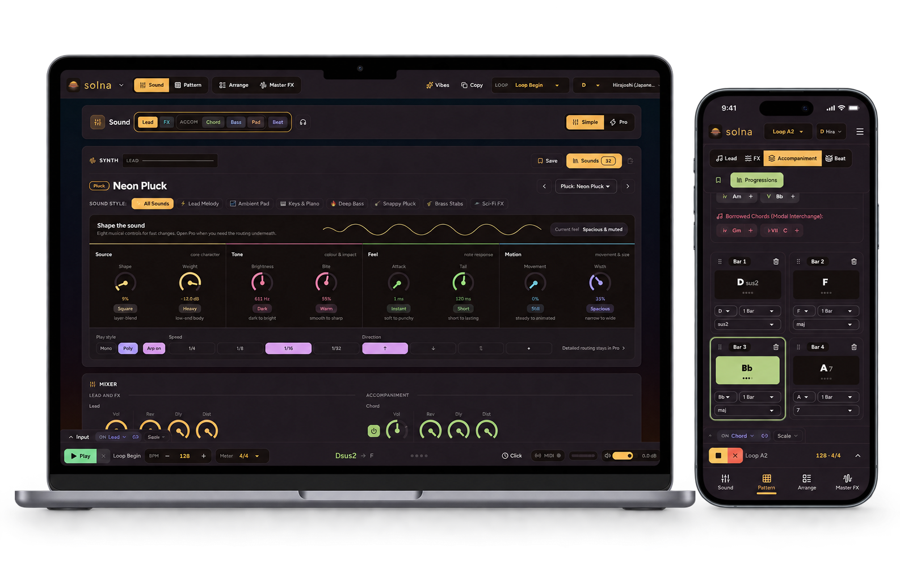

# Solna

**A solo loop studio for musical ideas.** Solna is an installable Progressive Web App (PWA) that
runs in your browser on desktop and mobile. Install it from a supported browser for an app-like
standalone window. Build patterns with a step sequencer, chord builder, synth and drum machine; use
genre-inspired Instant Vibes to get started, arrange your loops, then export your work.

Live app: <https://app.solna.themiddnight.dev/>

## See Solna in action

Build chord progressions and shape each part of a loop in Pattern, then arrange those loops into a
song. The responsive workspace also brings the core tools to mobile.

<p align="center">
  
</p>

## Sample project

[Open the sample project on Google Drive](https://drive.google.com/file/d/1PNTOTtGGVDBgJwJGpxSofyCXPYydJM_i/view?usp=drive_link)
(`somthing-trance-in-d-hirajoshi-new.solna`) to try a Solna project.

## Run it

Solna uses [Bun](https://bun.sh) for scripts and tests. The app itself is Vite + React.

```bash
bun install
bun run dev        # http://localhost:3000
```

Google Drive save/open is optional. Copy `.env.example` to `.env` and follow its comments to enable
it. Without it, Solna works the same, just without the Drive options.

## Check your work

```bash
bun run verify     # the completion gate: every test, lint, domain check and the build
bun run check:content   # quick run of the content-library checks only
```

CI runs `bun run verify` on every pull request, so a green run locally is a green run in CI.

## Where things live

| Path | What |
|---|---|
| `src/data/` | Factory content: synth presets, Beat presets, chord progressions, chord rhythms, bass patterns, drum grids, effect chains, scales and the Instant Vibes. Plain literals only. |
| `src/audio/` | The Web Audio engine: voices, drums, effects, playback and export |
| `src/store/` | App state (zustand) and the bridge from state to the engine |
| `src/components/` | The React UI |
| `src/musicCore/` | Music theory: notes, scales, chords |
| `docs/decisions/` | Architecture decision records: why the code is shaped the way it is |

## Contributing

New presets, progressions, rhythms and drum grids are the easiest place to start. See
[CONTRIBUTING.md](CONTRIBUTING.md). To report a bug, see
[docs/reporting-bugs.md](docs/reporting-bugs.md).

## License and trademarks

The code is licensed under the [Apache License 2.0](LICENSE). The **Solna** and **murva** names and
the Solna logo and icons are trademarks and are not covered by that license. You may fork the code,
but a published fork must use its own name and icons. See [TRADEMARKS.md](TRADEMARKS.md).
