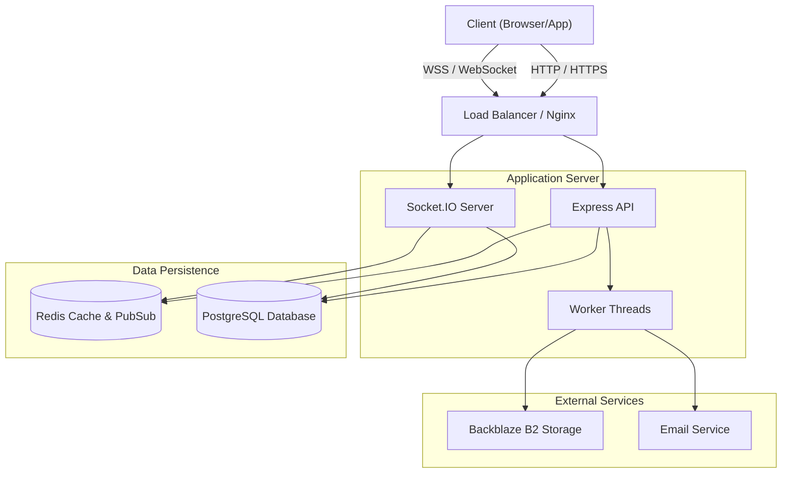
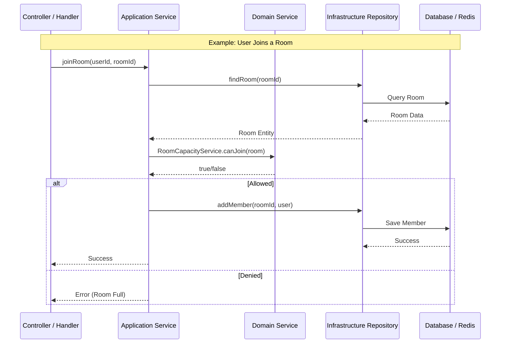
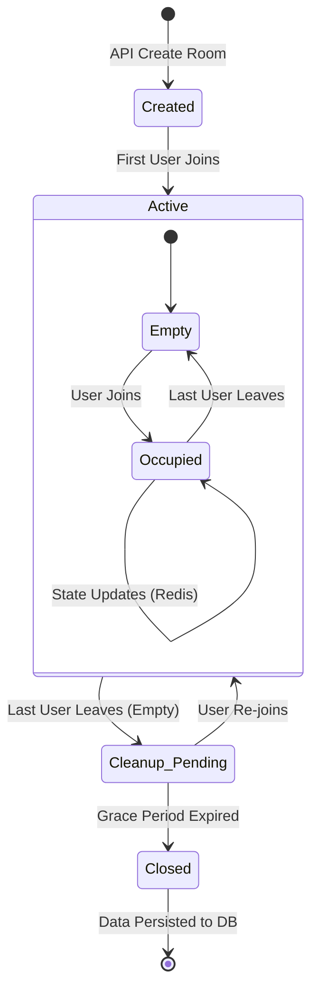
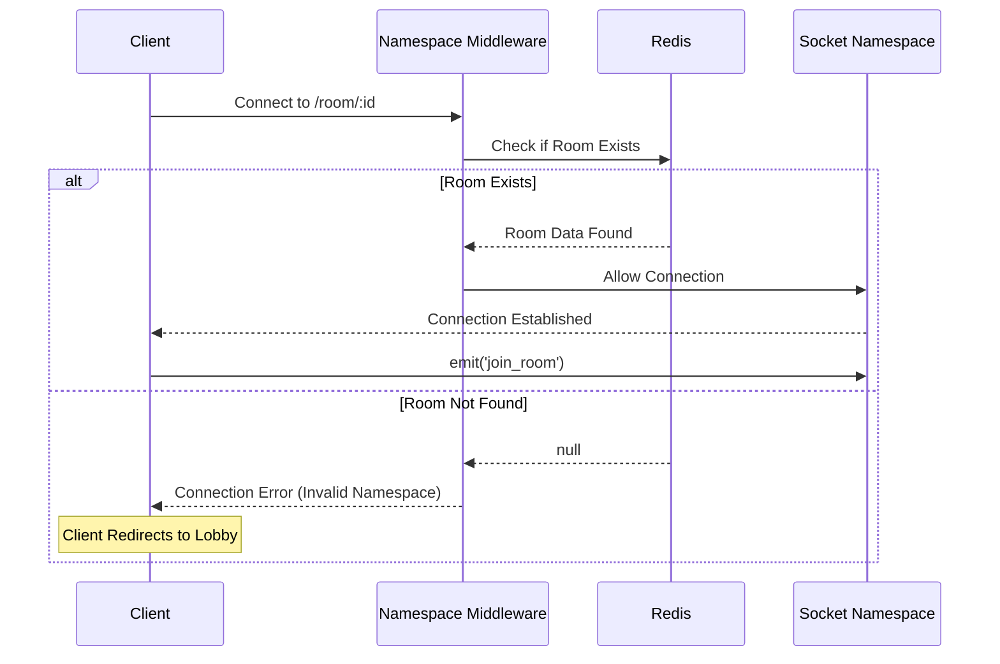
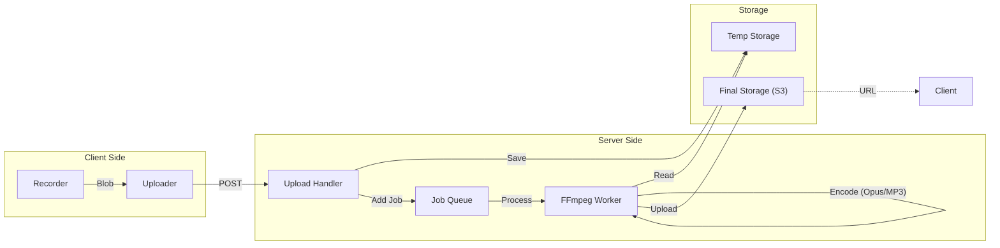

# Architecture Documentation

> **Comprehensive guide** to the murva backend architecture, including system design, Domain-Driven Design structure, and developer guidelines.

## Table of Contents

### Part 1: System Architecture
- [High-Level System Architecture](#1-high-level-system-architecture) (Visual)
- [Room Architecture](#room-architecture)
  - [Unified Base Architecture](#unified-base-architecture)
  - [Perform Room (Live Jamming)](#perform-room-live-jamming)
  - [Arrange Room (Collaborative Production)](#arrange-room-collaborative-production)
- [Domain-Driven Design Overview](#domain-driven-design-overview)
- [State Management](#state-management)
- [Service Architecture](#service-architecture)
- [Community & Collaboration](#community--collaboration)

### Part 2: Developer Guide
- [DDD Layers Explained](#ddd-layers-explained)
- [Project Structure](#project-structure)
- [Adding New Features](#adding-new-features)
- [Layer Decision Guide](#layer-decision-guide)

### Part 3: Patterns & Testing
- [Common Patterns](#common-patterns)
- [Testing Strategy](#testing-strategy)
- [Best Practices](#best-practices)

---

# Part 1: System Architecture

## 1. High-Level System Architecture

Overview of the entire backend system, including external services and data stores.



## Room Architecture

### Unified Base Architecture

The backend implements a **unified base class architecture** for both room types, eliminating code duplication:

**Base Classes:**
- `BaseRoomState` - Common state interface (roomId, roomType, bpm, timeSignature, lastUpdated)
- `BaseRoomStateService<T>` - Abstract state service with Redis persistence
- `BaseRoomHandler` - Abstract socket handler with common patterns

**Event Naming Convention:**
- `perform:*` - PerformRoom events (e.g., `perform:instrument_changed`, `perform:note_played`)
- `arrange:*` - ArrangeRoom events (e.g., `arrange:track_added`, `arrange:region_updated`)
- `room:*` - Shared room events (e.g., `room:state_updated`)

### 2. Domain-Driven Design (DDD) Layer Flow

How a request propagates through the layers of the application.



### Perform Room (Live Jamming)

- **Stateful Architecture**: Centralized state management with `PerformRoomStateService`
- **Live Jamming**: Real-time instrument synchronization across users
- **User State Tracking**: Per-user instrument, synth params, sequencer state
- **WebRTC Voice**: Ultra-low latency voice chat optimized for musical timing
- **Real-time Sync**: Metronome, instruments, effects synchronized via Socket.IO
- **Step Sequencer**: Collaborative pattern creation and sharing
- **State Persistence**: Redis-backed state with 24-hour TTL

### Arrange Room (Collaborative Production)

- **🎛️ Multi-track Production**: Real-time collaborative timeline editing with multiple tracks
- **🎹 MIDI Recording**: Record and edit MIDI notes with piano roll interface
- **🎙️ Audio Recording**: Record audio regions with waveform visualization and storage
- **🔒 Collaborative Locking**: Smart locking system to prevent editing conflicts
- **👥 Presence Tracking**: Real-time user selection and activity indicators
- **💾 Project Persistence**: Save and load complete project state with all tracks and regions

---

## State Management

The application uses a **Redis-Only Persistence Strategy** for room state management:

1. **Redis** - Single source of truth for all room state (perform & arrange)
2. **PostgreSQL** - Long-term data (users, projects, bands)

### 3. Room Lifecycle & State Management



### 4. Socket.IO Connection & Namespace Handling

The flow of establishing a connection to a specific room namespace.



### 5. Media Encoding & Project Save Flow

How audio files are processed and saved.



---

## Multi-Layer Cache Architecture

The application implements a **2-layer caching strategy** to optimize read performance:

```
┌─────────────┐
│   Client    │
└──────┬──────┘
       │
       ▼
┌─────────────────────────────────────────┐
│  L1: NodeCache (In-Memory, Per-Instance)│  ← 15s TTL, ~0.1ms latency
└──────┬──────────────────────────────────┘
       │ miss
       ▼
┌─────────────────────────────────────────┐
│  L2: Redis (Distributed, Shared State)  │  ← 24h TTL, ~1-3ms latency
└──────┬──────────────────────────────────┘
       │ miss
       ▼
┌─────────────────────────────────────────┐
│  Source: PostgreSQL / Computed State    │  ← ~10-50ms latency
└─────────────────────────────────────────┘
```

### Layer 1: NodeCache (Fast In-Memory Cache)
Ultra-fast per-instance cache for frequently accessed room data (15s TTL).

### Layer 2: Redis (Distributed State Store)
Single source of truth for all room state, shared across server instances (24h TTL).

---

## Real-time Sync Architecture

### Per-Room Mutex
`BaseRoomStateService` uses **per-room mutex** (`async-mutex`) to prevent race conditions in Redis read-modify-write operations.

### Ephemeral/Commit Pattern
High-frequency events (drag, knob, slider) broadcast only during interaction; final state committed to Redis on interaction end.

---

# Part 2: Developer Guide

## DDD Layers Explained

1.  **Domain Layer** (`domain/`): Pure business logic, no external dependencies.
2.  **Application Layer** (`application/`): Orchestrate use cases and coordinate domain services.
3.  **Infrastructure Layer** (`infrastructure/`): Implement external integrations (DB, Redis, handlers).
4.  **Shared Layer** (`src/shared/`): Cross-cutting concerns used by multiple domains.

## Project Structure

```
src/
├── index.ts                    # Bootstrap orchestration (global error handlers + startup order)
├── bootstrap/                  # Server startup (HTTP layer, shutdown, composition/ = per-phase dependency wiring)
├── domains/                    # Domain-Driven Design modules
│   ├── auth/
│   ├── room-management/
│   ├── perform-room/
│   ├── arrange-room/
│   └── ...
├── shared/                     # Canonical location for constants, utils, base classes
└── workers/                    # Worker threads (audio compression, AI)
```

### Composition Root (`bootstrap/composition/`, 2026-07-15)

Dependency wiring is split into phase-scoped compose modules; `index.ts` only orders them.
**Adding a service/handler → edit the matching compose module, not `index.ts`:**

| Module | Builds |
|--------|--------|
| `composeRoomManagement(roomRepository)` | room-management domain services (cleanup, user, settings, effect-chain, lifecycle, membership) |
| `composeArrangeServices(io, roomLifecycleService)` | arrange controllers + project import/retrieval services |
| `composeSocketHandlers(deps)` | all socket handlers, ending in `NamespaceEventHandlers` |
| `composeMonitoring(io, namespaceManager)` | performance monitoring / connection health / namespace cleanup |
| `registerBackgroundJobs(deps)` | every `setInterval`/`setTimeout`/EventBus subscription (all timers live here) |
| `restoreRoomNamespaces(...)` | Redis → namespace restore on startup |

Module singletons (`roomSessionManager`, `arrangeRoomStateService`, `performRoomStateService`,
storage services, …) are imported directly inside compose modules — not threaded through params.
Construction order within a module is dependency-ordered; do not reorder casually.

---

# Part 3: Patterns & Testing

## Common Patterns
- **Pattern 1**: Event-Driven Communication via centralized `EventNames.ts`.
- **Pattern 2**: State Management with Redis-backed services.
- **Pattern 3**: Repository Pattern for data access abstraction.
- **Pattern 4**: Thin Controllers delegating to Application Services.

## Testing Strategy
- **Unit Tests**: Domain logic in isolation (no mocks needed).
- **Integration Tests**: Full flows (Redis, Socket.IO).
- **Regression Tests**: Protect against breaking changes in room management and Arrange workflows.

---

See also:
- [API Reference](../../docs/API_CONTRACT.md)
- [WebSocket Events](../../docs/WS_CONTRACT.md)
- [Database Schema](./DATABASE.md)
