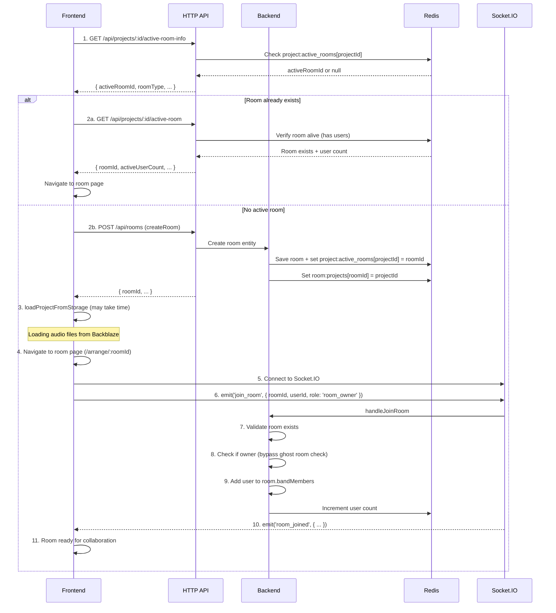
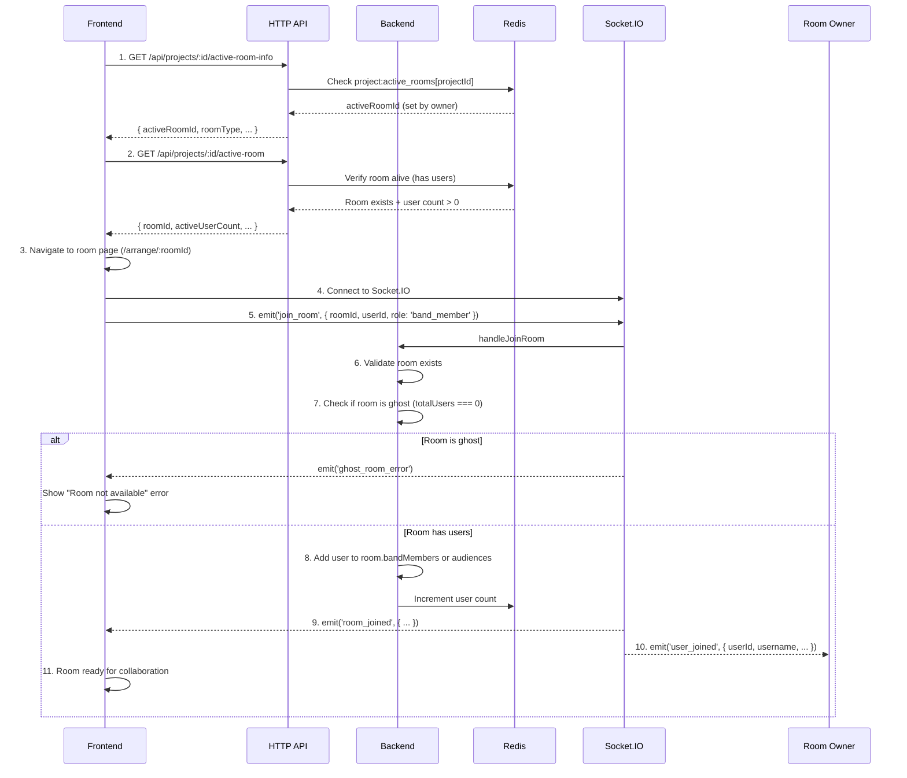

# Project Opening Flow

Detailed step-by-step flow for opening a project, creating a room (owner), and joining a room (members).

---

## 1. Room Owner Opening Project (HTTP + Socket)

### Sequence Diagram



### Timeline

| Step | Actor | Action | Duration | Notes |
|------|-------|--------|----------|-------|
| 1 | FE | Check active room | ~100ms | Pre-flight check |
| 2 | FE+BE | Create room or use existing | ~200ms | Atomic Lua script |
| 3 | FE | loadProjectFromStorage | **30s-2m** | ⚠️ Critical gap: owner in room but no socket |
| 4 | FE | Navigate to room page | ~100ms | DOM update |
| 5 | FE | Socket connect | ~500ms | WebSocket handshake |
| 6 | FE | emit join_room | ~50ms | Socket event |
| 7-9 | BE | Validate + add user | ~100ms | Room age check + cross-process session check |
| 10 | BE | Broadcast room_joined | ~50ms | Notify other members |
| 11 | FE | Room ready | ~0ms | State update |

### Critical Gap (Step 3)

**Problem**: Owner exists in room but has no active socket session
- Room created via HTTP (owner added to `bandMembers`)
- `loadProjectFromStorage` takes time (audio files)
- Socket connection happens later
- **Without protection**: `cleanupGhostUsers()` removes owner → room deleted

**Solution**: Room Age Check (30s) + Cross-Process Session Check
- Rooms younger than 30 seconds skip ghost cleanup entirely
- `isUserActiveInRoom()` checks Redis session keys directly (cross-process safe)
- Owner with active Redis session will not be cleaned up
- If owner's Redis session is gone (crashed before reconnecting), cleanup removes them and room is closed
- Owner can reconnect within the grace period (30s) to restore session

---

## 2. Room Member Joining Room (Socket Only)

### Sequence Diagram



### Timeline

| Step | Actor | Action | Duration | Notes |
|------|-------|--------|----------|-------|
| 1 | FE | Check active room | ~100ms | Pre-flight check |
| 2 | FE | Verify room alive | ~100ms | User count > 0 |
| 3 | FE | Navigate to room page | ~100ms | DOM update |
| 4 | FE | Socket connect | ~500ms | WebSocket handshake |
| 5 | FE | emit join_room | ~50ms | Socket event |
| 6-7 | BE | Validate + ghost check | ~100ms | No gap (socket + join same time) |
| 8 | BE | Add user to room | ~50ms | Update in-memory room |
| 9 | BE | Broadcast room_joined | ~50ms | Notify all members |
| 10 | BE | Notify owner | ~50ms | User joined event |
| 11 | FE | Room ready | ~0ms | State update |

### Key Difference from Owner

**No Gap**: Member is added to room via `handleJoinRoom` (Socket) with active socket session already present
- Socket connection happens first
- Then `join_room` event adds user to room
- No time window where user exists without socket

---

## 3. Comparison: Owner vs Member

### Owner Flow

```
HTTP: createRoom (owner added)
  ↓
FE: loadProjectFromStorage (30s-2m) ⚠️ GAP
  ↓
Socket: connect + join_room (owner socket session created)
  ↓
BE: handleJoinRoom (owner already in room, just verify)
  ↓
Room ready
```

### Member Flow

```
FE: Check active room (pre-flight)
  ↓
Socket: connect + join_room (same time)
  ↓
BE: handleJoinRoom (add user to room)
  ↓
Room ready
```

---

## 4. Protection Layers During Owner Opening

### Layer 1: Room Age Check (30 seconds)

```
cleanupGhostUsers() runs every 2 minutes
  ↓
For each room:
  if (roomAgeMs < 30_000) {
    skip cleanup  // ← Protects new rooms
  }
```

**Protects**: Newly created rooms during `loadProjectFromStorage`

### Layer 2: Cross-Process Session Check

```
cleanupGhostUsers() runs every 2 minutes
  ↓
For each user in room:
  isActive = await roomSessionManager.isUserActiveInRoom(roomId, userId)
  if (!isActive) {
    removeUserFromRoom(roomId, userId, true)  // ← Owner treated equally
  }
```

**Protects**: Users with valid Redis sessions (including owners connected from any server process)

### Layer 3: Reconnection Window (2 minutes after server restart)

```
Server starts
  ↓
roomRepository.syncFromRedis() // Restore rooms
  ↓
setTimeout(() => cleanupGhostUsers(), 2 * 60 * 1000)
  ↓
During 2-min window: no cleanup
```

**Protects**: All users after server restart

### Layer 4: Grace Period (Per-user)

```
User disconnects (unintentional)
  ↓
Enter grace period (30s for owner, 60s for others)
  ↓
During grace period: skip cleanup
  ↓
If reconnect within grace period: restore state
```

**Protects**: Users with temporary disconnections

---

## 5. Error Scenarios

### Scenario A: Owner Disconnects During loadProjectFromStorage

```
1. Owner: createRoom (owner added to room)
2. Owner: loadProjectFromStorage (30s-2m)
3. Owner: Browser crashes / network fails
4. cleanupGhostUsers() runs

Without protection:
  ❌ Owner removed → room empty → room deleted
  ❌ Member tries to join → "Room not found"

With protection:
  ✅ Room age check (30s) skips cleanup for new rooms
  ✅ If owner reconnects quickly (within grace period): room preserved
  ✅ If owner's Redis session is gone and room is old: room closed (correct behavior — owner truly crashed)
```

### Scenario B: Member Joins While Owner Still Loading

```
1. Owner: createRoom (owner added)
2. Owner: loadProjectFromStorage (15s in)
3. Member: Check active room → room exists (owner in room)
4. Member: Navigate + connect + join_room
5. Member: Added to room successfully
6. Owner: Finishes loading + connects
7. Both: Collaborate

✅ Works correctly (member joins while owner loading)
```

### Scenario C: Server Restart During Project Opening

```
1. Owner: createRoom (owner added)
2. Owner: loadProjectFromStorage (20s in)
3. Server: Crashes/restarts
4. Rooms: Restored from Redis
5. 2-min reconnection window: no cleanup
6. Owner: Reconnects within 2 min
7. Owner: Completes loadProjectFromStorage
8. Owner: Connects socket + joins
9. Room: Ready

✅ Works correctly (reconnection window protects)
```

---

## 6. User Experience Flow (Modal-based)

All project opening flows now use a consistent modal-based UX across Lobby, Profile, Community, and Band pages:

### Flow Pattern

1. **User clicks "Open" on a project card**
2. **System checks for active room** via `getActiveRoomInfo(projectId)`
3. **Two possible paths:**

   **Path A: Active room exists (activeUserCount > 0)**
   - Show `JoinExistingRoomModal`
   - Display active user count and privacy status
   - User can choose to:
     - Join existing room (may require approval if private)
     - Cancel and return

   **Path B: No active room**
   - Show `OpenProjectModal`
   - User configures room settings:
     - Room name (defaults to project name)
     - Description (optional)
     - Private room checkbox (requires approval for band members)
     - Hidden room checkbox (not shown in lobby)
   - User clicks "Create Room & Open"
   - System creates room → loads project → navigates to room

### Page-Specific Behavior

#### Lobby Page (`app/frontend/src/pages/Lobby.tsx`)
- **Continue Your Projects** section: `defaultHidden={true}` (user's own projects)
- **Discover & Contribute** section: `defaultHidden={false}` (community projects)
- Uses `handleProjectClick(project, isOwned)` to track ownership
- Integrates `useJoinRoom` hook for private room approval flow

#### Profile Page (`app/frontend/src/features/band/components/ProjectList.tsx`)
- **Owned Projects** tab: `defaultHidden={true}`
- **Contributed Projects** tab: `defaultHidden={true}`
- Same modal flow as Lobby

#### Community Page (`app/frontend/src/pages/Community.tsx`)
- All projects: `defaultHidden={false}` (public projects)
- Same modal flow as Lobby

### Modal Components

- **`OpenProjectModal`** (`app/frontend/src/features/projects/components/OpenProjectModal.tsx`)
  - Room configuration before creating
  - Validates room name required
  - Shows privacy/visibility warnings

- **`JoinExistingRoomModal`** (`app/frontend/src/features/projects/components/JoinExistingRoomModal.tsx`)
  - Shows active user count
  - Displays privacy status
  - Handles approval flow for private rooms
  - Project owners bypass approval (BR-2)

## 7. Related Code Files

### Frontend - Pages
- `app/frontend/src/pages/Lobby.tsx` — Modal-based project opening (user + community projects)
- `app/frontend/src/pages/Profile.tsx` — Profile page structure
- `app/frontend/src/pages/Community.tsx` — Modal-based project opening (public projects)
- `app/frontend/src/pages/BandDetail.tsx` — Band projects page

### Frontend - Components
- `app/frontend/src/features/band/components/ProjectList.tsx` — Modal-based project opening (owned/contributed)
- `app/frontend/src/features/projects/components/OpenProjectModal.tsx` — Room configuration modal
- `app/frontend/src/features/projects/components/JoinExistingRoomModal.tsx` — Join existing room modal
- `app/frontend/src/features/lobby/components/LobbyProjectCard.tsx` — Project card component

### Frontend - Hooks
- `app/frontend/src/features/rooms/shared/hooks/useJoinRoom.ts` — Join room with approval flow
- `app/frontend/src/features/audio/services/RoomSocketManager.ts` — Socket join_room

### Backend
- `app/backend/src/routes/projects.ts` — HTTP endpoints (active-room-info, active-room, createRoom)
- `app/backend/src/domains/room-management/infrastructure/handlers/RoomLifecycleHandler.ts` — handleJoinRoom, handleCreateRoom
- `app/backend/src/domains/room-management/application/RoomLifecycleService.ts` — cleanupGhostUsers (equal owner treatment)
- `app/backend/src/domains/room-management/infrastructure/services/RoomSessionManager.ts` — isUserActiveInRoom (cross-process check)
- `app/backend/src/domains/arrange-room/application/ProjectRoomService.ts` — Project↔Room mapping

---

## 7. Related Rules

### Business Rules (BR)
- **BR-1**: 1 Project = 1 Arrange Room (409 conflict if duplicate)
- **BR-2**: Project Owner Always Opens as Room Owner (auto role)
- **BR-8**: Room Owner Leave → Auto-Transfer Ownership

### Technical Rules (TR)
- **TR-5**: Room Restart Survival (2-min reconnection window)
- **TR-6**: Grace Period (Owner 30s, Regular 60s)

---

## 8. Troubleshooting

### "Room not found" on member join

Check:
1. Is owner still loading? (check logs for loadProjectFromStorage)
2. Did owner disconnect? (check grace period)
3. Is room in cleanup window? (check room age)
4. Is owner exception working? (check logs for "skip owner")

### Owner removed during loading

Check:
1. Is owner exception enabled? (check RoomLifecycleService.ts)
2. Is room age check working? (check logs for "skip cleanup")
3. Did cleanupGhostUsers() run? (check logs for "Found ghost user")

### Member can't join after owner creates room

Check:
1. Is room in Redis? (check project:active_rooms[projectId])
2. Does room have users? (check activeUserCount > 0)
3. Is room ghost? (check totalUsers === 0)
4. Is member in grace period? (check reconnection window)
