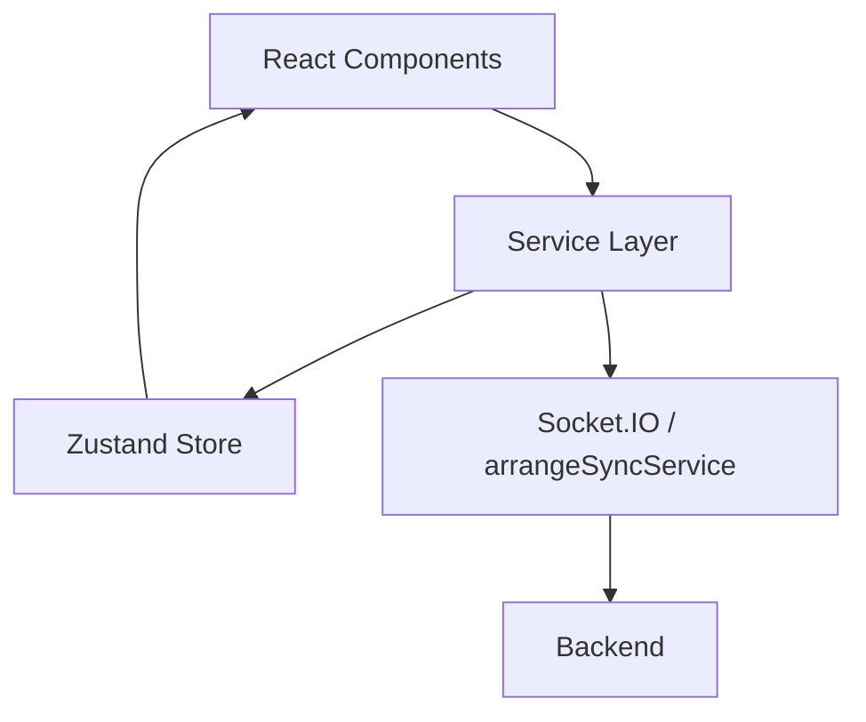
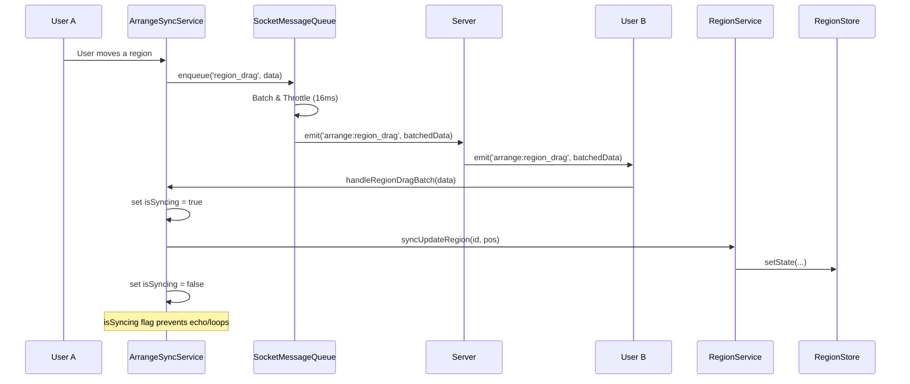
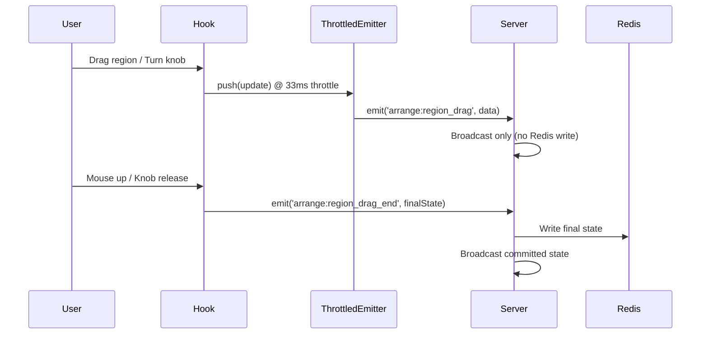

# Architecture Guide

System architecture, design patterns, and technical implementation details for murva Frontend.

> **Canvas rendering & theming** is documented separately: all Konva canvases (piano roll, step sequencer, multitrack timeline, audio editor) draw from token-driven colors resolved via `useCanvasPalette` / `canvasPalette` — never hard-coded hex. See [`docs/CANVAS_COLORS.md`](../../../docs/CANVAS_COLORS.md). Brand/theme tokens live in the sibling `murva-brand/` repo (`tokens.css`).

---

## 📑 Table of Contents

- [Architecture Principles](#architecture-principles)
- [Audio Architecture](#audio-architecture)
- [Room Architecture](#room-architecture)
- [Service Layer & State Management](#service-layer--state-management)
  - [Persisted State and Storage Tiers](#persisted-state-and-storage-tiers)
- [Real-time Data Flow](#real-time-data-flow)
- [Performance Optimizations](#performance-optimizations)
- [Project Structure](#project-structure)
- [Production Serving & Link Previews](#production-serving--link-previews)

---

## Architecture Principles

> **The project has committed to this model. New code must follow it; the codebase is converging
> toward it incrementally (lint-enforced, shrink-only). Follow this model over surrounding legacy.**

The frontend stacks **three organizing axes** (each has a canonical rule in
[`docs/RULES_AND_CONSTRAINTS.md`](../../../docs/RULES_AND_CONSTRAINTS.md)):

**1. Feature-driven (TR-37) — how code is grouped.** Domain logic in `src/features/<feature>/`;
`src/pages/` are route shells; cross-feature imports through a feature's curated `index.ts` public
surface (no deep imports into another feature's internals).

**2. Unidirectional Data Flow (TR-36) — how state moves.**
`event → store action → Zustand store → selector → UI` (side-effects via `subscribe`). One store per
state; components write via named actions only (never `getState`/`setState` — ESLint error); inbound
socket → store action or the typed `roomSocketBus`; derived values via selector/`useMemo`, never stored.
Details: [Service Layer & State Management](#service-layer--state-management),
[Real-time Data Flow](#real-time-data-flow), and the [UDF ADR](../../../docs/adr/2026-07-05-frontend-unidirectional-data-flow.md).

**3. Capability layers (TR-38) — which layer may depend on which.** A one-way, **lint-enforced**
dependency direction on top of the feature axis:

```
shell (pages) → feature → driver → engine → shared          (same-tier feature → feature allowed)
```

| Layer | Responsibility | May import |
|-------|----------------|-----------|
| `src/pages/` — **shell** | route composition (thin) | feature, driver, engine, shared |
| `src/features/` — **feature** | UI + state + wiring of a product capability | feature, driver, engine, shared |
| `src/drivers/` — **driver** | translate a room's control model → engine `NoteEvent`s (`live`=perform@now, `scheduled`=arrange@t) | engine, shared |
| `src/engine/` — **engine** | room-agnostic capability core: instruments, synth, effects, AudioContext, the `NoteEvent` seam — **no room-awareness** | engine, shared |
| `src/shared/` — **shared** | generic leaf utilities/types | shared only |

- **Room silos (2026-07-15):** within the feature tier, `src/features/rooms/` is further split into
  three lint-enforced elements — `room-perform` (`rooms/perform/**`), `room-arrange`
  (`rooms/arrange/**`), and `room-common` (`rooms/shared/**`). **Perform and Arrange must never
  import each other** (FC-1: they are separate room architectures); `room-common` is the only
  orchestration layer allowed to reach into both silos (`useRoom`, room switching, session
  conversion). Both silos may still use ordinary features (effects, instruments, audio), drivers,
  engine, and shared. Landed with **zero** suppressions — no cross-silo imports existed.
- **The seam:** the engine knows only *"play this note-event at this time"* (`playNote(event: NoteEvent)`).
  Live input = scheduling at `t = now`; recorded/arranged notes = scheduling at `t`. One engine, two drivers.
- **Enforcement:** `eslint-plugin-boundaries` (`boundaries/dependencies`, `default: disallow`) + a
  **shrink-only** `app/frontend/eslint-suppressions.json` baseline. Pre-existing cross-layer edges are
  grandfathered and may only be *removed*; a new violation **fails lint**. (Same ratchet pattern as the
  TR-27 `eslint.type-safety-baseline.mjs`.)
- **Migration status:** complete (2026-07-06) — engine capabilities (audio, instruments, effects)
  physically live in `src/engine/` and import zero features. `src/drivers/` is **reserved** (the thin
  live/scheduled seams are deliberately deferred until the perform/arrange input paths are decomposed);
  a few `shared → feature` edges remain as permanent grandfathers. Status + rationale:
  [`docs/architecture/ROOM_ENGINE_RELAYERING_BACKLOG.md`](../../../docs/architecture/ROOM_ENGINE_RELAYERING_BACKLOG.md).
  See also the [re-layering ADR](../../../docs/adr/2026-07-05-room-engine-relayering.md).

---

## Audio Architecture

### Ultra-Low Latency Design

**Separated Audio Contexts:**
- **Instruments Context**: 48kHz, `"interactive"` latency hint for minimal musical delay
- **Voice Chat Context**: 48kHz, `"interactive"` latency hint for minimal voice delay
- **No Competition**: Separate contexts prevent interference between music and voice processing

**Performance Features:**
- 4ms note processing intervals
- Fixed polyphony: 16 simultaneous notes per user
- Browser-specific optimizations
- Network optimizations for mesh networks

### MIDI & Percussion Standards

**General MIDI Percussion:**
- Drum pads use standardized GM note mapping (C1-A4)
- Electronic drum machines, curated DrumAbuse machines, and the acoustic drumset category all use the drumpad/GM-note contract
- All sample-based playback is provider-backed through the unified `InstrumentProvider` interface. Melodic soundfonts use `SmplrSoundfontProvider`, drum machines use `SmplrDrumProvider`, and acoustic drumsets use `VersilianAcousticDrumsetProvider` (wrapping the underlying `VersilianAcousticDrumProvider`). Repeated GM labels map to distinct articulations where available.
- Page navigation: Z/X keys for 3 pages of 16 drum pads (48 total positions)
- MIDI device ready: Compatible with external MIDI controllers
- Pattern portability: Sequencer patterns work consistently across DrumMachine, DrumAbuse, and Acoustic Drumset instruments

### Hardware MIDI Input

Hardware MIDI (external controllers/keyboards) is captured by one **tab-global singleton**,
`MidiService` in `src/shared/midi/` — not disposed on unmount, so the Web MIDI connection and
device list survive room switches. Both rooms subscribe via the shared `useMidi` hook and render
the same `<MidiSettingsControls>` UI; there is no per-room MIDI capture stack.
- **Perform**: `features/rooms/perform/hooks/usePerformMidi.ts` subscribes to the service and
  routes note messages through the live driver seam (`src/drivers/live/midiNoteDriver.ts`,
  `midiMessageToLiveNote`) to play **@now** — see [Project Structure](#project-structure) for the
  `drivers/` layer.
- **Arrange**: sources hardware messages directly from the shared service for monitoring/recording
  into the piano roll (`hooks/playback/useMidiMonitoring.ts`, `hooks/playback/useRecordingEngine.ts`);
  the arrange-side thin scheduled-driver seam (`src/drivers/scheduled/`) is reserved, not yet
  extracted (`docs/architecture/ROOM_ENGINE_RELAYERING_BACKLOG.md` §2, DEV-249).

### Stereo Effects & Audio Routing

The audio routing system uses a Haas-effect mono-to-stereo converter feeding the effect chain, followed by a **dB-native volume/pan stage** (`Tone.Channel`) that preserves stereo signals from effects like Ping Pong Delay, Auto Panner, and Stereo Widener.

#### Audio Signal Flow

```
Complete Signal Chain:

  Instrument → inputGain → monoToStereoConverter → [effects chain] → toneChannel (volume/pan)
                                   ↓                                        ↓
                              (Haas Effect)                       stereoEffectOutput
                           0.5ms L / 1.5ms R                              ↓
                                                                      masterSendGain
                                                                           ↓
                                                                      masterSum (getMasterInput)
                                                                           ↓
                                                                      [master inserts]
                                                                           ↓
                                                                      masterGain (the master fader)
                                                                           ↓
                                                                      masterOut (unity — capture tap)
                                                                      /         \
                                                                     ↓           ↓
                                                              capture taps    outputGain (unity, post-tap)
                                                          (recording / shadow /       ↓
                                                           broadcast / mixdown)  destination

Remote WebRTC voice joins at one of two points, chosen per room (DEV-325):

  voiceSource (MediaStreamSource off ontrack)
        ↓
  channel.voiceGain (per-peer fader, dB)
        ↓
  routing "mix"    → masterSum (getMasterInput) … upstream of the tap → PRINTED   (Perform)
  routing "direct" → outputGain                 … after the tap       → heard only (Arrange)
```

Both land on the **master bus**, never on the speaking peer's own channel. `stereoEffectOutput`
is the node the channel's `analyser` / `nativeAnalyser` / `monitorTap` all read, so voice routed
there drove the avatar's hold-halo glow whenever someone talked — the glow reports *instrument*
output, and speaking already has the amber speaking border (from the websocket signal, DEV-270).
The per-peer fader is unaffected: `voiceGain` sits on the voice branch itself.

#### Master Bus — No Corrective Processing, Reserved Post-Tap Stage (DEV-322)

**There is no limiter, auto-gain, or auto-trim anywhere on the master bus.** murva measures
audio level honestly and never corrects it automatically — the app's job is to make the level
legible; the user does the fixing (see TR-40 in `docs/RULES_AND_CONSTRAINTS.md`). A master
limiter (`DynamicsCompressorNode`) shipped briefly as DEV-302 and was removed by DEV-322: it
could not deliver the ceiling it implied (a 3 ms attack lets transients through) and a
look-ahead limiter that could would add latency the Perform room cannot accept — a safety net
that cannot guarantee its own promise, while muddying what the meter reports, is worse than
none. Do not reintroduce one here.

- **`masterGain`** is the master fader (Arrange only — Perform has no master fader by design,
  see below) and also the **meter tap**: `useMasterMeter` connects a `ChannelSplitter` here, so
  the meter reads the fully-faded, pre-tap signal.
- **`masterOut`** is a unity `GainNode` immediately after `masterGain` and is the **capture
  tap point** — `getMasterTap(): GainNode` returns it. **All capture hooks (recording, shadow
  capture, broadcast, mixdown) connect additively from here and disconnect their own node
  only** (targeted single-argument `disconnect(node)`). Never call bare `.disconnect()` on the
  returned node — that drops every tap and the speaker path.
- **`outputGain`** is a unity `GainNode` wired **after** `masterOut`, between the capture tap
  and `context.destination`. It is the stage for anything that must be *heard* but never
  *printed* into a recording/export; `getPostTapInput(): GainNode` returns it. Reserved by
  DEV-322 so that adding such a need later would never have to move the capture-tap contract
  (`masterOut`) again — DEV-325 was the first taker, and it cost no rewiring.
  Its other current tenant-in-waiting is a future local monitor level.
- **Silent rendering** (Arrange mixdown) uses `divertOutputToCapture(node)` /
  `restoreOutputToSpeakers(node)` on the bus, which detach/reattach `masterOut → outputGain`
  and redirect to the render target instead. Callers no longer disconnect `masterOut` from
  `context.destination` themselves — the bus owns the speaker path.
- **`masterSum`** is where every channel lands (`getMasterInput()`), ahead of the master
  inserts and the fader. It is a separate node from `masterGain` specifically so a channel
  cannot connect past the inserts — before DEV-323 the two were the same node, and
  `getMasterGain()` is still the fader so the meter keeps reading post-fader.
- **`[master inserts]`** is the Arrange master effect chain (DEV-323), applied whole via
  `MixerEngine.applyMasterEffectChainState` → `MasterAudioBus.setMasterInserts`. Inserts sit
  **before** the fader, as a DAW master strip does — the fader is clean output trim, not the
  thing driving a compressor — and before the tap, so they are printed into every capture.
  `setMasterInserts` rebuilds the whole `masterSum → … → masterGain` hop rather than splicing,
  because an appended insert would otherwise leave the previous last-node → fader edge alive as
  a dry path around it. **The chain is empty today: the runtime substrate is in place but there
  is no UI yet, deliberately** — the master strip's layout is an open design question, so it
  was deferred rather than guessed. `'master'` is a valid `EffectChainType` and the effects
  store seeds an empty chain for it, but `effectsIntegration.getChannelIdForChain('master')`
  returns `null` on purpose: the master is not a mixer user-channel, so the per-channel
  add/remove path must never claim it.
- **Remote voice is routed per room, not per browser** (DEV-325). `MixerEngine.setVoiceRouting`
  takes `"mix"` or `"direct"`; the room states it via `useVoiceRouting` and the engine never
  learns which room it is in (TR-38). **Perform uses `"mix"`** — the room owner's mix *is* the
  broadcast and a session recording without the band talking is not the jam (BR-14).
  **Arrange uses `"direct"`** — a mixdown or stem export should contain the project, not the
  conversation about it, and landing after the tap also puts voice outside the master fader.
  The mixer is a singleton that outlives a room change, so both rooms assert their mode on
  mount rather than inheriting; `setVoiceRouting` moves already-wired peers too.
- Remote voice reaches the graph via `createMediaStreamSource` off `ontrack`'s stream, **not**
  `createMediaElementSource` on the hidden `<audio>` element — that yields silence for a
  MediaStream-backed element (DEV-324). The element stays and keeps playing as the sink that
  keeps the receive pipeline pulling, muted so the voice is heard once. On WebKit/iOS
  (`supportsRemoteStreamWebAudio === false`) voice stays on the direct element path and is
  outside the graph entirely.
- The metronome bus bypasses this chain entirely (it connects directly to
  `context.destination`, deliberately excluded from recording/broadcast).
- **The master meter is shared between rooms.** `MasterLevelMeter`
  (`features/rooms/shared/components/MasterLevelMeter.tsx`, backed by
  `features/rooms/shared/hooks/useMasterMeter.ts`) renders the stereo meter + clip indicator,
  with an optional room-owned fader slot. Arrange's `MasterMeter.tsx` is a thin wrapper that
  owns the master-volume store and the knob passed into that fader slot; Perform renders
  `MasterLevelMeter` with no fader — **Perform has no master fader and no master effects, by
  design, permanently** (one participant quietly re-fading a live room is not a control worth
  having). Because there is no limiter, the meter's **clip indicator is load-bearing, not
  decorative** — it is the only thing telling a user the output is too hot.
- `useUnityMasterOutput()` asserts the master fader sits at unity for rooms with no fader
  control (Perform). `MasterAudioBus` is a static singleton that survives the Arrange →
  Perform client-side route change, so without this a Perform room would silently inherit
  whatever fader position the last Arrange session left behind, with no Perform control to
  discover or undo it.

#### Volume & Pan Control (`MixerEngine`, `runtime/MixerEngine.ts`)

`setUserVolume(userId, volumeDb: Decibels)` / `getUserVolume(userId): Decibels | null` are **dB-native**, backed by Tone's `Channel.volume`. `volumeDb` is the branded `Decibels` type from `@/shared/audio/gainUnits`; the live fader range is **-60..+12 dB** (`MIXER_VOLUME_MIN_DB`/`MIXER_VOLUME_MAX_DB`, exported from `MixerEngine.ts`). `-Infinity` is a true, uncapped mute — it bypasses the clamp entirely so a muted channel is silent, never merely quiet at -60 dB (DEV-295).

**Arrange `Track.volume` is dB-native too (DEV-303).** The persisted field itself — not just the `MixerEngine` runtime API above — is the branded `Decibels` type, unity = 0 dB, same **-60..+12** fader range, with a 0.5 dB step on the track-header slider (no percent representation anywhere). `Track.volume` is **never** `-Infinity`; mute is a separate, orthogonal `muted` boolean (`arrangeTrackMixStore`), not encoded in `volume`. `useTrackAudioParams.ts` computes the *effective* volume passed downstream (to `MixerEngine.setUserVolume` for audio tracks, `trackInstrumentRegistry.updateChannelMix` for MIDI tracks) each render: `track.volume` normally, or `SILENCE_DB` (`-Infinity`) when the track is muted or another track is soloed — only that derived, ephemeral value ever reaches `-Infinity`. Before DEV-303, `Track.volume` was linear `0..1`; because an old file's `volume: 0.8` would otherwise be silently reinterpreted as `+0.8 dB`, this migration bumped `PROJECT_SCHEMA_VERSION` 2→3 (`shared/src/constants/ProjectSchemaVersion.ts`). Per the beta/legacy-load policy (DEV-319, TR-40), a file below the current version is **not** refused — it loads with its changed-unit loudness fields reset to current defaults (`resetLegacyLoudnessFields` in `legacyLoudnessReset.ts`) and the user is told; only a file from a **newer** build is refused (`ProjectVersionMismatchError`).

`setUserPan(userId, pan)` / `getUserPan(userId)` still take a plain `-1..1` number, but pan is now applied via `Tone.Channel.pan` — **equal-power panning built into Tone.js** (TR-34: reuse a maintained library instead of hand-rolling a pan law), not a linear L/R gain taper.

**`channelCount: 2` is required on the `Channel` constructor.** Tone's `Channel`/`Panner` default to `channelCount: 1` + `channelCountMode: "explicit"`, which makes the internal `StereoPannerNode` down-mix stereo input to mono *before* panning, at every pan position — silently destroying Haas stereo width, PingPongDelay's L/R alternation, AutoPanner, StereoWidener, and Chorus, plus a quiet ~3dB unity-gain loudness drop (verified via `OfflineAudioContext`). `MixerEngine.createUserChannel` passes `new Channel({ volume: 0, pan: 0, channelCount: 2 })` explicitly to keep the panner in true stereo mode — this is the actual reason stereo survives here, not anything about what feeds the channel upstream. See `MixerEngine.stereo.test.ts` for the regression test and the `dsp-audio` skill's Common Mistakes list.

**Ceiling note:** with `channelCount: 2`, Tone's equal-power pan law *sums* energy from the far channel into the near one for correlated/hard-panned content. Measured: a hard-panned (`pan: -1`), max-boosted (`+12 dB`) source can reach roughly **+18 dB** into the master bus — above the nominal `MIXER_VOLUME_MAX_DB` (+12 dB) fader ceiling. The old linear-taper L/R network had a hard ceiling of exactly +12 dB (it only ever attenuated on pan, never boosted); Tone's native equal-power pan does not have that property. This is an accepted consequence of the TR-34 decision to use Tone's native pan law rather than re-deriving a custom one — worth knowing if a signal into the master bus looks unexpectedly hot.

This replaces a previous hand-rolled implementation that split the post-effects signal with a native `ChannelSplitter`, computed linear L/R gains from `targetVolume`/`targetPan`, and remerged with a `ChannelMerger` (DEV-305). That splitter/merger network is deleted; `Tone.Channel` is now the live stage, feeding `stereoEffectOutput` → a per-channel `masterSendGain` (used for ref-counted master-mute, e.g. Vocoder-ext carrier muting) → the master bus.

**Voice volume is separate and unrelated.** `setVoiceVolume`/`getVoiceVolume`/`voiceVolume` (delegated to `VoiceVolumeController`) remain **linear gain**, roughly `0..~4`, controlling the WebRTC voice-routing tap — not the instrument channel fader, and not touched by the dB migration.

#### Key Design Decisions

1. **Mono-to-Stereo Converter**: All instruments (mono) pass through a Haas effect converter that creates stereo width using subtle L/R delays (**0.5ms left, 1.5ms right**) with slight gain differences (right channel at 0.95x). This still uses a native `ChannelSplitter`/`ChannelMerger` pair — unrelated to volume/pan, unaffected by the dB migration.

2. **Unified Routing**: All audio routes through `stereoEffectOutput` (Tone.Gain), fed by the `Tone.Channel` volume/pan stage, regardless of whether effects are present.

3. **Effect Chain Rebuilding**: When effects are added/removed, the chain is rebuilt: `monoToStereoOutput → [effects] → toneChannel`.

4. **Effect Implementation**: Stereo effects (PingPongDelay, AutoPanner, Chorus, StereoWidener, Tremolo) use `Tone.Gain` nodes and native Tone.js connections to preserve stereo throughout the signal chain.

### Arpeggiator Architecture

The **Arpeggiator** is a utility class that provides pattern-based note sequencing for synthesizers, integrated into `InstrumentEngine` via callback functions.

#### Design Pattern

**Independent Timing System:**
- Uses recursive `setTimeout` instead of `Tone.Transport` for independent control
- Allows arpeggiator to run independently of global transport state
- Precise timing based on BPM and subdivision values

**Callback-Based Integration:**
```typescript
new Arpeggiator({
  triggerNote: (note: string) => { /* Play note on synth */ },
  releaseNote: (note: string) => { /* Release note on synth */ },
  getBPM: () => Tone.getTransport().bpm.value,
});
```

#### Mono vs Poly Synth Handling

The arpeggiator callbacks handle mono and poly synths differently due to their distinct Tone.js APIs:

**Mono Synth (MonoSynth, FMSynth):**
- `triggerNote`: Calls `synthRef.triggerAttack(note, time, velocity)` + `filterEnvelopeRef.triggerAttack(time)`
- `releaseNote`: Calls `synthRef.triggerRelease(time)` **without note parameter** + `filterEnvelopeRef.triggerRelease(time)`
- Filter envelope is managed separately from amplitude envelope

**Poly Synth (PolySynth):**
- `triggerNote`: Calls `synthRef.triggerAttack(note, time, velocity)`
- `releaseNote`: Calls `synthRef.triggerRelease(note, time)` **with note parameter**
- No separate filter envelope management

#### Latch Behavior

The arpeggiator implements **"Replace on new chord"** latch behavior, matching standard hardware synthesizers:

**Flow:**
1. **Latch ON** + press C-E-G → `latchedNotes = [C, E, G]`, arp plays pattern
2. **Release all keys** → arp continues playing C-E-G (latch holds pattern)
3. **Press D** (after releasing all) → `latchedNotes` clears and becomes `[D]` (new chord detected)
4. **Press F#** (while holding D) → `latchedNotes = [D, F#]` (add to current chord)
5. **Latch OFF** → clears `latchedNotes`, stops if no keys held

**Key Logic:**
- New chord detection: `noteOn` arrives when `heldNotes.length === 0` (all keys released)
- Always tracks physical key state in `heldNotes` (even when latch is ON)
- `latchedNotes` is the separate pattern that persists after key release

#### Parameters

| Parameter     | Type      | Range      | Description                                    |
| ------------- | --------- | ---------- | ---------------------------------------------- |
| `enabled`     | boolean   | -          | Enable/disable arpeggiator                     |
| `mode`        | ArpMode   | -          | up, down, upDown, downUp, random               |
| `subdivision` | string    | -          | Note timing (8n, 16n, 4n, etc.)                |
| `octaveRange` | number    | 1-4        | Number of octaves to arpeggiate across         |
| `gate`        | number    | 0.05-1.0   | Note length as fraction of interval (0.5 = 50%) |
| `latch`       | boolean   | -          | Hold pattern after key release                 |

#### Integration with InstrumentEngine

**Initialization:**
- Arpeggiator instance created in `initializeSynthesizer()`
- Initial parameters applied from `synthState`

**Note Routing:**
- When `arpEnabled = true`: `playSynthNotes()` → `arpeggiator.noteOn()`
- When `arpEnabled = true`: `stopSynthNotes()` → `arpeggiator.noteOff()`
- When `arpEnabled = false`: Normal synth playback

**Parameter Sync:**
- `updateSynthParams()` propagates arp parameters to `arpeggiator.updateParams()`
- Changes from UI or preset loading automatically sync to arpeggiator

#### Instrument Lifecycle & Unified Caching

**`InstrumentEnginePool`** provides key-based caching and concurrent-load deduplication. It is used in two distinct scopes:

| Scope | Pool instance | Key format | Instrument switch strategy |
|-------|--------------|------------|---------------------------|
| **Perform Room** (local + remote users) | Per `useInstrumentManager` hook instance (destroyed on component unmount) | `${userId}-${instrumentName}-${category}` | Stale engines for the same `userId` are disposed before loading the new instrument |
| **Arrange Room** (Arrange tracks) | Module-level singleton in `trackInstrumentRegistry` (persists for app session) | `trackId` (stable DB ID) | `engine.updateInstrument()` swaps the inner sub-engine in-place — no new pool entry created |

**Companion audio** (`useCompanionAudio`) uses its own `enginesRef` map rather than the pool, because each `CompanionEngineEntry` carries scheduling state (`scheduledTimeouts`, `pendingStopTimeouts`, `sustainChord`) that must stay co-located with the engine.

**Cleanup contract — every engine owner must call the appropriate teardown:**
- `trackInstrumentRegistry.disposeTrack(trackId)` — when an Arrange track is deleted
- `trackInstrumentRegistry.disposeAll()` (via `disposeAudioEngine()`) — when leaving / switching Arrange Room
- `pool.disposeAll()` (via `cleanup()`) — on `useInstrumentManager` unmount (automatic via `useEffect`)
- `cleanupCompanionEngine(entry)` — when a companion is removed, muted, or the hook unmounts

All teardown paths call `mixer.removeUserChannel()` to release the associated audio routing node.

**Arrange Automation Ramping Preparation:**
- Sub-engines implement `scheduleParameterChange(paramName, value, time, transitionTime)` to support time-offset parameter sweeps.
- Leverages native `rampTo` or Web Audio `setValueAtTime` mapping to prevent clicking and pops during timeline playback.

---

## Room Architecture

### Shared Room Shell UI

Perform Room and Arrange Room both use the shared `RoomChatRoot` floating chat FAB/panel. Chat messages are no longer routed through the audio socket hook or embedded as a fixed sidebar section; the shared chat root owns `chat_message` subscription, unread count state, and send payloads for the current room.

Perform Room and Arrange Room use a shared split-tab workspace shell for tablet and desktop-sized viewports:
- The shell has top and bottom tab sections with a persisted bottom-section height and non-persisted active tabs.
- Duplicate panels are active in only one section at a time. Selecting the same panel in the other section automatically returns the previous section to its room-specific fallback tab.
- Panel content is rendered once per panel id and moved between the top and bottom grid areas, avoiding duplicate synth, editor, instrument, or effects trees.
- Perform desktop/tablet top tabs are `Virtual Stage`, `Instrument Settings`, and `Sequencer`; bottom tabs are `Instrument Input`, `Instrument Settings`, and `Sequencer`.
- Arrange desktop/tablet top tabs are `Multitrack`, `Region Editor`, and `Instrument Settings`; bottom tabs are `Region Editor`, `Instrument Input`, and `Instrument Settings`.
- `Instrument Settings` uses a shared full-size centered placeholder when the selected Perform instrument or Arrange track does not expose editable settings.
- The right `Sidebar` renders on all non-mobile screens: inline (≥1280px, default expanded) or overlay drawer (720–1279px, default collapsed strip) — there is no bottom-tab `Tools` entry.
- Voice chat runtime is page-owned: `PerformRoom.tsx` and `ArrangeRoom.tsx` each mount one `VoiceRuntimeProvider`, while sidebars, tablet overlay drawers, and mobile strips render `VoiceInputView` controls against that shared runtime.
- `VoiceInputView` layout is controlled by `variant="full" | "compact"`; visibility/collapse state must not own microphone/WebRTC lifecycle.
- Mobile room docks remain single-panel layouts. Mobile drawers may suppress duplicate voice controls for clarity, but duplicate views no longer imply duplicate microphone streams because runtime ownership is centralized in `VoiceRuntimeProvider`.
- Arrange `xl` sidebar collapses into a persistent strip. Runtime/action controls use variants (`VoiceInput`, monitor share, master meter), while list-heavy content uses lightweight summaries such as effect counts and member count.

### Unified Base Architecture

The application uses a **unified base class architecture** for both PerformRoom and ArrangeRoom, eliminating code duplication and ensuring consistent patterns:

**Base Classes:**
- `BaseRoomSyncService<TState>` - Abstract sync service for real-time collaboration
- `BaseRoomState` - Common state interface (roomId, roomType, bpm, timeSignature, roomScale)

**PerformRoom Implementation:**
- `PerformSyncService` extends `BaseRoomSyncService`
- `usePerformRoomSync` - Main collaboration/sync hook (BPM, scale, companion state, etc.)
- `usePerformRoomController` - Composes sync, modals, effects, and recording hooks for `PerformRoom.tsx`

**ArrangeRoom Implementation:**
- `arrangeSyncService` extends `BaseRoomSyncService`
- `useArrangeCollaboration` - Main collaboration hook
- Specialized hooks: `useArrangeTrackSync`, `useArrangeRegionSync`, etc.

**Event Naming Convention:**
- `perform:*` - PerformRoom events (e.g., `perform:instrument_changed`, `perform:note_played`)
- `arrange:*` - ArrangeRoom events (e.g., `arrange:track_added`, `arrange:region_updated`)
- `room:*` - Shared room events (e.g., `room:state_updated`, `room:user_joined`)

### Room UI Architecture

Both **PerformRoom** and **ArrangeRoom** use a modular layout system with separate components for desktop and mobile:

**Layout Components:**
- `PerformRoomDesktopLayout` / `PerformRoomMobileLayout` - Live jamming UI optimized for each screen size
- `ArrangeRoomDesktopLayout` / `ArrangeRoomMobileLayout` - Arrange interface with responsive layouts
- Shared components: `MobileDock`, `SidebarShell`, `SplitTabWorkspaceShell`

**Architecture Pattern:**

```typescript
// Page component selects layout based on screen size
<PerformRoom>
  {isMobile ? (
    <PerformRoomMobileLayout {...props} />
  ) : (
    <PerformRoomDesktopLayout {...props} />
  )}
</PerformRoom>
```

**Benefits:**
- Clean separation between mobile and desktop UX
- Conditional rendering at layout level (better performance)
- Shared components reduce code duplication
- Easier to maintain responsive behavior

---

## Service Layer & State Management

> **HTTP / server data:** for how services talk to the backend — the axios + axios-retry transport layer, react-query usage, and when to use `useQuery` / `useMutation` / imperative calls / raw `fetch` — see [`docs/DATA_FETCHING_POLICY.md`](../../../docs/DATA_FETCHING_POLICY.md).

We use **Zustand** for state management, but direct access to stores is abstracted via a **Service Layer**.

- **Stores**: Hold the state and basic actions (e.g., `arrangeTrackStore`, `arrangeRegionStore`)
- **Services**: Encapsulate business logic, synchronize with other services, and handle store interactions (e.g., `TrackService`, `arrangeSyncService`)
- **Selectors**: Optimized hooks for reading state in React components to prevent unnecessary re-renders



### Unidirectional Data Flow rules (2026-07)

State flows one way — see [`docs/adr/2026-07-05-frontend-unidirectional-data-flow.md`](../../../docs/adr/2026-07-05-frontend-unidirectional-data-flow.md):

1. One store per state — no mirroring into `useState`, no cross-store duplication.
2. Components write via store actions only (`getState`/`setState` in `*.tsx` is an ESLint **error**
   repo-wide, `no-restricted-syntax` in `eslint.config.js` — test files and `this.setState` are
   exempted).
3. Inbound socket events call a store action; one-shot notification/command events go through
   the typed `roomSocketBus` (mitt) consumed via `useRoomSocketEvent`. Callback-ref registries
   are forbidden.
4. Components read via selectors; derived values are computed, never stored.

### Persisted State and Storage Tiers

Every piece of state that survives a page reload is assigned a **storage tier** (TR-41). The canonical
registry is [`src/shared/storage/storageTiers.ts`](../../src/shared/storage/storageTiers.ts) — it maps
every `localStorage` / `sessionStorage` key to one of five tiers and is the **single source of truth**
for what gets cleared when a user logs out.

| Tier | Name | Storage | Cleared on logout? | Purpose |
|------|------|---------|---------------------|---------|
| 1 | **device** | `localStorage` | No | Hardware-bound settings (audio device id, MIDI port, mic gain). Survives every account change. |
| 2 | **session** | `sessionStorage` | Tab-close | Input state scoped to one browser tab (instrument mode, melody/root octave, velocity). |
| 3 | **lastUsed** | `localStorage` | Yes | The last value a local device used, no server copy. Survives tab close but not logout. |
| 4 | **preferences** | `localStorage` + DB | Yes | Deliberately-configured user preferences synced to the server (chord order, drumpad layout, scale slots, theme). The `localStorage` copy is a first-paint cache — the server copy is authoritative. |
| 5 | **transient** | (none) | N/A | Ephemeral runtime state never written to any storage. |

**Hard constraints:**
- Never call `localStorage.clear()` or `sessionStorage.clear()` — use `clearStorageForTiers()` from the
  registry instead, so device-tier keys survive.
- Every new key persisted to `localStorage` or `sessionStorage` **must** be registered in
  `storageTiers.ts` with its correct tier. A key that is not in the registry is invisible to logout
  clearing and becomes permanent litter (TR-41).
- **Tier 4 (preferences)** is the only tier that syncs to the server. Adding a new tier-4 namespace
  requires: (a) a Zod schema in `shared/src/validation/userPreferencesSchema.ts`, (b) a binding in
  `src/features/user-preferences/sync/namespaceBindings.ts`, and (c) a `hydrateFromServer` action on
  the owning Zustand store.
- Tier 1 (device) keys **must not** be cleared on logout. If you add a new device-level setting,
  register it as tier 1.

For the full rule text, see TR-41 in [`docs/RULES_AND_CONSTRAINTS.md`](../../../docs/RULES_AND_CONSTRAINTS.md).

---

## Real-time Data Flow

Two shapes of inbound socket traffic, kept deliberately distinct:

- **State-bearing events** (region drag, track updates, member/room state, etc.) keep flowing
  socket → store action → selector, as shown in the sequence diagrams below.
- **One-shot notification/command events** — kick, owner-switch, room lifecycle, synth-params
  RPC, and `arrangeLockConflict` — flow through the typed `roomSocketBus` (mitt), consumed via
  `useRoomSocketEvent`. These are fire-once signals with no persisted state, so they bypass the
  store layer entirely instead of being written into a store just to be read once by a listener
  (the callback-ref pattern this replaced). No event names changed as part of this — see
  [`docs/adr/2026-07-05-frontend-unidirectional-data-flow.md`](../../../docs/adr/2026-07-05-frontend-unidirectional-data-flow.md).

### Arrange Sync

The **Arrange Room** uses a sophisticated synchronization engine to keep multiple users in sync while editing audio/MIDI tracks.



### Ephemeral/Commit Sync Pattern

High-frequency interactions (drag, knob, slider) ใช้ **Ephemeral/Commit pattern** เพื่อลด server load:



**Commit events ที่ใช้:**

*Arrange Room (commit ตอน interaction end):*
- `arrange:region_drag_end` — ตอน drag region เสร็จ (`useArrangeRegionSync.ts`)
- `arrange:synth_params_commit` — ตอนปล่อย knob (`InstrumentControlsPanel.tsx`)
- `arrange:effect_chain_commit` — ตอนปล่อย effect param (`useEffectModule.ts`)
- `arrange:track_property_commit` — ตอนปล่อย volume/pan slider (`useArrangeTrackSync.ts`)

*Perform Room (debounced commit 1s หลัง user หยุดเปลี่ยน):*
- `perform:synth_params_commit` — หลังหมุน synth knob (`useRoomSocket.ts` → `debouncedSynthParamsCommit`)
- `perform:effects_chain_commit` — หลังเปลี่ยน effects (`useRoomSocket.ts` → `debouncedEffectsChainCommit`)

### Lock Management

**Collaborative Locking** ป้องกันการแก้ไข element เดียวกันพร้อมกัน:

- **Occupancy Store** (`features/rooms/shared/stores/roomOccupancyStore.ts`): Zustand store เก็บ element occupancy ฝั่ง client (แทน `lockStore.ts`/`useArrangeLockStore` เดิมที่ถูกถอดออกใน DEV-350 Round 2) — `canEdit`/`isOwner` fail closed จนกว่าจะได้ state-sync ก้อนแรก (`hasHydrated`)
- **Lock TTL** (TR-4): แยกตาม kind — `primitive` (knob/fader/ปุ่มเดี่ยว) ถูกแย่งได้เมื่อค้างเกิน 30 วินาที (`PRIMITIVE_LOCK_TTL_MS` จาก `SyncConfig.ts`); `container` (popup/modal/region editor) **ยังไม่มี expiry ที่บังคับใช้จริง** — `CONTAINER_LOCK_TTL_MS` เป็นสัญญาที่ยังไม่มีผู้อ่าน และ `occupancy:heartbeat` ยัง dead อยู่ (DEV-361) จึงต้อง leave เองตอนปิด/unmount
- **Ephemeral Commit Timeout**: Auto-commit safety net หลัง ephemeral event 5 วินาที (`EPHEMERAL_COMMIT_TIMEOUT_MS = 5_000`)
- **Lock Conflict Rollback**: เมื่อได้รับ `arrange:lock_conflict` → release local lock + notify user ผ่าน callback
- **Drag Deduplication**: `draggingRegionIdsRef` ป้องกัน `useEffect(selectedRegionIds)` ส่ง lock ซ้ำกับ `handleRegionDragStart`

### Reconnection Reconciliation

เมื่อ socket reconnect (`RoomSocketManager.ts`):
1. **Clear local locks** — ล้าง occupancy ที่ค้างอยู่ฝั่ง client (อาจ stale) แล้วรอ snapshot จาก server
2. **Request fresh state** — server ส่ง state ใหม่ทั้งหมดกลับมา
3. **Re-sync** — FE rebuild state จาก server response

---

### Music Theory System Data Flow

**DEV-226 (unified scale model):** the room's shared `roomScale` and the user's personal scale feed a shared pure selector, `resolveEffectiveScale(roomScale, personalScale, followScale)`, exposed per-room via `usePerformEffectiveScale()` / `useArrangeEffectiveScale()`. Every instrument/sequencer/pitch-effect consumer reads the derived `effectiveScale` — never the raw `roomScale` directly (room-key DISPLAY consumers are the exception). Full diagram and flow: `app/frontend/docs/MUSIC_THEORY.md` § Data Flow Architecture; concept summary: `.claude/skills/perform-room/SKILL.md` § Unified scale model.

---

## Performance Optimizations

### SocketMessageQueue

A utility class that batches and throttles high-frequency events to reduce network load and server strain:

- **Batching**: Groups multiple updates into single messages
- **Throttling**: Limits message frequency (default 16ms interval)
- **Deduplication**: Drops intermediate updates, only sends latest state per entity
- **Use Cases**: Cursor movement, fader adjustment, region dragging, real-time parameter changes

### Lazy Loading

Route-based code splitting using `React.lazy` and `Suspense` to minimize initial bundle size:

```typescript
const PerformRoom = lazy(() => import('./pages/PerformRoom'));
const ArrangeRoom = lazy(() => import('./pages/ArrangeRoom'));
```

### WebRTC Mesh

Peer-to-peer voice chat that bypasses the server for audio streaming:
- Minimal latency (direct peer connections)
- Reduced server bandwidth usage
- Automatic quality adjustment based on network conditions

### Fixed Polyphony

Consistent polyphony across all browsers and conditions:
- **16 simultaneous notes per user** (APP_MAX_POLYPHONY)
- No dynamic adjustment based on WebRTC state
- Predictable performance for all users
- Prevents audio glitches and CPU overload

---

## Navigation Patterns

### Leave Room Behavior
- **Pattern**: `navigateAfterLeave(navigate)` — return to the recorded origin, else the lobby (both `replace: true`)
- **Implementation**: `useRoomActions.handleLeaveRoomConfirm()`, `useRoomActions.handleLeaveRoom()` → `navigateAfterLeave` (`features/rooms/shared/utils/navigateAfterLeave.ts`)
- **Origin source**: `useTrackRoomReturnOrigin` (mounted in `App`) records the last *returnable* page (Community / Band / Profile / Lobby) into sessionStorage; rooms and transient auth/redirect pages (`/invite`, `/login`, `/auth/*`) are rejected, so a swap or an in-room refresh keeps the origin, and a direct invite-link guest (no returnable predecessor) falls back to the lobby.
- **Rationale**: Users expect to return to where they came from rather than always going to the lobby — done via an explicit origin, not `navigate(-1)`, which was fragile against invite-link entry, room swaps, and history-less loads.

### Room Switching Navigation
- **Pattern**: `navigate(path, { replace: true })` - Replace history entry
- **Implementation**: `useRoomSwitch.performSwitch()`, `useRoomSwitch.followOwner()`
- **Rationale**: When switching from Room A → Room B, replace Room A in history to prevent "Leave Room" from returning to Room A
- **Flow**:
  ```
  Before: [Previous Page] → Room A → Room B
  After:  [Previous Page] → Room B
  Leave:  [Recorded origin] ← Room B (navigateAfterLeave → origin, else lobby)
  ```

### Error Modal Behavior
- **Pattern**: Non-dismissible modals for critical errors
- **Implementation**: `GhostRoomModal` - Cannot close by clicking backdrop or X button
- **Rationale**: Force user to acknowledge error and take explicit action (Go Back)

---

## Error Handling & Recovery

### Room Not Available Error Flow
1. **Detection**: Backend returns "Room not found" or frontend detects ghost room
2. **Error Type**: `ErrorType.ROOM_NOT_AVAILABLE`
3. **Recovery Strategy**: `RecoveryAction.NO_ACTION` - Stop retrying immediately
4. **Socket Behavior**: `socket.disconnect()` to prevent retry loop
5. **User Experience**: Display `GhostRoomModal` with dynamic message and "Go Back" button

### Error Recovery Strategies
- `ROOM_NOT_AVAILABLE`: NO_ACTION (no retry, show modal)
- `NAMESPACE_CONNECTION_FAILED`: RETRY_CONNECTION (with max retries)
- `NETWORK_ERROR`: RETRY_CONNECTION (with exponential backoff)
- `PERMISSION_DENIED`: SHOW_USER_PROMPT (no retry)

**Key Files**:
- `ErrorRecoveryService.ts` - Strategy selection
- `RoomSocketManager.ts` - Error classification and socket disconnect
- `GhostRoomModal.tsx` - User-facing error modal

---

## Error Handling & Offline Detection

### Backend Connectivity Monitoring

The application implements a robust offline detection system to provide immediate feedback when the backend becomes unavailable.

**Architecture:**

1. **Initial Health Check** (`useHealthCheck` hook):
   - Runs once on app mount via `App.tsx`
   - Checks `/api/health` endpoint
   - Redirects to `/offline` page if backend is unreachable
   - Does not run periodic checks (relies on axios interceptor for runtime detection)

2. **Runtime Network Error Detection** (axios interceptor):
   - Intercepts all API requests via `axiosInstance.ts`
   - Detects network errors: `ERR_NETWORK`, `ECONNABORTED`, `Network Error`
   - Automatically redirects to `/offline` page when backend becomes unavailable
   - Prevents error propagation to UI components

3. **Offline Page Recovery** (`Offline.tsx`):
   - Displays user-friendly offline message
   - Polls `/api/health` every 10 seconds (configurable via `HEALTH_CHECK_INTERVAL_MS`)
   - Shows live countdown timer: "Retrying in X seconds..."
   - Displays last check timestamp
   - Auto-redirects to home page when backend becomes available

**Key Files:**
- `src/shared/hooks/useHealthCheck.ts` — Initial health check on app mount
- `src/shared/services/healthCheckService.ts` — Health check service with configurable interval
- `src/shared/utils/axiosInstance.ts` — Network error interceptor
- `src/pages/Offline.tsx` — Offline page with countdown timer

**Configuration:**
```typescript
// src/shared/services/healthCheckService.ts
export const HEALTH_CHECK_INTERVAL_MS = 10000; // 10 seconds
```

**User Experience:**
- Immediate feedback when backend goes offline
- Clear countdown showing when next retry will occur
- Automatic recovery when backend comes back online
- No manual refresh required

---

## Project Structure

> **Layer model (TR-38):** on top of the feature axis, the frontend has a capability-layer axis
> with a lint-enforced dependency direction `shell (pages) → feature → driver → engine → shared`
> (see [`docs/RULES_AND_CONSTRAINTS.md`](../../../docs/RULES_AND_CONSTRAINTS.md) TR-38 and the ADR
> `docs/adr/2026-07-05-room-engine-relayering.md`). Enforced by `eslint-plugin-boundaries` with a
> shrink-only suppressions baseline for pre-existing cross-layer debt. Within the feature tier,
> `rooms/perform` ↔ `rooms/arrange` cross-imports are also lint-forbidden (room silos, FC-1);
> only `rooms/shared` may reach both.

```
src/
├── features/           # Feature-based architecture
│   ├── ai/             # AI-powered generation features
│   ├── audio/          # Audio processing & WebRTC voice
│   ├── auth/           # Authentication hooks & utilities
│   ├── band/           # Band management & community features
│   ├── effects/        # Audio effects chains
│   ├── feedback/       # User feedback collection system
│   ├── instruments/    # Virtual instruments (Guitar, Bass, Drums, Synth)
│   │   ├── constants/  # General MIDI percussion mapping
│   │   ├── providers/  # Decoupled sample loaders (smplr soundfont/drums, acoustic drumset adapters)
│   │   └── utils/      # Facade InstrumentEngine, InstrumentEnginePool and grouping helpers
│   ├── lobby/          # Lobby room list & management
│   ├── metronome/      # Synchronized timing across users
│   ├── projects/       # Project save/load & management
│   ├── sequencer/      # Step sequencer (shared between rooms)
│   │   ├── components/ # StepSequencer, controls, Konva canvas
│   │   ├── hooks/      # useSequencer, useSequencerPlayback, etc.
│   │   ├── stores/     # sequencerStore with slices
│   │   ├── services/   # SequencerService, SequencerWorkerService
│   │   ├── types/      # Sequencer types and interfaces
│   │   └── utils/      # Sequencer utilities and helpers
│   ├── subscription/   # Subscription & billing management (beta mockup)
│   │   ├── components/ # CurrentPlanCard, PlanSelector, PlanComparisonCard
│   │   ├── constants/  # Plan definitions (FREE/ARTIST/PRO tiers)
│   │   ├── hooks/      # useSubscription hook
│   │   ├── stores/     # subscriptionStore (plan state, beta access)
│   │   ├── types/      # Plan, Invoice, PaymentMethod types
│   │   └── index.ts    # Barrel exports
│   ├── rooms/          # Room management & Socket.IO integration
│   │   ├── arrange/    # Arrange Room (Collaborative production)
│   │   │   ├── components/    # ArrangeRoomDesktopLayout, ArrangeRoomMobileLayout
│   │   │   ├── hooks/         # Refactored modular hooks
│   │   │   │   ├── audio/     # Audio & Volume hooks
│   │   │   │   ├── broadcast/ # HLS & State broadcast hooks
│   │   │   │   ├── interactions/ # Keyboard & Mouse interaction hooks
│   │   │   │   ├── midi/      # MIDI & Voice-to-MIDI hooks
│   │   │   │   ├── playback/  # Transport & Engine hooks
│   │   │   │   ├── project/   # Project loading & saving hooks
│   │   │   │   ├── sync/      # State synchronization hooks
│   │   │   │   └── ui/        # UI state & Modal hooks
│   │   │   ├── stores/        # Arrange state (tracks, regions, notes)
│   │   │   ├── contexts/      # Real-time collaboration context
│   │   │   ├── services/      # arrangeSyncService & storeAdapters.ts
│   │   │   ├── workers/       # Web Workers for audio processing
│   │   │   └── types/         # Arrange-specific types
│   │   ├── perform/    # Perform Room (Live Jamming)
│   │   │   ├── components/    # PerformRoomDesktopLayout, PerformRoomMobileLayout
│   │   │   ├── hooks/         # usePerformRoomSync, usePerformRoomController
│   │   │   ├── services/      # PerformSyncService extends BaseRoomSyncService
│   │   │   └── stores/        # Instrument state
│   │   ├── shared/     # Shared room components & utilities
│   │   │   ├── components/    # MobileDock, SidebarShell, SplitTabWorkspaceShell
│   │   │   ├── stores/        # roomStore (shared room state)
│   │   │   └── hooks/         # useRoomSwitch, useRoomSocketContext, etc. (shared room hooks)
│   │   └── types/      # RoomType configurations & factory patterns
│   └── ui/             # Shared UI components & state (mixed: generic primitives + music-domain UI — see backlog Slice A)
├── engine/             # Capability core — room-agnostic (TR-38). Imports only shared.
│   ├── audio/          # AudioContext lifecycle + audio config (extracted from features/audio)
│   ├── effects/        # Canonical EffectType model
│   └── instruments/    # NoteEvent seam type
├── drivers/            # Event-source seam — translate a room's control model → engine NoteEvents (TR-38)
│   ├── live/           # perform: schedule @now
│   └── scheduled/      # arrange: Tone.Transport @t
├── shared/             # Cross-feature leaf utilities & stores (TR-38: imports nothing app-ward)
│   ├── technical-info/  # Technical Environment Context (OS, Browser)
│   ├── api/            # API client and endpoints
│   ├── components/     # Shared UI components
│   ├── constants/      # Global constants
│   ├── hooks/          # Shared React hooks
│   ├── services/
│   │   └── socket/
│   │       ├── BaseRoomSyncService.ts    # Base sync service for all room types
│   │       └── SocketEventTypes.ts       # Event type definitions
│   ├── stores/         # Global Zustand stores
│   ├── types/          # Global TypeScript types
│   └── utils/          # Utility functions
├── pages/              # Main app routes
│   ├── Lobby.tsx               # Room list & creation
│   ├── PerformRoom.tsx         # Live jamming room (uses PerformRoomDesktop/MobileLayout)
│   ├── ArrangeRoom.tsx         # Collaborative production room (uses ArrangeRoomDesktop/MobileLayout)
│   ├── AudienceRoom.tsx        # Audience/viewer room
│   ├── Community.tsx           # Public projects & bands
│   ├── BandDetail.tsx          # Band detail & members
│   ├── JoinBand.tsx            # Band join via invite
│   ├── Profile.tsx             # User profile & projects
│   ├── AccountSettings.tsx     # Account settings (includes CurrentPlanCard)
│   ├── ManagePlan.tsx          # Billing & subscription management
│   ├── Login.tsx               # Login page
│   ├── Register.tsx            # Registration page
│   ├── AuthCallback.tsx        # OAuth callback handler
│   ├── VerifyEmail.tsx         # Email verification
│   ├── ForgotPassword.tsx      # Password reset request
│   ├── ResetPassword.tsx       # Password reset
│   └── Invite.tsx              # Room invite handling
├── app-config/         # Router & provider configuration
├── types/              # Global type definitions
├── test/               # Test setup & utilities
└── __tests__/          # Integration tests & testing documentation
```

### Key Architectural Decisions

1. **Feature-based Organization**: Features are self-contained with their own components, hooks, stores, and services
2. **Shared Sequencer**: Moved to `features/sequencer/` for reusability across room types
3. **Base Classes**: `BaseRoomSyncService` (extended by `PerformSyncService` and `arrangeSyncService`) eliminates code duplication
4. **Service Layer**: Abstracts store access and encapsulates business logic
5. **Responsive Layouts**: Separate desktop/mobile components for optimal UX
6. **Type Safety**: The frontend follows the repo-wide strict TypeScript policy. App code, Vitest files, Playwright E2E files, and TypeScript support files are expected to pass strict type-checking and type-aware ESLint without using `any`.

---

## Build Stability & Maintenance

### Hooks Categorization (Arrange Room)
To manage the complexity of the Arrange Room, hooks are categorized by function:
- `audio/`: Audio context and metering
- `broadcast/`: Real-time state broadcasting
- `interactions/`: User input and canvas interactions
- `midi/`: MIDI processing and recording
- `playback/`: Transport and engine control
- `project/`: Project lifecycle management
- `sync/`: Real-time state synchronization
- `ui/`: Local UI state and layouts

### Type Standardization
- **Selector Types**: Store selectors should preserve precise inferred types or use explicit selector/result types where inference is not stable. `@typescript-eslint/no-explicit-any` and type-aware `no-unsafe-*` rules are enforced as errors.
- **Import Aliases**: Consistent use of `@` aliases for cleaner imports and easier refactoring.
- **Verification Scope**: Frontend type gates cover app code, Vitest files, Playwright E2E files, and frontend TypeScript support/config files included by the project `tsconfig` set.

---

## Production Serving & Link Previews

In production the frontend is served by a small Bun server, [`server.ts`](../server.ts) (`bun server.ts`, wired in `nixpacks.toml`), **not** `vite preview` — `vite preview` is a dev tool and cannot render per-route HTML.

**Why server-side:** social crawlers (Facebook, LINE, X, Discord, Slack, …) do not execute JavaScript. They read the raw `<meta>` tags in the served HTML, so `react-helmet` (which runs in the browser) is invisible to them. To give shared **invite links** a meaningful preview, the Open Graph / Twitter Card tags must be injected before the HTML leaves the server.

**What it does:**
- `/invite/:code` → resolves the room type via the backend (`GET /api/rooms/invite/:code`, which already returns `roomType`) and injects room-type-specific `og:*` / `twitter:*` tags into `dist/index.html`, then serves the SPA shell so the app still boots normally for real visitors.
- All other routes → static assets from `dist/`, with SPA fallback to `index.html`.

**Design constraints:**
- Previews vary **only by room type** (`perform` vs `arrange`) — never by a private room's name/description — and every injected value comes from a fixed in-process map, so nothing about a private room leaks into a public preview and no untrusted input reaches the HTML.
- Backend URL: `BACKEND_INTERNAL_URL` (prefer Railway internal networking) with fallback to `VITE_API_URL`. Canonical origin for absolute `og:image`/`og:url`: `PUBLIC_SITE_URL` with fallback to the request's forwarded host. Both are optional (see `.env.example`).
- `server.ts` is type-checked and linted via `tsconfig.server.json` (Bun runtime types), per TR-27.

---

See also:
- [RULES_AND_CONSTRAINTS.md](../../docs/RULES_AND_CONSTRAINTS.md) - Core business and technical rules
- [API Contract](../../docs/API_CONTRACT.md) - REST API documentation
- [WebSocket Contract](../../docs/WS_CONTRACT.md) - Real-time event reference
