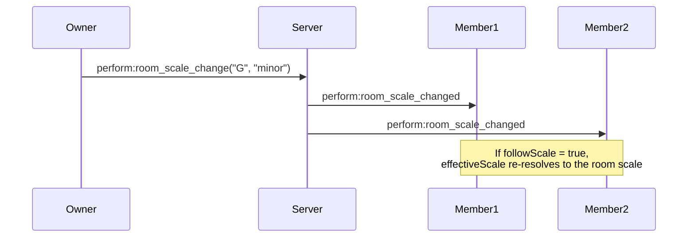
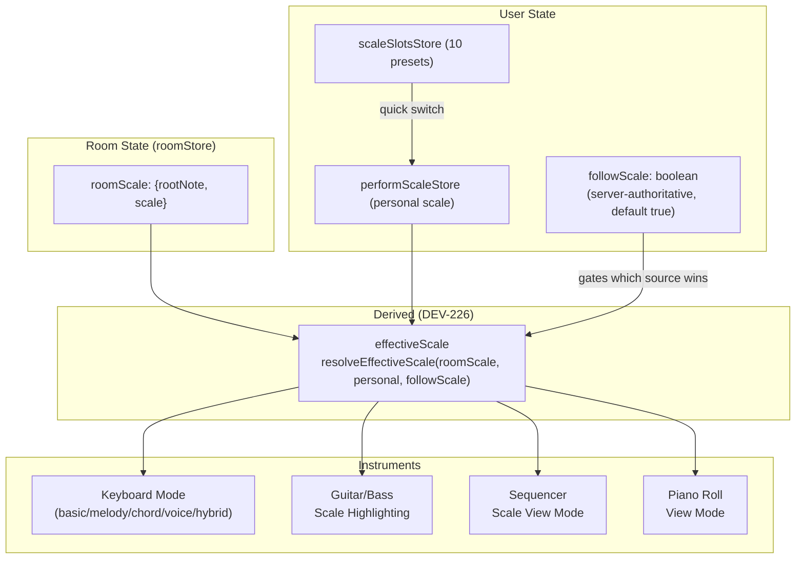

# Music Theory System

Complete guide to the music theory assistance system - a core differentiating feature that helps beginners stay in key while giving advanced users powerful creative tools.

---

## 📑 Table of Contents

- [Overview](#overview)
- [Scale Definition](#scale-definition)
- [Room-Wide Scale Synchronization](#room-wide-scale-synchronization)
- [Virtual Keyboard Modes](#virtual-keyboard-modes)
- [Sequencer Scale View](#sequencer-scale-view)
- [Piano Roll Scale View](#piano-roll-scale-view)
- [Data Flow Architecture](#data-flow-architecture)
- [MIDI Standard and Octave Convention](#midi-standard-and-octave-convention)

---

## Overview

The Music Theory System synchronizes scale settings across all connected users and instruments, providing:

- **Beginner-Friendly**: Impossible to play wrong notes in Melody/Chord modes
- **Advanced Tools**: Full chromatic access with visual scale highlighting
- **Real-time Sync**: Scale changes propagate to all users instantly
- **Flexible**: Users can follow room owner's scale or use their own

---

## Scale Definition

### Powered by Tonal.js

The app leverages [Tonal.js](https://github.com/tonaljs/tonal) for accurate music theory calculations, providing professional-grade scale generation, chord construction, and note transposition.

### Supported Scale Types

**19 scales across 6 categories:**

| Category       | Scales                                                |
| -------------- | ----------------------------------------------------- |
| **Diatonic**   | Major, Minor (Natural), Harmonic Minor, Melodic Minor |
| **Modes**      | Dorian, Phrygian, Lydian, Mixolydian, Locrian         |
| **Pentatonic** | Major Pentatonic, Minor Pentatonic, Egyptian          |
| **Blues**      | Major Blues, Minor Blues                              |
| **World**      | Hirajoshi (Japanese), Pelog (Indonesian), Vietnamese  |
| **Other**      | Bebop, Diminished                                     |

### Scale Generation

Notes are dynamically generated using Tonal.js:

```typescript
// Using Tonal.js Scale.get()
getScaleNotes(root: "C", scale: "major", octave: 3)
// → ["C3", "D3", "E3", "F3", "G3", "A3", "B3"]

getScaleNotes(root: "D", scale: "hirajoshi", octave: 4)
// → ["D4", "E4", "F4", "A4", "Bb4"]
```

---

## Room-Wide Scale Synchronization

### How It Works



### Key Concepts

| Concept              | Description                                                  |
| -------------------- | ------------------------------------------------------------ |
| **Room Scale**       | Room owner broadcasts the shared scale (`roomScale`) to all members |
| **Follow Mode**      | Members toggle `followScale` (server-authoritative, default `true` for joining band members) to auto-sync to the room scale |
| **Scale Slots**      | 10 quick-switch presets (hotkeys 1-0) for fast scale changes |
| **Independent Mode** | Members can disable follow to use their own scale            |

> **DEV-226 (unified scale model):** every instrument/sequencer/pitch-effect consumer reads the derived `effectiveScale` (`resolveEffectiveScale(roomScale, personalScale, followScale)`), not `roomScale` directly — see `.claude/skills/perform-room/SKILL.md` § Unified scale model.

### Hum-to-Find Scale

**Automatic Scale Detection:**
- Sing or hum into your microphone
- Audio input device selector for choosing microphone
- Always-on audio level meter for monitoring input
- Real-time pitch detection analyzes your melody
- System automatically detects the best matching key and scale
- One-click apply to set room scale

---

## Virtual Keyboard Modes

The keyboard component supports five modes that change how physical keyboard input maps to notes:

### 1. Basic Mode (Piano Layout)

**Full Chromatic Keyboard:**
- All 12 notes per octave are playable
- Traditional piano key mapping
- Suitable for experienced players who want full control

**Key Mapping:**
```
Row 1 (Black keys): W E   T Y U   O P
Row 2 (White keys): A S D F G H J K L ; '
```

### 2. Melody Mode (Scale-Only)

**Only scale notes are mapped to keys. Impossible to play wrong notes!**

```
Physical Keys: A S D F G H J K L ; ' (and upper row)
      ↓
Scale Notes: C D E F G A B C D E F (in C Major)
```

**Benefits:**
- Beginners can play melodies without music theory knowledge
- Every key produces a "correct" note in the current scale
- Octave controls (Z/X) to shift range
- Perfect for improvisation and learning

**Example in C Major:**
- Press A → plays C
- Press S → plays D
- Press D → plays E
- No matter what you press, it's always in key!

### 3. Chord Mode (One-Key Chords)

**Each key plays a complete chord.**

**Smart Chord Generation:**
- Chord quality (major/minor/diminished) is automatically determined by analyzing scale degree intervals
- Non-standard scales (pentatonic, blues, world) use their parent diatonic scale for chord generation
- Example: Minor Pentatonic → Minor scale chords, Major Pentatonic → Major scale chords

**Chord Quality Rules (based on scale position):**

| Scale     | I     | ii    | iii   | IV    | V     | vi    | vii°  |
| --------- | ----- | ----- | ----- | ----- | ----- | ----- | ----- |
| **Major** | Major | minor | minor | Major | Major | minor | dim   |
| **Minor** | minor | dim   | Major | minor | minor | Major | Major |

**Chord Modifiers (hold modifier key + chord key):**

| Modifier       | Effect               | Example   |
| -------------- | -------------------- | --------- |
| Dominant 7     | Adds b7              | C → C7    |
| Major 7        | Adds major 7th       | C → Cmaj7 |
| sus2           | Replace 3rd with 2nd | C → Csus2 |
| sus4           | Replace 3rd with 4th | C → Csus4 |
| 6              | Adds 6th             | C → C6    |
| add9           | Adds 9th (no 7th)    | C → Cadd9 |
| Power Chord    | Root + 5th only      | C → C5    |
| Maj/Min Toggle | Flip chord quality   | Cm → C    |

**Chord Voicing (octave shift):**
- Range: -2 to +2 (C/V keys)
- Shifts the base triad octave up/down
- All 3 triad notes land in the same target octave (close voicing); tension notes (7th, 9th) placed strictly above the highest triad note

**Wide Range toggle (Digit0):**
- Raises the 3rd (or the sus tone) and the 7th/6th one octave, leaving root and 5th in place — the R-5-10 spread (e.g. `C3 G3 E4` instead of `C3 E3 G3`)
- **Only applies while the chord stays inside the octave** — a triad, 6, dom7, maj7 or sus. A chord that already reaches a 9th, 11th or 13th keeps its close voicing, because spreading it pushes the upper structure up again: a 13th ends up spanning nearly three octaves, and a lone add9/add11 leaves a 10-13 semitone gap at the top, where close intervals belong
- Detected from the chord SYMBOL's intervals, never from the rendered notes (`chordHasCompoundTension` / `applyWideRangeVoicing` in `shared/src/music/musicUtils.ts`). `Cadd9` and `C7` both have four notes, but only `Cadd9` states a 9th — and the rendered voicing cannot tell you which, because `voiceChordNotes` appends the same octave digit to each pitch class of the base triad, so `G7` comes out `G3 B3 D3 F4` (a 15-semitone span holding no compound tension) while `Aadd9` comes out `A3 C#3 E3 B3` (a 10-semitone span that is a 9th chord). For this reason the Wide Range decision is made inside `getChordFromDegree`, via its `{ wideRange: true }` option, rather than by the caller holding the notes
- Available in Chord Mode and Hybrid Mode. Chord Voice mode uses the raw spread (`applyOpenVoicing`) at any chord size, since the player picks one chord tone per finger

### 4. Chord Voice Mode

**Select a chord degree, then finger each note individually.**

**Workflow:**
1. Press Q–U to select a chord degree (I–VII) — selection persists until changed
2. Press H to play the bass root at the root octave (Z/X to shift bass octave)
3. Press J/K/L/;/' to finger root/3rd/5th/7th/9th individually

**Note Stacking Rules:**
- Natural stacking: each chord tone placed strictly above the previous, starting from the chordVoicing base octave (C/V to shift)
- 7th type derived from the actual scale interval — V chord (G in C major) uses dominant7 (Bb), not major7
- 9th derived directly from the parent scale (no Tonal chord parser)
- Bass (H) is independent of the chord tone stack — pitch set by rootOctave (Z/X)

**Key Mapping:**
```
Q W E R T Y U   → Select degree I II III IV V VI VII
H               → Bass root (at rootOctave)
J K L ; '       → Root / 3rd / 5th / 7th / 9th
```

Available on both Keyboard and Guitar instruments.

### 5. Hybrid Mode

**Two-hand split: chords on left, melody on right.**

- Left hand keys: chord layout (same as Chord Mode — 1 key = 1 chord)
- Right hand keys: melody layout (same as Melody Mode — scale-only notes)
- Wide Range toggle (Digit0) available for open chord voicing
- Available on both Keyboard and Guitar instruments

---

## Sequencer Scale View

The step sequencer can filter displayed rows based on the current scale:

### View Modes

| View Mode       | Rows Shown                                              |
| --------------- | ------------------------------------------------------- |
| **All Notes**   | All chromatic notes (C, C#, D, D#, ...)                 |
| **Scale Notes** | Only in-scale notes + any out-of-scale notes with steps |
| **Drum Mode**   | General MIDI percussion (not affected by scale)         |

### Visual Feedback

**In-scale notes:** Normal color (full opacity)
**Out-of-scale notes:** Dimmed/different color with ⚠️ warning indicator

This helps users:
- Focus on scale notes for melodic patterns
- Identify out-of-scale notes that may need adjustment
- Maintain harmonic consistency across patterns

### Scale-Aware Pattern Creation

When creating patterns in Scale Notes view:
- Only scale notes are easily accessible
- Out-of-scale notes are still available but visually distinct
- Helps beginners stay in key while learning
- Advanced users can intentionally add chromatic notes for color

---

## Piano Roll Scale View

Similar filtering for the Arrange Room piano roll editor:

### View Modes

```typescript
type ViewMode = "all-keys" | "scale-keys" | "only-notes";

getVisibleMidiNumbers(viewMode, rootNote, scale, notes);
```

| View Mode      | Behavior                                               |
| -------------- | ------------------------------------------------------ |
| **All Keys**   | Show all 128 MIDI notes                                |
| **Scale Keys** | Show only notes in scale + existing out-of-scale notes |
| **Only Notes** | Show only rows that have notes (compact)               |

### Out-of-Scale Detection

```typescript
isNoteInScale(midiNumber: 60, rootNote: "C", scale: "major")
// Check: (60 % 12) exists in [0, 2, 4, 5, 7, 9, 11] relative to root
// → true (C is in C major)
```

**Visual Indicators:**
- In-scale notes: Normal piano key color
- Out-of-scale notes: Highlighted with warning color
- Helps maintain harmonic consistency during editing

### Benefits

1. **Compact View**: Only Notes mode shows just the rows with data
2. **Scale Focus**: Scale Keys mode helps stay in key
3. **Full Control**: All Keys mode for chromatic editing
4. **Visual Feedback**: Out-of-scale warnings prevent accidental dissonance

---

## Data Flow Architecture

### System Overview



### State Management

**Room State:**
- `roomScale`: Current shared scale set by the room owner (`roomStore`)
- Broadcasted to all members via Socket.IO (`perform:room_scale_change(d)`)
- Persisted in room state on backend

**User State:**
- `performScaleStore`: Personal scale for this user
- `followScale`: Server-authoritative boolean flag (on `BandMember`), default `true` for joining band members, always `false` for the owner
- `scaleSlotsStore`: 10 saved scale presets (hotkeys 1-0) — never overwritten by following

**Derived (DEV-226 — unified scale model):**
- `effectiveScale = resolveEffectiveScale(roomScale, personalScale, followScale)` — a shared pure selector in `@jam-band/shared`
- Exposed via the room-specific wrapper hook `usePerformEffectiveScale()`
- Every instrument/sequencer/pitch-effect consumer reads `effectiveScale`, never the raw `roomScale` directly — only room-key DISPLAY consumers read the raw shared key

**Instrument Integration:**
- All instruments subscribe to `effectiveScale` changes
- Automatically update visual indicators
- Keyboard modes adjust note mapping
- Sequencer/Piano Roll update visible rows

### Scale Synchronization Flow

1. **Owner Changes Scale**:
   - Owner updates scale via UI
   - Client emits `perform:room_scale_change`
   - Server broadcasts `perform:room_scale_changed` to all members

2. **Members Receive Update**:
   - `effectiveScale` re-resolves via `resolveEffectiveScale`
   - If `followScale = true`: `effectiveScale` reflects the new `roomScale`
   - If `followScale = false`: `effectiveScale` stays on the member's personal scale
   - Visual indicator shows the room's current scale

3. **Instruments React**:
   - Subscribe to `effectiveScale` changes
   - Update keyboard mappings (Melody/Chord modes)
   - Update visual highlighting (Guitar/Bass fretboard)
   - Update visible rows (Sequencer/Piano Roll)

### Scale Slots (Quick Presets)

**10 Preset Slots (1-0 keys):**
- Save current scale to slot
- Load scale from slot with single keypress
- Persisted in local storage
- Independent from room owner scale

**Use Cases:**
- Quick switching between common scales
- Save favorite scales for different songs
- Experiment with different modes rapidly

---

## MIDI Standard and Octave Convention

The application uses the **Scientific Pitch Notation (SPN) / MIDI Standard** for all note-name to MIDI-pitch calculations and mappings, rather than the Yamaha convention.

### Octave Mapping Comparison

| Pitch | MIDI Number | Scientific (SPN) | Yamaha | Status in App |
|---|---|---|---|---|
| **Middle C** | 60 | **C4** | C3 | **Enforced (Scientific)** |
| **Lowest Drum Pad Note** | 36 | **C2** | C1 | **Enforced (Scientific)** |

### Usage in Codebase

- **Shared Helpers**: Use the functions `midiPitchToNoteName` and `noteNameToMidiPitch` in `app/frontend/src/shared/utils/generalMidiPercussion.ts` for all conversions.
- **Audio Engines**: Instruments loaded via Tone.js or smplr natively expect Middle C to be C4 (60).
- **General MIDI Percussion Map**:
  - Kick Drum: `C2` (MIDI 36)
  - Snare Drum: `D2` (MIDI 38)
  - Closed Hi-hat: `F#2` (MIDI 42)
  - Open Hi-hat: `A#2` (MIDI 46)
