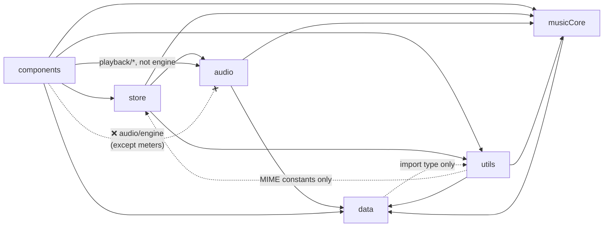
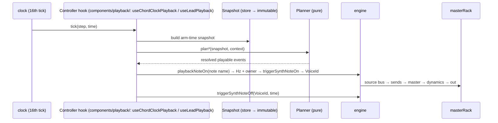

# Solna — Feature & Module Overview

A high-level map of what the app does and how the code is organised. For the rules behind each
boundary, `CLAUDE.md`, `.claude/rules/` and `docs/decisions/` are authoritative; this page is the bird's-eye view. The code-verified,
file-cited map (component tree, every slice, node graph, real import graph, findings) is in
[`structure/`](structure/README.md).

## 1. User-facing features

Solna has **2 layers → 4 views**, plus **4 Pattern segments**, plus cross-cutting features.

| # | Feature | Where | What it does |
|---|---------|-------|--------------|
| 1 | **Sound** view | Loop layer | Per-track synth design (oscillator, filter, envelopes, LFO, voice, arp), preset library, Beat kit editor, sound mixer with per-track reverb/delay/distortion sends |
| 2 | **Pattern** view | Loop layer | Sequencing, split into 4 segments ↓ |
| 2a | ↳ Lead | Pattern | Pitch-matrix melody grid, note length/resize, live Rec |
| 2b | ↳ FX | Pattern | Second melody track (lead's twin) for risers / effects |
| 2c | ↳ Accompaniment | Pattern | Chord progression, chord rhythm, bass pattern, pad — preset or custom span timelines |
| 2d | ↳ Beat | Pattern | 11-voice drum step sequencer, drum-grid library |
| 3 | **Arrange** view | Song layer | Order loops into a song, copy loops, song-mode playback, delete a loop with a timed Undo toast, change the key of several loops (Set/Transpose) with Undo |
| 4 | **Master** view | Song layer | Master effects rack: reverb, delay, distortion, 3-band EQ, compressor, limiter (with gain-reduction meters), Monitor visualizer. Every track, the Beat bus included, has its own reverb, delay and distortion send levels per loop (Mixer Rev/Dly/Dist knobs). Beat drums reach reverb through their per-voice reverb sends scaled by the Beat track's reverb send, and reach delay and distortion through the Beat track's delay and distortion sends |
| 5 | Loops | Loop selector | Multiple loops per project, copy/paste loops and modules |
| 6 | Instant Vibes | Top bar | 8 genre presets (Lo-Fi Chill, Synthwave 80s, Cyber EDM, Deep Ambient, Boom Bap, Zen Garden, Lo-Fi Waltz, Afro 6/8) + dice reroll |
| 7 | Transport & music context | TransportBar (bottom) + Header (desktop) / MobileTopBar (mobile) | Play/stop, BPM, meter, metronome, playhead in TransportBar (on mobile: one row, the rest in its transport sheet); key & scale in the frame's top bar |
| 8 | Performance input | Bottom dock + Sound view | Dock: focus chip, QWERTY / on-screen keyboard, drum pads (per-pad velocity persisted). Arpeggiator is a per-track Sound panel; Web MIDI is a background bridge; solo/mute live on the mixer |
| 9 | Project management | Project menu | IndexedDB autosave, `.solna` file open/save, Google Drive open/save |
| 10 | Export (mixdown WAV, MIDI, stems) | Header Export button (song layer) → Export dialog | Offline render of the song to WAV, the song timeline to a Standard MIDI File, or dry per-track stems in one ZIP; one job at a time, kinds as data (`store/exportKinds.ts`) |
| 11 | Audio health & recovery | Transport | AudioContext health monitor; recovery is a branch of `IncidentDialog`, surfaced by the `IncidentWarning` chip |
| 12 | Incident reporting | Dialog | Privacy-safe bug reports, explicit GitHub export |
| 13 | Diagnostics | Project menu → Tools (DEV builds only) | Session recorder, render counts, exportable diagnostics |
| 14 | PWA | Background | Service worker, update prompt |

## 2. Code modules (`src/`)

| Module | Role | Key files |
|--------|------|-----------|
| `data/` | Pure factory content; no runtime imports (type-only imports allowed) | `synthPresets`, `beatPresets`, `drumGrids`, `chordProgressions`, `chordRhythms`, `bassPatterns`, `effectChains`, `scales`, `vibes` |
| `musicCore/` | Music theory domain (the only `tonal` user) | `tonalAdapter`, `chordQuality`, `pitch`, `scale` |
| `utils/` | Helpers (theory, timing, gain units, meters, WAV encode, storage); not all pure — no layering block | `musicTheory`, `noteSpelling`, `gainUnits`, `meterScheduler`, `encodeWav` |
| `audio/` | Raw Web Audio engine, plus root-level pattern/melody logic that builds no nodes | `engine` (singleton), `masterRack`, `synth/*` (subtractive voices), `drumSynth`, `clock`, `leadMelody`, `chordRhythms` |
| `audio/playback/` | Engine bridges + planners (controllers themselves are hooks in `components/`) | `playbackEngine`, `plan/{padPlan,chordPlan,melodyPlan,chordEvents,beatPlan,songSnapshot,songTimeline}`, `chordPlayback`, `synthPlayback`, `arpPlayback`, `noteInputBus` |
| `audio/export/` | Offline mixdown, MIDI and stems export | `renderMixdown`, `renderMidi`, `renderStems` |
| `audio/runtime/` | AudioContext session & health | `audioSession`, `healthMonitor`, `policy` |
| `store/` | Zustand store (slices) + bridges | `store`, `*Slice`, `engineSync`, `sanitize`, `projectStore`, `projectAutosave`, `drive*`, `midiInput`, `vibes` |
| `components/` | React views **and**, in `components/playback/`, the transport controller hooks mounted by `PlaybackHost` (`useChordClockPlayback`, `useLeadPlayback`, `useSequencerPlayback`) plus `useInputDeck` | `loop/*`, `song/*`, `project/*`, `ui/*`, `shell/*` (`DesktopShell`, `MobileShell`, `MobileTopBar`, `MobileTabBar`, `useLayoutMode`), `header/*`, `Header`, `TransportBar`, `InstantVibesBar` |
| `routing/` | URL ↔ layer/tab/loop | `tabRouting`, `useRouteSync` |
| `incidents/` | Bug-report privacy boundary | `recorder`, `sanitize`, `githubReport` |
| `diagnostics/` | Dev diagnostics recorder (imports store, engine and UI directly) | `recorder`, `DiagnosticPanel` |
| `pwa/` | Service worker | `serviceWorker`, `useServiceWorkerUpdate` |
| `architecture/` | Cross-cutting architecture tests only | `dependencyLayers.test.ts` |

## 3. High-level architecture

```mermaid
flowchart TB
  subgraph UI["components/ (React views — all mounted, gated hidden/block)"]
    direction TB
    Header["Layout shell (DesktopShell / MobileShell)<br/>Header or MobileTopBar + MobileTabBar · TransportBar · InstantVibesBar"]
    subgraph LoopL["Loop layer"]
      Sound["Sound view<br/>synth · Beat kit · mixer"]
      Pattern["Pattern view<br/>Lead · FX · Accompaniment · Beat"]
    end
    subgraph SongL["Song layer"]
      Arrange["Arrange view"]
      Master["Master view (FX rack)"]
    end
    Dock["Bottom input dock<br/>focus chip · keyboard · drum pads"]
    ProjectUI["Project menu · Drive browser"]
  end

  Routing["routing/<br/>URL ↔ layer / tab / loopId"]

  subgraph Store["store/ — one Zustand store"]
    Slices["slices (store.ts binds): transport · musicContext · synth · chords · bass · pad<br/>lead · fx · beat · effects · ui · presets · loop · loopCopy · project · export · drive<br/>+ separate audioRecovery store"]
    EngineSync["engineSync<br/>store → engine bridge for persistent state"]
    Snapshots["playbackPlanSnapshots · mixdownSnapshot"]
    Persist["persist + sanitize<br/>(validate, no migrations;<br/>serialise only when a persisted value changed)"]
    Autosave["projectAutosave · projectStore<br/>(IDB: 1 object store, 1 key)"]
    MIDI["midiInput"]
  end

  subgraph Audio["audio/ — raw Web Audio API"]
    Planners["playback/plan/<br/>pure planners"]
    Controllers["playback bridges (playbackEngine, synthPlayback)<br/>driven by hooks in components/"]
    Clock["clock (shared 16th)"]
    Engine["engine singleton"]
    Synth["synth/ voice manager<br/>subtractive voices"]
    Drums["drumSynth (11 voices)"]
    Rack["masterRack<br/>buses · sends (not the Beat bus) · dynamics · analysers"]
    Export["export/renderMixdown · renderStems<br/>(OfflineAudioContext)"]
    Midi["export/renderMidi<br/>(no AudioContext)"]
    Runtime["runtime/ health · session"]
  end

  subgraph Domain["Pure domain"]
    MusicCore["musicCore/<br/>(only tonal importer)"]
    Utils["utils/"]
    Data["data/<br/>presets · grids · progressions · vibes"]
  end

  subgraph Storage["Persistence"]
    LS[("localStorage<br/>live session")]
    IDB[("IndexedDB<br/>project slot")]
    Drive[("Google Drive<br/>optional")]
    File[(".solna / .wav files")]
  end

  Side["incidents/ · diagnostics/ · pwa/"]

  UI -- actions / selectors --> Store
  Routing <--> Store
  UI -. analyser reads only .-> Rack
  Pattern -- mounts controller hooks --> Controllers
  EngineSync -- setters --> Engine
  Snapshots --> Planners
  Controllers --> Planners
  Controllers --> Clock
  Controllers -- note name → Hz, owner, VoiceId --> Engine
  Engine --> Synth & Drums --> Rack
  Engine --> Runtime
  Snapshots --> Export
  Snapshots --> Midi
  Export -- createRenderEngine(ctx) --> Engine
  MIDI -- notes via synthPlayback --> Controllers
  MIDI -- CC patch edits --> Slices
  Slices -. "cuts · previews · lifecycle call engine directly" .-> Engine
  Persist <--> LS
  Autosave <--> IDB
  Store <--> Drive
  Store <--> File
  Store --> Data
  Audio --> Data
  Utils --> MusicCore
  Audio --> MusicCore
  Store --> Utils
  Side -. "incidents/: sanitized args only" .- Store
  Side -. "diagnostics/: reads store + engine directly (DEV)" .-> Engine
```

### Layering rules (enforced by ESLint)

- `data/` imports nothing at runtime (`import type` edges are allowed).
- `audio/` never imports `store/` or `components/`.
- `store/` never imports `components/`.
- `components/` never imports `audio/engine` (except the four analyser-reading meter components).
- `tonal` is imported only by `musicCore/tonalAdapter.ts`.
- In practice, 7 component files reach the engine through `audio/playback/playbackEngine.ts`,
  which lint allows; `utils/`, `diagnostics/` and `routing/` have no layering block at all.
  Details and measured edge counts: [structure/04](structure/04-domain-and-dependencies.md).

## 4. Playback flow (one note)

The same planners and snapshots drive `renderMixdown` offline through the song timeline
(`walkSongTimeline`), so the export matches live playback.
