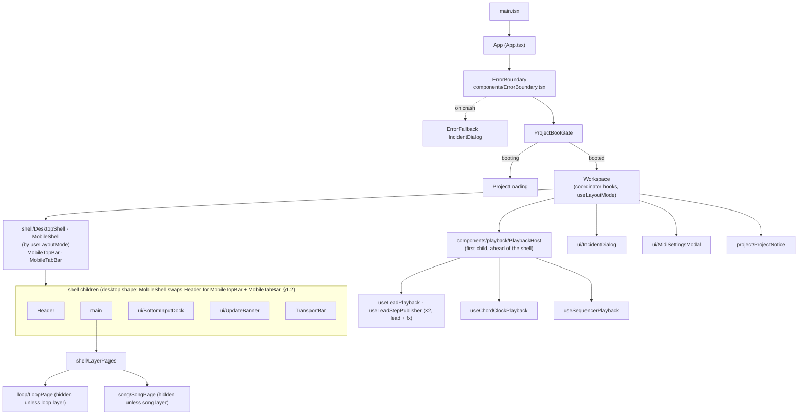
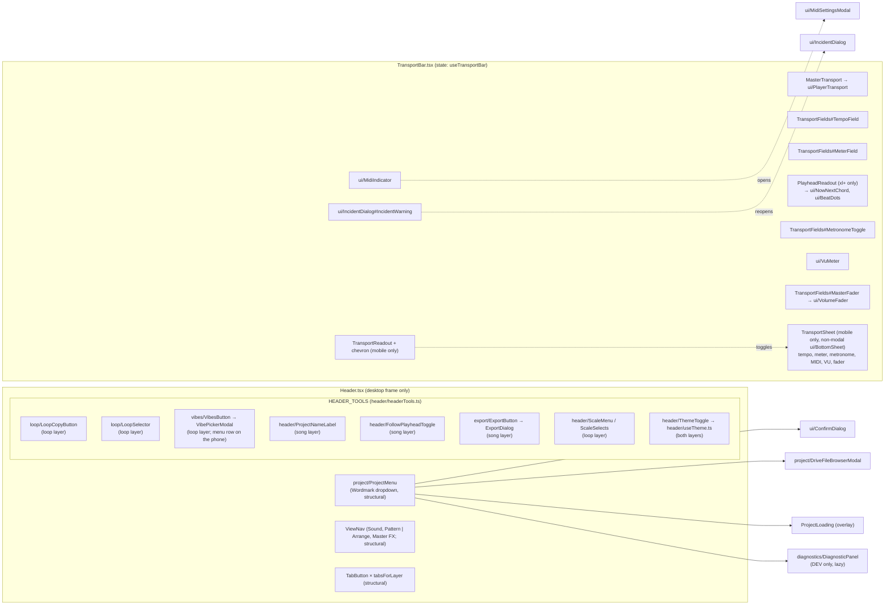
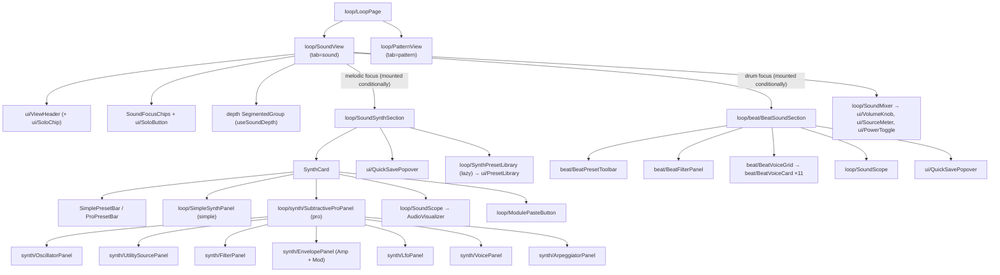
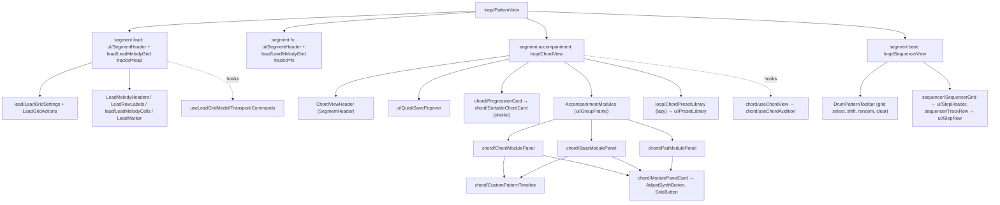
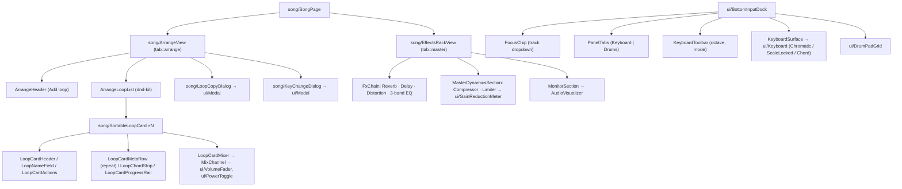

# 01 — UI layer: real structure (from source)

Scope: `src/main.tsx`, `src/App.tsx`, `src/components/**` (144 non-test files, ~29.1k lines),
`src/routing/`, `src/pwa/`. Everything below was read from code on 2026-09-21 (branch `main`,
HEAD `67008707`). Where a statement is inferred rather than observed it is marked **(uncertain)**.
Line numbers are `path:line` at that commit.

---

## 1. Component tree

### 1.1 Boot and shell

`main.tsx` renders `<App/>` inside `React.StrictMode` (`src/main.tsx:9-13`). `App` is three
nested components in one file:

| Level | Component | File | Role |
|---|---|---|---|
| 1 | `App` | `src/App.tsx:249` | Installs global incident capture + hydrates last incident (`src/App.tsx:252-255`); wraps everything in `ErrorBoundary`. |
| 2 | `ErrorBoundary` | `src/components/ErrorBoundary.tsx` | Class boundary; fallback `ErrorFallback` renders its own `IncidentDialog` (`ErrorBoundary.tsx:73`) and a Reload button (`:55`). |
| 3 | `ProjectBootGate` | `src/App.tsx:217` | Awaits `bootProject()`; shows `ProjectLoading` until settled, then `Workspace` (`src/App.tsx:241`). |
| 4 | `Workspace` | `src/App.tsx:92` | Mounts every coordinator hook, `PlaybackHost` and the dialogs; renders `DesktopShell` or `MobileShell` by `useLayoutMode()`. |

`Workspace` coordinator hooks (all mounted once, `src/App.tsx:95-152`): `useEngineSync`,
`useRouteSync`, `usePlayheadSync`, `useSongModeSync`, `useSoloNavClear`, `useFocusPanelSync`,
`useVibeNavClear`, `useInputDeck` (QWERTY + arp + drum pads), `useServiceWorkerUpdate`,
first-gesture `audioEngine.init()` + `applyEngineSnapshot()` (`:135-143`), idle-wake
(`:146-148`), `startAudioRecoveryBridge` (`:152`). Note `App.tsx` itself imports
`audioEngine` directly (`src/App.tsx:18`); it is outside `src/components/`, so the layering ban
does not apply to it.

`Workspace` render order (`src/App.tsx`):

1. `PlaybackHost` — first child of the root, ahead of the shell (DEV-422; position amended by
   ADR-0040)
2. The layout shell — `DesktopShell` or `MobileShell` (`src/components/shell/`), chosen by
   `useLayoutMode()`. Desktop (`DesktopShell`), in order:
   - `Header`
   - `<main>` → `shell/LayerPages` (`LoopPage` gated + `SongPage` gated)
   - `BottomInputDock`
   - `UpdateBanner`
   - `TransportBar`

   Mobile (`MobileShell`), in order:
   - `MobileTopBar` → the menu sheet
   - `<main>` → `shell/LayerPages`
   - `BottomInputDock`
   - `UpdateBanner`
   - `TransportBar` — without the bottom inset, `variant="mobile"`: one row, its settings in the
     non-modal transport sheet (`TransportSheet`) rendered inside the bar
   - `MobileTabBar` — owns the bottom inset
3. `IncidentDialog` (also the audio-recovery modal)
4. `MidiSettingsModal`
5. `ProjectNotice`

### 1.2 Header and transport

### 1.3 Loop layer

### 1.4 Song layer, dock and dialogs

---

## 2. Feature inventory

"Where" = the surface a user sees it on.

### 2.1 Global shell

| # | Feature | Where | File |
|---|---|---|---|
| 1 | Boot loading screen | Before workspace | `src/components/ProjectLoading.tsx`, `src/App.tsx:241` |
| 2 | Crash fallback with Reload + details (DEV) + incident dialog | Replaces app | `src/components/ErrorBoundary.tsx:30-73` |
| 3 | Project menu (Wordmark dropdown) | Header, left | `src/components/project/ProjectMenu.tsx:519` |
| 4 | New project (with replace-confirm) | Project menu | `ProjectMenu.tsx:87-91,183-192` |
| 5 | Open `.solna` (local file input) | Project menu → Local | `ProjectMenu.tsx:96,586-592` |
| 6 | Save / Save to Drive (label follows source) | Project menu → Local | `ProjectMenu.tsx:78,118-120` |
| 7 | Save as… (local) | Project menu → Local | `ProjectMenu.tsx:98` |
| 8 | Open from Drive (browser modal) | Project menu → Drive | `ProjectMenu.tsx:105`, `project/DriveFileBrowserModal.tsx` |
| 9 | Save as to Drive… | Project menu → Drive | `ProjectMenu.tsx:106` |
| 10 | Connect / Disconnect Drive, account label | Project menu → Drive | `ProjectMenu.tsx:107,123` |
| 11 | Report a Bug (manual incident) | Project menu → Tools | `ProjectMenu.tsx:81-84` |
| 12 | Diagnostics panel (DEV builds only) | Project menu → Tools | `ProjectMenu.tsx:21-22,620-624` |
| 13 | Loop / Song layer (implied by the tab, no switch — ADR-0042) | Header | `Header.tsx` `ViewNav` |
| 14 | View tabs (Sound, Pattern / Arrange, Master FX) | Header | `Header.tsx` `TabButton`, `ViewNav`; `viewMeta.ts` |
| 15 | Copy loop sections to clipboard | Header (loop layer) | `loop/LoopCopyButton.tsx` |
| 16 | Active-loop selector | Header (loop layer) | `loop/LoopSelector.tsx` |
| 17 | Project name edit (Enter/Escape/blur) | Header (song layer) | `header/ProjectNameLabel.tsx` |
| 18 | Follow playhead toggle | Header (song layer) | `header/FollowPlayheadToggle.tsx` |
| 19 | Export dialog (kinds, progress, cancel) | Header Export button (song layer) → dialog | `src/components/export/` |
| 20 | Master key & scale (inline ≥xl, dropdown below) | Header (loop layer) | `header/ScaleMenu.tsx` |
| 21 | Light/dark theme toggle (persisted `solna_theme`) | Header, right | `header/ThemeToggle.tsx`, `header/useTheme.ts` |
| 22 | Vibe picker — open, preview a vibe on the current loop | Header Vibes tool (loop layer; menu row on the phone) → modal | `vibes/VibesButton.tsx`, `vibes/VibePickerModal.tsx`, `vibes/useVibePicker.ts`, `store/vibePreview.ts` (`beginVibePreview`, `previewVibe`) |
| 23 | Vibe dice reroll (previewed card only) | Vibe picker card | `vibes/VibePickerModal.tsx`, `vibes/useVibePicker.ts`, `store/vibePreview.ts` (`rerollPreview`) |
| 24 | Preview Play/Stop, Use (with its toast), Cancel (restores the loop) | Vibe picker footer | `vibes/useVibePicker.ts`, `store/vibePreview.ts` (`playPreview`, `stopPreview`, `commitVibePreview`, `cancelVibePreview`) |
| 25 | Preview module prefetch (lazy chunk on hover/focus) | Header Vibes tool | `vibes/useVibePicker.ts` (`prefetchVibePreview`) |
| 26 | Play / soft stop / hard stop (loop solo vs song playAll) | Transport bar | `TransportBar.tsx` (`MasterTransport`), `useTransportBar.ts` (`onPlay`), `ui/PlayerTransport.tsx` |
| 27 | Play-target label + Song-mode badge | Transport bar | `useTransportBar.ts` (`songModeLabel`), `TransportBar.tsx` (`MasterTransport`) |
| 28 | BPM field with −/+ | Transport bar (mobile: transport sheet) | `TransportFields.tsx` (`TempoField`) |
| 29 | Time signature (meter) select | Transport bar (mobile: transport sheet) | `TransportFields.tsx` (`MeterField`), `meterSelect.ts` |
| 30 | Now/next chord + beat dots readout (≥xl only) | Transport bar | `PlayheadReadout.tsx`, `TransportBar.tsx` |
| 31 | Metronome toggle | Transport bar (mobile: transport sheet, dot on the readout) | `TransportFields.tsx` (`MetronomeToggle`) |
| 32 | MIDI activity indicator (opens MIDI settings) | Transport bar (mobile: transport sheet) | `ui/MidiIndicator.tsx` |
| 33 | Incident / audio-recovery warning chip | Transport bar | `ui/IncidentDialog.tsx:137` |
| 34 | Master VU meter | Transport bar (mobile: transport sheet) | `ui/VuMeter.tsx` |
| 35 | Master volume fader | Transport bar (mobile: transport sheet) | `TransportFields.tsx` (`MasterFader`) |
| 36 | MIDI settings: device select, mappings, MIDI learn, reset | Modal | `ui/MidiSettingsModal.tsx:9-17,255` |
| 37 | Audio-recovery modal (Recover / Retry / Reload / Not now) | Modal (shared with incident) | `ui/IncidentDialog.tsx:154-238` |
| 38 | Incident report: preview, Share/Copy/Download, Discard, Report on GitHub | Modal | `ui/IncidentDialog.tsx:186-225` |
| 39 | Project notice (storage-unavailable/save/load failures, unrecognised references) | Root banner | `project/ProjectNotice.tsx` |
| 40 | PWA update banner (Reload / dismiss), hourly poll | Above transport | `ui/UpdateBanner.tsx`, `src/pwa/useServiceWorkerUpdate.ts` |
| 41 | Solo chip (shows solo set, "Clear solo") | Every `ViewHeader`/`HeaderCard` | `ui/SoloChip.tsx`, `ui/ViewHeader.tsx:121` |

### 2.2 Input dock and keyboard shortcuts

| # | Feature | Where | File |
|---|---|---|---|
| 42 | Dock show/hide + collapsed summary | Dock tab strip | `ui/BottomInputDock.tsx:102,334-351` |
| 43 | Focus chip — which track the keyboard plays (6 values) | Dock, always visible | `ui/BottomInputDock.tsx:50` |
| 44 | Panel tabs Keyboard / Drums | Dock | `ui/BottomInputDock.tsx:135` |
| 45 | Keyboard mode Chromatic / Scale / Chord | Dock toolbar | `ui/BottomInputDock.tsx:20-30,164` |
| 46 | Octave down/up buttons | Dock toolbar | `ui/BottomInputDock.tsx:195-209` |
| 47 | On-screen keyboard (3 layouts) | Dock | `ui/Keyboard.tsx` |
| 48 | Drum pads (10 pads, per-pad velocity slider; velocity persisted as `drumPadVelocities`, committed on release) | Dock → Drums | `ui/DrumPadGrid.tsx`, `components/drumPadVelocity.ts` |
| 49 | QWERTY note keys (mode-dependent map) | Global | `useInputDeck.ts:519-590` |
| 50 | `-` / `=` octave shortcut | Global | `useInputDeck.ts:533-540` |
| 51 | Drum-pad keys Z X C V B N M , . / | Global | `useInputDeck.ts:624-635`, `ui/DrumPadGrid.tsx:31-40` |
| 52 | Arpeggiated live input (when focused track's arp active) | Global | `useInputDeck.ts:703` |
| 53 | Held-note release on blur / visibility change | Global | `useInputDeck.ts:429` (`useHeldNoteRelease`) |

### 2.3 Sound view (loop layer)

| # | Feature | Where | File |
|---|---|---|---|
| 54 | Focus chips (Lead, FX, Chord, Bass, Pad, Drums) | Sound header | `loop/SoundView.tsx:59` |
| 55 | Solo focused track | Sound header | `loop/SoundView.tsx` (`SoloButton id=btn-solo-target`) |
| 56 | Depth switch: Simple/Pro (melodic), Simple/Essential/All (drum), persisted in localStorage | Sound header | `loop/useSoundDepth.ts:55-70` |
| 57 | Synth preset bar — Simple category chips / Pro category tabs + picker + prev/next | Synth card | `loop/SoundSynthSection.tsx:44-66,143-430` |
| 58 | Simple synth macro controls | Synth card (simple) | `loop/SimpleSynthPanel.tsx:73,369` |
| 59 | Pro panels: Oscillators, Sub/Noise, Filter, Amp env, Mod env, LFO, Voice, Arp | Synth card (pro) | `loop/synth/SubtractiveProPanel.tsx`, `loop/synth/*Panel.tsx` |
| 60 | Synth quick-save popover | Synth card | `SoundSynthSection.tsx:454`, `ui/QuickSavePopover.tsx` |
| 61 | Sound library drawer: search, audition, delete custom, import/export JSON | Drawer | `loop/SynthPresetLibrary.tsx:429-483`, `ui/PresetLibrary.tsx` |
| 62 | Scope (waveform visualizer) | Synth card, Beat section | `loop/SoundScope.tsx`, `AudioVisualizer.tsx` |
| 63 | Module paste (loop clipboard → this sound) | Synth/Beat cards | `loop/ModulePasteButton.tsx` |
| 64 | Beat preset select (Factory / My Presets) + prev/next | Beat section | `loop/beat/BeatPresetToolbar.tsx:72-164` |
| 65 | Beat preset save / reset kit / reset voice | Beat section | `loop/beat/BeatSoundSection.tsx:95-172` |
| 66 | Beat bus filter | Beat section | `loop/beat/BeatFilterPanel.tsx` |
| 67 | Per-voice cards (11) with knobs + preview | Beat section | `loop/beat/BeatVoiceCard.tsx`, `beatControlSchema.ts` |
| 68 | Mixer: 6 channel strips (level, mute, meter, Rev/Dly/Dist sends) in 3 groups | Sound, bottom | `loop/SoundMixer.tsx:25-47,234` |

### 2.4 Pattern view (loop layer)

| # | Feature | Where | File |
|---|---|---|---|
| 69 | Segment row Lead / FX / Accompaniment / Beat (sets focus) | Pattern header | `ui/SegmentedControl.tsx:90`, `viewMeta.ts` |
| 70 | Melody grid paint/erase cells, keyboard resize (arrows) | Lead / FX | `loop/lead/LeadMelodyCells.tsx:225-244`, `leadPaint.ts` |
| 71 | Note resize by drag | Lead / FX | `loop/lead/useLeadNoteResize.ts`, `ui/useSpanResize.ts` |
| 72 | Scale / chromatic row view | Lead / FX settings | `LeadGridControls.tsx:45` |
| 73 | Octave window up/down | Lead / FX settings | `LeadGridControls.tsx:72` |
| 74 | Melody loop length (bars) | Lead / FX settings | `LeadGridControls.tsx:107` |
| 75 | Step resolution | Lead / FX settings | `LeadGridControls.tsx:139` |
| 76 | Gate | Lead / FX settings | `LeadGridControls.tsx:166` |
| 77 | Rec arm (only on the focused melody grid) | Lead / FX actions | `LeadGridControls.tsx:241-255`, `useLeadGridModel.ts:148` |
| 78 | Copy / paste bar, clear melody | Lead / FX actions | `LeadGridControls.tsx:260-282` |
| 79 | Row-label note preview; column/bar select | Lead / FX grid | `LeadMelodyGrid.tsx:79-231` |
| 80 | Progression editor: add chord, quick-add palette (7ths; the chip auditions while held, its `+` appends), reorder (drag, ←/→), delete, root/quality/bars selects, hold-to-preview | Accompaniment | `loop/chord/ProgressionCard.tsx`, `chord/SortableChordCard.tsx` |
| 81 | Reharmonize + auto-reharmonize toggle | Accompaniment progression | `chord/ProgressionCard.tsx`, `chord/useChordView.ts` (`useProgressionHarmonize` reads `autoReharmonize`/`reharmonizedIndicator` from the store) |
| 82 | Save progression (quick-save) + success toast | Accompaniment header | `loop/ChordView.tsx` (`ChordViewHeader`) |
| 83 | Progression library: factory/custom, audition, load, delete, import/export JSON | Drawer | `loop/ChordPresetLibrary.tsx:454-733` |
| 84 | Chord module: rhythm preset/custom, custom span timeline, pattern bars, octave, feel, sound preset, hold-preview | Accompaniment | `chord/ChordModulePanel.tsx`, `chord/CustomPatternTimeline.tsx`, `chord/moduleFields.tsx` |
| 85 | Bass module: pattern preset/custom, note palette tool, bars, octave, feel, sound preset | Accompaniment | `chord/BassModulePanel.tsx`, `chord/bassStepChoice.ts` |
| 86 | Pad module: pad/drone mode, voicing, octave, drone degree, drone intervals, sound preset | Accompaniment | `chord/PadModulePanel.tsx` |
| 87 | "Adjust synth" jump (sets focus + Sound tab) and per-module Solo | Each module card | `chord/AdjustSynthButton.tsx`, `chord/ModulePanelCard.tsx` |
| 88 | Drum grid: step toggle, per-voice mute, level, preview | Beat segment | `loop/sequencer/TrackRow.tsx:81-154` |
| 89 | Drum-grid library select, shift ←/→, random, clear | Beat toolbar | `loop/SequencerView.tsx:229-318` |

### 2.5 Song layer

| # | Feature | Where | File |
|---|---|---|---|
| 90 | Arrange: add loop; per card select/cue, rename, edit (deep link to Sound), move up/down, duplicate, copy-parts-into, delete (with a timed Undo snackbar via the shared `FeedbackHost`, `song/useLoopUndo.ts`), drag reorder, audition "play only", repeat count, per-loop channel mixer, chord strip, progress rail, follow-playhead scroll | Arrange | `song/ArrangeView.tsx:229-431`, `song/SortableLoopCard.tsx:225-798` |
| 91 | Copy parts between loops (quick chips, per-group checkboxes, key/bar notices) | Arrange → dialog | `song/LoopCopyDialog.tsx:327` |
| 92 | Change the key of several selected loops at once — Set (one key for all) or Transpose (each loop's own root shifted, scale type kept), old-to-new preview per loop, with a timed Undo snackbar sharing the loop-delete Undo's feedback host | Arrange → dialog | `song/KeyChangeDialog.tsx`, `song/useKeyChangeDialog.ts`, `song/useLoopKeyChangeUndo.ts` |
| 93 | Master FX: Reverb, Delay, Distortion, 3-band EQ, Compressor, Limiter (with GR meters), Monitor visualizer (mode switch, paused off-tab) | Master | `song/EffectsRackView.tsx:73-176,333-694` |

---

## 3. Per-view dependencies

"Reads/writes" lists store fields/actions reached by selector or `getState()`. Dynamic selectors
(`s[FIELD_TABLE[target]]`) are expanded where the table was read.

| View / panel | Store reads | Store writes (actions) | Non-store deps |
|---|---|---|---|
| `Header` (`Header.tsx`) | `activeTab`, `scaleRoot`, `scaleType`, `projectName`, `followPlayhead` | `setActiveTab`, `setScaleRoot`, `setScaleType`, `setProjectName`, `toggleFollowPlayhead` | guarded `localStorage` for theme; `document.documentElement[data-theme]` |
| `ExportButton` (`export/`) | `exportJob`, `selectExportBusy` | `startExport`, `cancelExport` | — |
| `ProjectMenu` | `projectName`, `projectSource`, `drive*`, `selectExportBusy` | `newProject`, `saveProject`, `saveProjectAsLocal`, `openProjectFile`, `exportProjectFile`, `openFromDrive`, `saveAsToDrive`, `listDriveProjects`, `connectDrive`, `disconnectDrive`, `setProjectNotice` | `store/driveClient`, `store/projectFile`, `store/incidentReporter` (`reportManualIncident`), lazy `@/diagnostics/DiagnosticPanel` |
| `useVibePicker` (`vibes/`) | `isAnyPlayerActive`, `selectedVibeId` (via `ui/useLiveStore`, for the Current mark) | via the lazy `import('@/store/vibePreview')` → the preview commands (`beginVibePreview` … `cancelVibePreview`); `showFeedback` on Use | `data/vibes`, `ui/useTimedToast` (`scheduleTimeout`, the dice spin) |
| `TransportBar` | `bpm`, `meterId`, `masterVolume`, `metronomeActive`, `playbackScope`, `activeTab`, `activeLoopId`, `loops`, `songLoopIndex`, `aggregateAllPlayers` | `playAll`, `soloLoop`, `softStopAll`, `hardStopAll`, `setBpm`, `setMeter`, `setMasterVolume`, `toggleMetronome` | `ui/VuMeter` → `audioEngine` analyser; `diagnostics/renderCounts` |
| `PlayheadReadout` | `playheadChordIndex`, `playheadChordStartBeat`, `chords`, `meterId`, `scaleRoot/Type` | — | `usePlayheadBeat` (`components/playheadBeat.ts`, local pub/sub) |
| `BottomInputDock` | `isInputPanelOpen`, `inputPanelMode`, `focusTrack` (+ props from `useInputDeck`) | `setIsInputPanelOpen`, `setInputPanelMode`, `setFocusTrack` | — |
| `useInputDeck` (in `Workspace`) | `keyboardMode`, `scaleRoot/Type`, `bpm`, `focusTrack`, focused synth + arp via `SYNTH_PARAM_FIELD`/`SYNTH_ARP_FIELD` | `setKeyboardMode`, `setDrumPadVelocity` | `audio/playback/{synthPlayback,arpPlayback,heldNotes,noteInputBus,drumPlayback}`; `window` key listeners; local state for octave, active notes, pad-velocity drag preview |
| `IncidentDialog` / `IncidentWarning` | `incidents/incidentStore`, `store/audioRecovery` state (own `useSyncExternalStore`-style hooks, `IncidentDialog.tsx:27-34`) | `recoverAudio`, discard/dismiss/reopen | `navigator.share`, clipboard, `window.open` |
| `MidiSettingsModal` | `isMidiSettingsOpen`, `midiMappings`, `selectedMidiInputId`, `midiLearnTargetId` | `add/update/remove/resetMidiMappings`, `setSelectedMidiInputId`, `setMidiLearnTargetId`, `setIsMidiSettingsOpen` | `navigator.requestMIDIAccess` (device list only; the MIDI bridge itself is `store/midiInput.ts`, started from `engineSync.ts:266`) |
| `SoundView` | `focusTrack`, `activeTab` | `setFocusTrack` | `useSoundDepth` (localStorage) |
| `SoundSynthSection` | focused `*SynthParams` / `*ArpSettings` via `useSynthChannel` (`synth/useSynthChannel.ts:60-67`), `customSynthPresets` | `set*SynthParams`, `set*ArpSettings`, `saveCustomPreset`, `deleteCustomPreset` | `useSynthPatchDraft` → `store/synthPatchPreview`; `audio/playback/presetPreview` (library audition) |
| `SoundMixer` | `isAnyPlayerActive`, per-channel volume/muted, `trackSends[source]` via `useTrackSendsDraft` | `setSynthVolume`…`setBeatLevel`, `toggle*Muted` (`SoundMixer.tsx:25-47`), `setTrackSends` via `useTrackSendsDraft` | `ui/SourceMeter` → `audioEngine` analysers; `store/trackSendsPreview` for the send-knob drag |
| `BeatSoundSection` | `activeLoopId`, `beatParams`, `beatMix`, `customBeatPresets` | `setBeatParams`, `setBeatPreset`, `resetBeatParams`, `resetBeatVoice`, `saveCustomBeatPreset` | `useBeatParamDraft` → `store/beatPreview`; `audio/playback/drumPlayback` (preview) |
| `ChordView` + `useChordView` | `chords`, `scaleRoot/Type`, `chordOctave`, `chordRhythm*`, `bassPattern*`, `customChord*`, `customBass*`, `meterId`, `bpm`, `playheadChord*` (+ `usePlayheadBeat`), `spellingKey`, `customChordProgressions` | `setChords`, `saveCustomChordProgression`, `deleteCustomChordProgression` | mounts `useChordAudition` (pattern preview via `audio/playback/chordPlayback`); the clock subscription and note-on/off live in `playback/useChordClockPlayback.ts`, mounted by `PlaybackHost`, not here |
| Chord/Bass/Pad module panels | the lane's own fields (see §2.4 rows 84–86) | `setChordRhythmId/Mode`, `setCustomChordEvent(Length)`, `setCustomChordLoopLength`, `setChordFeel`, `setChordOctave`, bass and pad equivalents, `togglePadDroneInterval` | `store/synthPresetInstall`, `audio/chordRhythms`, `audio/bassPatterns`; `CustomPatternTimeline` uses `useSegmentGatedStep` |
| `LeadMelodyGrid` (×2) | `leadMelodySteps`/`fxMelodySteps` etc. via `MELODY_TRACKS`, `focusTrack`, `recordingTrack`, `meterId`, `bpm`, `scaleRoot/Type`, `chords` | lead-slice actions via `store/leadSlice`, `setRecordingTrack` | `audio/playback/leadMelody`, `audio/leadLiveRecord`; `playback/useLeadPlayback.ts` (clock → `plan/melodyPlan`) and `playback/useLeadStepPublisher.ts` (publishes to `playbackStep.ts`) are mounted by `PlaybackHost`, not here |
| `SequencerView` + `SequencerGrid` | `beatPattern`, `beatMix`, `meterId`, `sequencerPlayer` | `replaceBeatPattern`, `toggleBeatStep`, `toggleBeatVoiceMuted`, `setBeatVoiceLevel` | `useSegmentGatedStep`; `playback/useSequencerPlayback.ts` (clock subscription, `plan/beatPlan` (`planBeatStep`), `drumPlayback`) is mounted by `PlaybackHost`, not here |
| `ArrangeView` + `SortableLoopCard` | `loops`, `activeLoopId`, `activeTab`, `meterId`, `playbackScope`, `songLoopIndex`, `followPlayhead` | `addLoop`, `deleteLoop`, `restoreLoop`, `duplicateLoop`, `reorderLoops(Array)`, `setLoopName`, `setLoopRepeatCount`, `setLoopMix`, `applyLoopCopy`, `applyLoopKeyChange`, `undoLoopKeyChange`, `soloLoop`, `hardStopAll`, `setActiveTab` | direct `subscribePlaybackClock` (`ArrangeView.tsx:142`); `window.history.pushState` (`:50`); `store/loadLoop`; dnd-kit |
| `LoopCopyDialog` | `loopCopySelection`, `loopCopySourceId` | `setLoopCopySelection` | — |
| `KeyChangeDialog` + `useKeyChangeDialog` | — | `applyLoopKeyChange` (via `useLoopKeyChangeUndo`) | props from `ArrangeView`: `loops`, `activeLoopId` (old-to-new preview); `useLoopKeyChangeUndo` shares the loop-delete Undo toast's timer (`song/useLoopUndo.ts`, `useLoopUndo`) and container |
| `EffectsRackView` | `effects`, `activeTab` | `setEffects` (via `useEffectsDraft` → `store/effectsPreview`) | `ui/GainReductionMeter` and `AudioVisualizer` → `audioEngine` |

Clock subscribers inside `src/components/`: `usePlayheadSync.ts` (App-level, publishes the
beat once per beat through the local `playheadBeat` pub/sub, `components/playheadBeat.ts`),
`playback/useSequencerPlayback.ts`, `playback/useChordClockPlayback.ts`,
`playback/useLeadPlayback.ts`, `playback/useLeadStepPublisher.ts` — all mounted once by
`playback/PlaybackHost.tsx` — plus `song/ArrangeView.tsx:142`. Step fan-out to views goes through the module singleton
`stepPublisher` in `src/components/playbackStep.ts:161` (`useCurrentStep`, `useSegmentGatedStep`).

---

## 4. Routing and mounting

### 4.1 URL ↔ store (`src/routing/`)

- Path segment selects the layer: `/song` → song, anything else → loop (`tabRouting.ts:6-9`).
- `?tab=` must belong to that layer's tab list, else default (`sound` / `arrange`)
  (`tabRouting.ts:11-13,36-38`).
- `?loopId=` is read on both layers but only written on the loop layer
  (`tabRouting.ts:47-50`); a loopId on `/song` triggers normalization (`:43`).
- Mount: URL wins — `setActiveTab(tab)`, `loadLoop(loopId)` if different, then
  `replaceState` to the normalized URL (`useRouteSync.ts:10-23`). Note the mount path calls
  `loadLoop` even when the URL is `/song?...&loopId=` and then strips it (`:16-22`).
- Back/forward: `popstate` mirrors URL into the store without pushing (`useRouteSync.ts:26-32`).
- Store → URL: `activeTab` change pushes with the layer derived from the *new* tab
  (`useRouteSync.ts:35-49`); `activeLoopId` change pushes only while on the loop layer (`:50-62`).
- Arrange's "Edit loop" pushes the URL itself first, then sets tab + loads loop, so the
  subscriptions see a matching URL (`song/ArrangeView.tsx:49-53`).
- Layer switch in the header always lands on the layer's *default* tab (`Header.tsx:37-39`).

### 4.2 Gating (verified)

| Level | Where | Mechanism |
|---|---|---|
| Layer | `components/shell/LayerPages.tsx` | `isSongLayer(activeTab)` → `block`/`hidden` on `LoopPage` / `SongPage` wrappers |
| Loop tabs | `loop/LoopPage.tsx:10-11` | `activeTab === 'sound' / 'pattern'` |
| Song tabs | `song/SongPage.tsx:10-11` | `activeTab === 'arrange' / 'master'` |
| Pattern segments | `loop/PatternView.tsx:39-44,53-75` | `segmentForFocus(focusTrack)` via `useLiveStore` |
| Vibe picker | `vibes/VibesButton.tsx`, the `vibes` `HEADER_TOOLS` row | Rendered on the loop layer only (`layers`); the picker `Modal` mounts with the button and opens on its local `open` state |
| Sound synth vs Beat editor | `loop/SoundView.tsx:225-236` | **Unmounted/remounted** on focus change between melodic and drum |
| `HEADER_TOOLS` `layers` (`header/headerTools.ts`) | `headerToolsOn(layer)` | not rendered off the song layer |
| Master Monitor | `song/EffectsRackView.tsx` | stays mounted, `paused={activeTab !== "master"}` |
| Meters | `utils/meterScheduler` | IntersectionObserver per registration (per `PatternView.tsx:19-21` comment) |

---

## 5. Findings

### 5a. Contradictions with `CLAUDE.md` / `docs/architecture/feature-overview.md`

1. **Export is not in the project menu.** feature-overview row 10 puts it at the Header, opened
   via `ExportButton`; the export UI (`ExportDialog`) and state live in `src/components/export/`
   and `store/export*.ts`, not `Header.tsx`. `ProjectMenu` has no export row.
2. **Transport controls are in the bottom bar, not the "Top bar".** feature-overview row 7 puts
   Play/stop, BPM, meter, metronome and playhead in the top bar; they are all in
   `TransportBar` at the bottom (`TransportBar.tsx:328-379`). Only key & scale is in the top
   header (`Header.tsx:646`). The playhead readout is hidden below `xl` (`TransportBar.tsx:352`).
3. **The bottom dock has no arpeggiator, MIDI or solo/mute controls** (feature-overview row 8).
   The dock is focus chip + keyboard + drum pads (`ui/BottomInputDock.tsx:306-398`). Arp
   settings live in the Sound pro panel (`loop/synth/ArpeggiatorPanel.tsx`); MIDI settings open
   from the transport bar's `MidiIndicator`; solo is `SoloButton`/`SoloChip` in view headers and
   module cards; mute is in `SoundMixer`/Arrange cards.
4. **Master view also has a 3-band EQ and a Monitor visualizer**, which feature-overview row 4
   omits (`EffectsRackView.tsx:504-550,594-640`).
5. **Diagnostics is DEV-only.** feature-overview row 13 lists it as a panel without that
   qualifier; it is gated on `import.meta.env.DEV` (`ProjectMenu.tsx:21-22,81-84`).
6. **"Audio health & recovery modal" is not a separate modal** — it is the `IncidentDialog`
   with a recovery branch (`ui/IncidentDialog.tsx:154-238`); the "transport health" indicator is
   `IncidentWarning` (`:137`). Consistent in substance, but a reader looking for a recovery-modal
   component will not find one.
7. **Fixed on `fix/structure-audit-bugs`:** CLAUDE.md now says `bell` has no pad. **`DEFAULT_PADS` has 10 entries, not the 11-voice order CLAUDE.md implies** ("`DEFAULT_PADS`
   … follow it"). `bell` is deliberately omitted (`ui/DrumPadGrid.tsx:30-48`). Order is kept;
   the roster is not complete.
8. **"Components are dumb views" is not what `src/components/` holds.** It hosts all four live
   playback controllers — `loop/chord/useChordPlayback.ts` (710 lines), `loop/lead/useLeadPlayback.ts`,
   `useSequencerPlayback.ts`, and the input/arp controller `useInputDeck.ts` (776 lines) — plus
   the step pub/sub singleton `playbackStep.ts:161`. They import
   `audio/playback/playbackEngine` (note-on/off, clock) directly (`useChordPlayback.ts:30-37`,
   `useSequencerPlayback.ts:7`). CLAUDE.md does name `useChordPlayback`/`useLeadPlayback` as
   controllers, and ESLint only bans `audio/engine`, so this is legal — but the "dumb views"
   label in CLAUDE.md (§Architecture, layer 4) and feature-overview §2 is inaccurate.
   **Fixed on `fix/structure-audit-bugs`:** both docs now name the controllers and where they live. **Fixed (DEV-422):** the controllers moved to `components/playback/` and are mounted once by `PlaybackHost`, not by the grids.
9. **Fixed on `fix/structure-audit-bugs`:** `playheadBeat` is no longer a store key; `usePlayheadSync` publishes it through the
   local pub/sub `components/playheadBeat.ts`, read with `usePlayheadBeat()` by `PlayheadReadout`
   and `useChordView`.
10. **Fixed on `fix/structure-audit-bugs`:** drum-pad velocity is persisted (`drumPadVelocities` in the ui slice, committed once on
    slider release through `Slider`'s `onCommit`), so the "persisted pad list" comment is now true.
11. Stale ESLint comment (outside UI scope but it is the list CLAUDE.md calls binding): the
    layer-3 block comment names three analyser exemptions (`eslint.config.js:582-585`) while the
    actual allowlist has four including `GainReductionMeter` (`eslint.config.js:746-760`).

### 5b. Structural smells

**Very large files** (`wc -l`, non-test):

| Lines | File |
|---|---|
| 886 | `src/components/song/SortableLoopCard.tsx` |
| 798 | `src/components/ui/PresetLibrary.tsx` |
| 776 | `src/components/useInputDeck.ts` |
| 745 | `src/components/loop/ChordPresetLibrary.tsx` |
| 510 | `src/components/playback/useChordClockPlayback.ts` |
| 694 | `src/components/song/EffectsRackView.tsx` |
| 685 | `src/components/Header.tsx` |
| 677 | `src/components/loop/SoundSynthSection.tsx` |
| 663 | `src/components/ui/Keyboard.tsx` |
| 627 | `src/components/project/ProjectMenu.tsx` |
| 624 | `src/components/ui/Knob.tsx` |
| 607 | `src/components/AudioVisualizer.tsx` |
| 602 | `src/components/loop/SynthPresetLibrary.tsx` |
| 577 | `src/components/loop/chord/useChordView.ts` |

**Components doing too much**

- `Header.tsx` mixes navigation, theme persistence (`:434-506`), project-name editing
  (`:173-232`) and the whole mixdown-export orchestration including download and progress
  (`:274-432`). The export flow is a feature, not header chrome.
  **Mixdown half fixed on `refactor/dev-421-export-feature`:** export is its own feature in
  `src/components/export/` + `store/export*.ts`; theme persistence and project-name editing
  remain. **Fixed (DEV-430):** theme, project name, follow toggle and key menu moved to
  `components/header/`; the cluster is `HEADER_TOOLS`.
- `SortableLoopCard.tsx` (886 lines) holds ~12 sub-components: name draft hook, card actions,
  mixer, chord strip with note derivation, progress rail, status badge (`:37-798`).
- `useInputDeck.ts` is keyboard map, QWERTY listener, arp state bridge, held-note release,
  equal-power polyphony, and the drum-pad controller in one file (`:72-776`). Its
  `activeNotes` state lives in `Workspace` (`useInputDeck.ts:673`, mounted at `App.tsx:122`),
  so every key press re-renders the app root; children are `React.memo`'d
  (`appChildMemo.test.tsx` exists to pin that).
- `useChordView.ts` is seven hooks (`:56-548`) that together are a controller for the whole
  Accompaniment segment. **Fixed (DEV-422):** every transport controller is mounted by
  `PlaybackHost` in `App.tsx`; no grid mounts one — `useChordView.ts` now only mounts
  `useChordAudition` (pattern preview).

**Logic that looks misplaced**

- **Fixed (DEV-422):** playback used to be owned by grid components (drums because
  `SequencerGrid` called `useSequencerPlayback()`, lead/FX because `LeadMelodyGrid` called
  `useLeadPlayback`, chords via `useChordView.ts`), correct only because every segment stayed
  mounted. Now every transport controller is mounted by `PlaybackHost` in `App.tsx`; no grid
  mounts one, and unmounting a segment no longer silences its lane.
- Pattern transforms (random / shift / clear) are defined in the view with `Math.random`
  (`loop/SequencerView.tsx:73-91`), not in the store or a util like the lead's `leadPaint.ts`.
- ~~`vibeActions.ts` is store orchestration (`applyVibeToStore`, `useAppStore.getState()`,
  `Math.random`) living in `src/components/` (`vibeActions.ts:13-35`).~~ **Resolved by ADR-0045:**
  `vibeActions.ts` is deleted; its actions are the preview commands in `store/vibePreview.ts`.
- Routing logic duplicated outside `src/routing/`: `ArrangeView.editLoop` does its own
  `pushState` (`song/ArrangeView.tsx:49-53`).
- `useSoundDepth.ts` does its own `localStorage` I/O and legacy-key adoption
  (`musibox_synth_view_mode`, `murva_synth_view_mode`) in a component folder
  (`loop/useSoundDepth.ts:90-93,119-140`); theme does the same in `Header.tsx:434-461`. UI
  preferences therefore live in three places: persisted slice, and two ad-hoc keys.
- **Fixed (DEV-422):** the hook is `components/playback/useArpPlayback.ts`, a thin wrapper over
  `startArpClock` in `audio/playback/arpPlayback.ts`; `REACT_IMPORT_BAN` keeps `react` out of
  `src/audio/`.
- `DEFAULT_PADS` (data) is exported from a view file and imported by a hook
  (`useInputDeck.ts:36`).

**Duplication**

- At least six hand-rolled toast timers with no shared primitive (on `fix/structure-audit-bugs`,
  `ui/useTimedToast.ts` was extracted and `InstantVibesBar` and the loop Undo toast use it; the rest
  are deferred; **resolved by ADR-0045** for the strip, which is deleted — `vibes/useVibePicker.ts`
  reuses only `scheduleTimeout`, for the dice spin):
  ~~`InstantVibesBar.tsx:28-43`~~ (deleted), `loop/ChordPresetLibrary.tsx:87`,
  `loop/SynthPresetLibrary.tsx:151`, `loop/synth/synthPresetBrowser.ts:98,106`,
  `loop/chord/useChordView.ts:169,381`. None clears its timer on unmount (setState after unmount
  possible; harmless in React 18 but untidy).
- Three parallel draft-gesture hooks — `song/useEffectsDraft.ts` (142),
  `loop/beat/useBeatParamDraft.ts` (190), `loop/synth/useSynthPatchDraft.ts` (183) — share only
  `useDraftGestureForceRender.ts`. **(uncertain)** whether they could be one generic hook;
  their preview targets differ.
- Five "header" components with overlapping roles: `ui/ViewHeader` (+`HeaderCard`),
  `ui/SegmentHeader`, `ui/ModuleHeader`, `ui/StepHeader`, plus `ChordViewHeader` /
  `ArrangeHeader` locals.
- Two chord/synth library drawers (`ChordPresetLibrary` 745, `SynthPresetLibrary` 602) on top of
  a shared `ui/PresetLibrary` (798) — ~2.1k lines for two browsers.

**Orphaned / test-only pieces**

- `export { KEYBOARD_NOTES } from "../ui/Keyboard"` in `loop/SoundView.tsx:29` has no importer
  (the only consumer, `ui/Keyboard.test.ts:17`, imports from `./Keyboard`). Knip reports zero
  findings, so it apparently does not flag re-exports **(uncertain why)**.

**Inconsistent foldering / naming**

- `src/components/ui/` mixes primitives (`Knob`, `Slider`, `Modal`, `IconButton`), pure
  helpers (`spanResize.ts`, `fieldClasses.ts`, `cx.ts`) and store-connected app features
  (`BottomInputDock`, `MidiSettingsModal`, `IncidentDialog`, `MidiIndicator`, `SoloButton`,
  `SoloChip`, `SegmentHeader`, `SegmentedControl`'s `PatternSegmentRow`).
- Components root has 13 non-component modules (`playbackStep.ts`, `playerStop.ts`,
  `transportAction.ts`, `sequencerGrid.ts`, `meterSelect.ts`, `mixLayers.ts`,
  `fxDescriptors.ts`, `vibeActions.ts` (deleted by ADR-0045), `visualizerDraw.ts`, `viewMeta.ts`, …).
- **Fixed (DEV-422):** playback hooks used to be scattered (`useSequencerPlayback.ts` at root,
  `useLeadPlayback.ts` in `loop/lead/`, `useChordPlayback.ts` in `loop/chord/`); all now live in
  `components/playback/`.
- `SequencerView` / `sequencer/` vs. "Beat" everywhere else (segment id `beat`,
  `loop/beat/` folder for the sound side). `ChordView` renders the segment called
  "Accompaniment". Mixed import styles (`@/components/playbackStep` vs `./playbackStep`).
- Legacy "musibox" names persist in UI keys (`musibox_sound_depth`,
  `loop/useSoundDepth.ts:71`).

**Routing edge cases (verified by reading, not by running)**

- Switching Song → Loop via the header builds the URL from the *current* (song) query, which
  never carries `loopId` (`useRouteSync.ts:45`, `tabRouting.ts:49`), so the loop-layer URL has no
  `loopId` until the active loop changes. Reloading that URL keeps the persisted
  `activeLoopId`, so the effect is only a less-shareable URL.
- Back/forward to a URL without `loopId` does not change `activeLoopId`
  (`useRouteSync.ts:30`), so history is not a full record of loop navigation.

**UX gaps observed in code**

- ~~Deleting a loop has no confirmation and there is no undo.~~ **Fixed on `fix/structure-audit-bugs`:** deleting a loop shows a
  timed Undo snackbar via the shared `FeedbackHost` (`song/useLoopUndo.ts`, `restoreLoop`); a confirm dialog was deliberately not
  added. ~~A vibe click rewrites the loop and the code notes "there is no
  undo" (`InstantVibesBar.tsx:244-245`).~~ **Resolved by ADR-0045:** a vibe is previewed on the
  loop and kept only on Use; Cancel restores it. Only project-replacing actions and preset deletes use
  `ConfirmDialog`.
