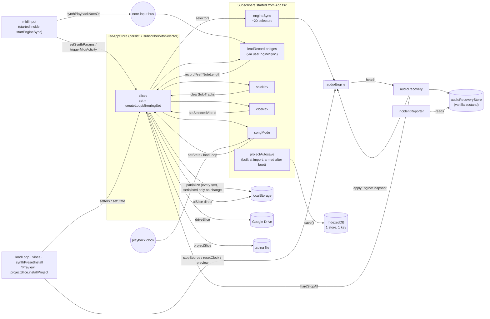

# 02 — State layer (`src/store/`) as built

Mapped from source on 2026-09-21 (branch `main`, HEAD `67008707`). Every claim cites
`path:line`; items marked **(uncertain)** were inferred, not traced end to end. Test files were
read only to confirm behaviour. Version numbers are deliberately not recorded (see `CLAUDE.md`).

Scope: 69 non-test files in `src/store/`, plus `src/types.ts` (418 lines) and `src/types/synth.ts`
(199 lines).

---

## 1. Store composition

There is **one app store**, `useAppStore` (`src/store/store.ts:286`), built as
`create()(persist(subscribeWithSelector(creator)))`. The creator wraps zustand's `set` once in
`createLoopMirroringSet` (`store.ts:294`, `loopSync.ts:66`) and hands that wrapped `set` to
**every** slice. `store.ts:296-312` spreads **17 slice creators**, in this order:

transport, musicContext, synth, chords, bass, pad, lead, fx, beat, effects, ui, presets, loop,
loopCopy, project, export, drive.

`AppStore` (`types.ts:756-772`) extends only **16** interfaces. `loopCopySlice` has no interface
of its own: it returns `Pick<LoopSlice, 'applyLoopCopy'>` (`loopCopySlice.ts:9`), and
`applyLoopCopy` is declared inside `LoopSlice` (`types.ts:753`). Four slice interfaces live in
their slice files rather than in `types.ts`: `ProjectSlice` (`projectSlice.ts:59`), `DriveSlice`
(`driveSlice.ts:22`), `ExportSlice` (`exportSlice.ts`), `TrackSendsSlice` (`trackSendsSlice.ts`).

A **second, separate** zustand store exists: `audioRecoveryStore`, a vanilla `createStore`
(`audioRecovery.ts:58`, exported at `:173`). The incident store (`@/incidents/incidentStore`) is
outside this scope.

**Fixed on `fix/structure-audit-bugs`:** `playheadBeat`/`setPlayheadBeat` left the transport slice (a local pub/sub in
`components/playheadBeat.ts`), and the ui slice gained the persisted `drumPadVelocities`.

### 1.1 Slice table

"Reads" and "Writes" list state owned by *other* slices. Plain `set({ ownKey })` setters are
summarised as "setters".

| Slice (file, lines) | State keys | Actions | Reads other slices | Writes other slices |
|---|---|---|---|---|
| **transport** `transportSlice.ts` (340) | `bpm`, `meterId`, `masterVolume`, `metronomeActive`, `sequencerPlayer`, `chordsPlayer`, `leadPlayer`, `fxPlayer`, `playheadChordIndex`, `playheadChordStartBeat`, `songLoopIndex`, `playbackScope` | `setBpm` (clamped), `setMeter`, `setMasterVolume`, `toggleMetronome`, `play`/`softStop`/`hardStop(module)`, `playAll`/`softStopAll`/`hardStopAll`, `soloLoop`, `setPlayheadChord`, `setSongLoopIndex` | — | none (the `get` parameter is unused, `transportSlice.ts:244`) |
| | also exports pure helpers for other modules: `captureActivePlayers`, `restartPlayersPatch`, `stopAllPlayersPatch`, `playerStatesKey`, `aggregateAllPlayers`, `transportDisplayState` (`:109-241`) | | | |
| **musicContext** `musicContextSlice.ts` (40) | `scaleRoot`, `scaleType`, `selectedVibeId` | `setScaleRoot`, `setScaleType`, `setSelectedVibeId` | lead: `leadMelodySteps` | lead: rewrites `leadMelodySteps` on key change (`:19-34`). `fxMelodySteps` is not rewritten |
| **synth** `synthSlice.ts` (39) | `synthParams`, `chordSynthParams`, `bassSynthParams`, `synthArpSettings`, `chordArpSettings`, `bassArpSettings`, `synthVolume`, `synthMuted` | 6 setters + `setSynthVolume`, `toggleSynthMuted` | — | — |
| **chords** `chordsSlice.ts` (125) | `chords`, `chordRhythmId`, `chordRhythmMode`, `customChordRhythm`, `customChordLoopLength`, `customChordHoldSteps`, `chordFeel`, `chordOctave`, `chordMuted`, `chordVolume` | `setChords`, `setChordRhythmId`, `setChordRhythmMode`, `setCustomChordRhythm`, `setCustomChordLoopLength`, `setCustomChordEvent`, `setCustomChordEventLength`, `setChordFeel`, `setChordOctave`, `setChordVolume`, `toggleChordMuted` | transport `meterId`; bass `customBass*` | bass: `setChords` re-clamps and writes `customBassLoopLength/Pattern/HoldSteps` (`:32-59`) |
| **bass** `bassSlice.ts` (85) | `bassPatternId`, `bassPatternMode`, `customBassPattern`, `customBassLoopLength`, `customBassHoldSteps`, `bassFeel`, `bassOctave`, `bassMuted`, `bassVolume` | setters + `setCustomBassLoopLength`, `setCustomBassEvent`, `setCustomBassEventLength` | chords `chords`; transport `meterId` | — |
| **pad** `padSlice.ts` (43) | `PadState`: `padSynthParams`, `padArpSettings`, `padMode`, `padOctave`, `padVoicing`, `padDroneDegree`, `padDroneIntervals`, `padVolume`, `padMuted` | 8 setters + `setPadDroneIntervals`, `togglePadDroneInterval` (normalised through `sanitize.normalizePadIntervals`) | — | — |
| **lead** `leadSlice.ts` (427), built by `createMelodySlice(melodyTrack('lead'))` (`:425`) | `leadMelodySteps`, `leadLoopLength`, `leadStepResolution`, `leadMelodyView`, `leadMelodyOctave`, `leadGate`, `leadCursor`, `leadBarClipboard` | `setLeadMelodySteps`, `setLeadLoopLength` (resizes), `setLeadLoopLengthPreserve`, `setLeadStepResolution`, `setLeadMelodyView`, `setLeadMelodyOctave`, `setLeadGate`, `setLeadCursor`, `copySelectedLeadBar`, `pasteIntoSelectedLeadBar`, `toggleLeadNote`, `paintLeadNote`, `setLeadNoteLength`, `recordLeadNote` | transport `meterId`; musicContext `scaleRoot/scaleType`; ui `recordingTrack` (`:279`) | — |
| **fx** `fxSlice.ts` (32) | the `fx*` twin of the lead keys + `fxSynthParams`, `fxArpSettings`, `fxVolume`, `fxMuted` | the `Fx` twins of the lead actions + `setFxSynthParams`, `setFxArpSettings`, `setFxVolume`, `toggleFxMuted` | same as lead | — |
| **beat** `beatSlice.ts` (200) | `beatParams`, `beatPattern`, `beatMix` | `setBeatPreset`, `setBeatParams`, `updateBeatVoice`, `updateBeatFilter`, `resetBeatVoice`, `resetBeatParams`, `replaceBeatPattern`, `toggleBeatStep`, `setBeatVoiceLevel`, `toggleBeatVoiceMuted`, `setBeatLevel`, `toggleBeatMuted` | presets `customBeatPresets` (`:42-44`); transport `meterId` | — |
| **effects** `effectsSlice.ts` (14) | `effects` | `setEffects` | — | — |
| **ui** `uiSlice.ts` (147) | `activeTab`, `focusTrack`, `soloTracks`, `recordingTrack`, `loopCopySelection`, `loopCopySourceId`, `loopClipboard`, `keyboardMode`, `followPlayhead`, `midiActivityTimestamp`, `midiMappings`, `isMidiSettingsOpen`, `isInputPanelOpen`, `inputTargetPin` (persisted), `midiLearnTargetId`, `selectedMidiInputId` | setters/togglers, including `setDrumPadVelocity` and the MIDI-mapping CRUD (`:127-140`) | — | writes **localStorage directly** for `keyboardMode` and `followPlayhead` (`solna_keyboard_mode`, `solna_follow_playhead`, `:10-57`, `:116-125`) |
| **presets** `presetsSlice.ts` (164) | `customSynthPresets`, `customChordProgressions`, `customBeatPresets` | `saveCustomPreset`, `deleteCustomPreset`, `saveCustomChordProgression`, `deleteCustomChordProgression`, `saveCustomBeatPreset`, `deleteCustomBeatPreset`; `MAX_LIBRARY_ENTRIES` cap on save (`:16`) | beat `beatParams` | beat: `saveCustomBeatPreset` also sets `beatParams.basePresetId` (`:143`) |
| **loop** `loopSlice.ts` (273) | `loops`, `activeLoopId` | `addLoop`, `duplicateLoop`, `deleteLoop`, `reorderLoops`, `reorderLoopsArray`, `setLoopName`, `setLoopTempName`, `setLoopRepeatCount`, `setLoopMix`, `setActiveLoop` | transport `playbackScope`, `songLoopIndex`, player fields | transport: `playbackScope` (`:114`, `:149`), `songLoopIndex`, stops every player on delete (`:175-178`); flat per-loop mix keys via `setLoopMix` (`:260-269`) |
| **loopCopy** `loopCopySlice.ts` (61) | — | `applyLoopCopy` | loop | `loops`, then calls `loadLoop` (engine side effects) when the target is active (`:26-29`) |
| **trackSends** `trackSendsSlice.ts` | `trackSends` | `setTrackSends` | — | — |
| **loopKeyChange** `loopKeyChangeSlice.ts` | — | `applyLoopKeyChange`, `undoLoopKeyChange` | loop | `loops` plus, when the active loop is among the changed/restored ones, its flat key fields — one `set()` per action, never `crossLoopSeam` or `loadLoop` |
| **project** `projectSlice.ts` (474) | `projectName`, `projectSource`, `projectStoreStatus`, `projectNotice` | `setProjectNotice`, `setProjectName`, `loadProject`, `save`, `saveProject`, `saveProjectAsLocal`, `saveAsBody`, `adoptSaveAs`, `applyProjectSource`, `newProject`, `openProjectFile`, `exportProjectFile` | everything in `PROJECT_CONTENT_KEYS`; presets `customBeatPresets` | `installProject` (`:155-203`) writes all project content, every per-loop flat key, `activeLoopId`, `selectedVibeId`, `songLoopIndex`, `soloTracks`, `recordingTrack`, `loopClipboard`; it also calls `cancelExport`, `hardStopAll` and `audioEngine.stopSource` directly (`:165-169`); `saveProject` calls drive's `saveToDrive` (`:307`) |
| **export** `exportSlice.ts` | `exportJob` | `startExport`, `cancelExport` (kinds registered in `exportKinds.ts`: `mixdown-wav`, `midi`, `stems` — incident operations `mixdown`, `midi-export`, `stems-export`) | all content via `buildMixdownSnapshot` (`mixdownSnapshot.ts`) | project `projectNotice` |
| **drive** `driveSlice.ts` (163) | `driveSignedIn`, `driveAvailable`, `driveUser` (persisted) | `connectDrive`, `disconnectDrive`, `listDriveProjects`, `openFromDrive`, `saveToDrive`, `saveAsToDrive` | project `projectSource` | project: `projectNotice`; calls `openProjectFile`, `saveAsBody`, `adoptSaveAs`, `applyProjectSource`, `exportProjectFile` |

### 1.2 How the melody tracks are built

`createMelodySlice(track, set, get)` (`leadSlice.ts:323`) builds state keys and actions from
**computed property names** taken from two tables: `MELODY_TRACKS` (`melodyTracks.ts:38-81`,
store-field names per track) and `MELODY_ACTIONS` (`leadSlice.ts:87-110`, action names per
track). It returns `Partial<AppStore>` and is cast to `LeadSlice`/`FxSlice` (`leadSlice.ts:422`,
`:426`; `fxSlice.ts:21`). The compiler therefore does not check that the generated object
actually implements either interface.

---

## 2. Non-slice modules

### 2.1 Runtime bridges and subscriptions (things that run)

| Module | What it does | Started by | Subscribes to | Writes |
|---|---|---|---|---|
| `store.ts` persist + `loopSync.ts` | Hydrates from localStorage, then mirrors every per-loop write into `loops[]` inside the same `set()` | Runs at import time (`store.ts:286`) | — (wraps `set`) | localStorage `musibox_project_state_v1` through `createDedupedJsonStorage` (`persistStorage.ts`, skips a write whose persisted values are all unchanged by reference) and the coalesced storage; `loops` (`loopSync.ts:26-57`) |
| `projectAutosave.ts` | Schedules `save()` for the idle window whenever a content key changes | Built at import (`store.ts:357`) but disarmed; armed in `bootProject`'s `finally` (`store.ts:371`) | `[...PROJECT_CONTENT_KEYS, 'projectName']` with `shallow` (`projectAutosave.ts:27`, `:72-76`) | IndexedDB via `state.save()` (`:64`) |
| `store.ts` `flushBeforeHide` | Flushes autosave and persist | `pagehide` and `visibilitychange` listeners added at import (`store.ts:390-399`) | DOM events | IDB + localStorage |
| `engineSync.ts` | The store → engine bridge: bpm, meter, master volume, metronome, six source-bus states (solo-aware), `beatParams`, `beatMix.voices`, effects (frame-coalesced; reverb decay debounced 180 ms), five synth patches (frame-coalesced), plus a player-flags selector that calls `audioEngine.init()` and `resetClock()` (`:260-450`) | `useEngineSync()` in `App.tsx:95` (Workspace, after boot) | about 20 selectors, all `fireImmediately` except the player flags | `audioEngine.*` only |
| `engineSync.applyEngineSnapshot` | Re-pushes every engine value | the first-gesture handler (`App.tsx:141`) and `audioRecovery` (`audioRecovery.ts:110`) | — | `audioEngine.*` |
| `midiInput.ts` | Web MIDI: notes → `synthPlaybackNoteOn/Off` on the `'synth'` bus; CC → master volume or the Lead patch; MIDI learn | `startMidiInputBridge()` **inside** `startEngineSync` (`engineSync.ts:266`); idempotent via a module flag (`midiInput.ts:17`); never stopped | `navigator.requestMIDIAccess`, `window` blur, `visibilitychange` (`:329-332`) | store: `triggerMidiActivity` on **every** message, `setSynthParams`, `setMasterVolume`, `updateMidiMapping`; engine: none — **Fixed on `fix/structure-audit-bugs`:** the direct `updateSynthPatch` is gone, CC edits reach the engine through `engineSync` only |
| `leadRecord.ts` `startMelodyRecordBridges` | A live-clock collector, the record-arm sync, and one recorder per melody track (subscribes to the note-input bus and calls `record*` / `set*NoteLength`) | the second effect of `useEngineSync()` (`engineSync.ts:462`) | `leadClockActive`; the `focus`+`layer`+`activeLoopId` signature (`leadRecord.ts:261-315`); `subscribeNoteInput` | `recordingTrack`, `*MelodySteps`, `*MelodyOctave` |
| `soloNav.ts` | Clears `soloTracks` on a layer or `activeLoopId` change | `useSoloNavClear()` `App.tsx:111` | `{layer, activeLoopId}`, `shallow` (`soloNav.ts:49-98`) | `soloTracks` |
| `vibeNav.ts` | Clears `selectedVibeId` on any `activeLoopId` change | `useVibeNavClear()` `App.tsx:119` | `activeLoopId` (`vibeNav.ts:32-40`) | `selectedVibeId` |
| `reharmonizeNav.ts` | Clears the `reharmonizedIndicator` badge on an `activeLoopId` change or a project install (the same-loop-id-collides-across-projects case `soloNav.ts` also guards against) | `useReharmonizeNavClear()` `App.tsx` | `{activeLoopId, projectInstallCount}`, `shallow` | `reharmonizedIndicator` |
| `songMode.ts` | Song-layer coordinator: enters or leaves song scope, subscribes to the playback clock while a song plays, and schedules `loadLoop(id, {atBoundary})` at each boundary | `useSongModeSync()` `App.tsx:106` | `{tab, activeLoopId, playerStatesKey, playbackScope}` (`:285-307`); `subscribePlaybackClock` | direct `useAppStore.setState` (`:114`, `:137`), `songLoopIndex`; calls `loadLoop` |
| `audioRecovery.ts` | Audio health → recovery modal state; recovery = recreate session → `applyEngineSnapshot` → validate | `useEffect(() => startAudioRecoveryBridge())` `App.tsx:152` | `audioEngine.subscribeHealth` | its own vanilla store; `hardStopAll`; the incident store |
| `incidentReporter.ts` | Routes detected, render and manual incidents to the incident store | registers `setOperationFailureSink` **as an import side effect** (`:60`); `installGlobalIncidentCapture` in `App.tsx:254`; `ErrorBoundary` `App.tsx:258`; `ProjectMenu.tsx:554` | — | `@/incidents/incidentStore` |

### 2.2 Imperative command modules (called by components or bridges)

| Module | Role | Touches the engine directly? |
|---|---|---|
| `loadLoop.ts` | Atomic loop switch: hard-stop + cut + load the flat patch + restart, or the seamless `atBoundary` path (`:65-150`) | **yes**: `dropVoicesScheduledFrom`, `stopSource`, `resetClock` |
| `vibePreview.ts` | The vibe picker's commands (R337): stop + cut, then one `set()` of the vibe's patch, then `soloLoop(activeLoopId)`; Cancel writes the snapshot back in one `set()`; holds persisted writes and suspends note input while open. Replaced `applyVibeToStore` (ADR-0045) | **yes**: `stopSource` |
| `vibes.ts` | `vibeContentPatch` builds a resolved vibe's one atomic patch (**Fixed on `fix/structure-audit-bugs`:** the old apply made about 40 sequential setter calls), with the key change from `changeKey` (**Fixed on `refactor/dev-424-loop-content`:** `store/keyChange.ts`, `harmonizeChords: false`); `captureVibeTargets` snapshots every key it writes, for Cancel (R338) | no |
| `synthPresetInstall.ts` | Cuts the bus, then installs a preset (`:77-92`) | **yes**: `stopSource` (`:56`) |
| `synthPatchPreview.ts`, `effectsPreview.ts`, `beatPreview.ts`, `trackSendsPreview.ts` | Draft previews that bypass the store | **yes**: `updateSynthPatch` / `updateEffects` / `applyBeatParams` / `setSourceSends` |
| `stopAndRestart.ts` | `commitRestartAfterStop` — the restart decision after a stop (`:47-64`) | no (direct `useAppStore.setState`, `:60`) |
| `sourceTransition.ts` | A module-global "transition time" that `loadLoop` sets and `engineSync` reads (`:15-27`) | no (ambient coupling) |
| `loopClipboard.ts` | Copy/paste loop sections (`:17-36`) | no |
| `playbackPlanSnapshots.ts` | `AppStore` → immutable planner snapshots (`:31-98`) | no |
| `vibeVariation.ts` | Pure dice resolution | no |

### 2.3 Pure/support modules

`playbackScope.ts` (reducer), `focusTrack.ts` (focus mapping), `trackAudibility.ts` (solo logic),
`sourceBuses.ts` (the `SOURCE_BUSES` table plus the `SYNTH_*_FIELD` maps), `melodyTracks.ts`,
`navSignature.ts`, `levelUnits.ts` (fader dB ↔ gain), `initialState.ts` (defaults),
`beatPresets.ts`, `loop.ts` (loop keys, identity and custom-pattern span arithmetic),
`loopDefaults.ts` (`createDefaultLoopContent()`, the one per-loop default source),
`keyChange.ts` (`changeKey`/`harmonizeChordsToKey`, the pure key-change write),
`loopKeyChange.ts` (`changeKeyAcrossLoops`, `transposeRoot`, `targetKeyFor`; runs `changeKey` per
selected loop and returns each changed loop's pre-change key fields for undo),
`loopCopy.ts` (`LOOP_COPY_GROUPS`), sanitizers (`sanitize.ts`, `sanitizeSynth.ts`,
`sanitizeBeat.ts`), project I/O (`projectFormat.ts`, `projectFile.ts`, `projectSource.ts`,
`projectStore.ts`, `projectStoreIdb.ts`), Drive (`driveAuth.ts`, `driveClient.ts`,
`driveGapi.ts`), `migrate.ts` (legacy localStorage keys), `buildId.ts`, and four test fixtures
(`vibeVariationFixtures.ts`, `instantVibes{Chords,Drums,Effects}Fixture.ts`, each imported only by
one `*.test.ts`).

### 2.4 Diagram — subscriptions and bridges



---

## 3. Persistence as built

### 3.1 Where each piece of state lives

| Destination | What | Written by | Read by |
|---|---|---|---|
| localStorage `musibox_project_state_v1` | `metronomeActive`, `selectedVibeId`, `focusTrack`, `inputTargetPin`, `customSynthPresets`, `customChordProgressions`, `customBeatPresets`, `activeLoopId`, `driveUser` (`partializeAppState`, `store.ts`) | zustand `persist` → `createDedupedJsonStorage` (`persistStorage.ts`) → coalesced storage | `merge` → `sanitizePersistedState` (`store.ts:193-248`, `:337-341`) |
| localStorage `solna_keyboard_mode`, `solna_follow_playhead` | `keyboardMode`, `followPlayhead` | `uiSlice` setters, directly (`uiSlice.ts:10-57`) | slice initialiser (`uiSlice.ts:82-83`) |
| localStorage legacy keys (`murva_*`) | legacy preset libraries | — | `migrateLegacyPresets`, then removed (`migrate.ts:69-105`) |
| IndexedDB `solna-projects` / store `project` / key `current` | `ProjectSlotRecord { body, source }` (`projectSource.ts:89`) | `projectSlice.save` → `projectStore.save` → `putRecord` (`projectStoreIdb.ts:73-77`) | `projectStore.load` → `sanitizeSlotRecord` → `normalizeStoredBody` (`projectStore.ts`) |
| `.solna` file (local handle or download) | `ProjectBody` = envelope + `content` (`projectFormat.ts:156-175`) | `saveProject` / `saveProjectAsLocal` (`projectSlice.ts:300-332`) | `parseProjectFile` (`projectFile.ts:165`) → `openProjectFile` |
| Google Drive (`application/vnd.solna`) | the same `ProjectBody` | `saveToDrive`, `saveAsToDrive` (`driveSlice.ts:136-161`) | `openFromDrive` → `openProjectFile` (`:119-134`) |
| memory only | everything else: transport players, playhead, `playbackScope`, `songLoopIndex`, `soloTracks`, `recordingTrack`, clipboards, cursors, **`midiMappings`**, `selectedMidiInputId`, panel state, drive/project status, `exportJob` | — | — |

`PROJECT_CONTENT_KEYS = ['bpm','meterId','masterVolume','effects','loops']`
(`projectFormat.ts:177`). A loop in a body is `PROJECT_LOOP_KEYS = ['id','name','repeatCount',
...LOOP_FLAT_KEYS]` (`:189`); `tempName` is regenerated on every load (`loop.ts:499`). A Drive
`fileId` or local `FileSystemFileHandle` is stored only beside the body in the IDB record
(`projectSource.ts:89`), never in `.solna`.

### 3.2 Boot sequence

```mermaid
sequenceDiagram
  participant Mod as store.ts (module eval)
  participant LS as localStorage
  participant App as App.tsx
  participant Gate as ProjectBootGate
  participant PS as projectSlice
  participant IDB as IndexedDB
  participant WS as Workspace hooks
  participant Eng as audioEngine

  Mod->>LS: persist getItem (sync; falls back to legacy key)
  LS-->>Mod: payload → migrate (legacy adopt) → merge(sanitizePersistedState)
  Mod->>Mod: onRehydrateStorage: setState({}) + removeLegacyKeys
  Mod->>Mod: createProjectAutosave (subscribed, disarmed)
  Mod->>Mod: driveAuth.preload() if client id; add pagehide/visibilitychange flush
  App->>App: hydrateLatestIncident + installGlobalIncidentCapture
  App->>Gate: render <ProjectLoading/>
  Gate->>PS: bootProject() → loadProject()
  PS->>IDB: open (lazy, 10 s timeout) + get('current')
  alt record found
    IDB-->>PS: record → sanitizeSlotRecord → normalizeStoredBody
    PS->>PS: installProject(content, persisted activeLoopId, source)<br/>(hardStopAll + stopSource are no-ops pre-init)
  else not-found / unavailable / failed
    PS->>PS: new identity or projectNotice; reconcileActiveLoop()
  end
  PS-->>Gate: finally → projectAutosave.arm()
  Gate->>WS: setBooted(true) → mount Workspace
  WS->>Eng: useEngineSync: all selectors fireImmediately (setters no-op until init)
  WS->>WS: startMidiInputBridge (requestMIDIAccess), record bridges,<br/>route sync, playhead, songMode, soloNav, focusPanel, vibeNav, audio recovery
  Note over WS,Eng: first user gesture → audioEngine.init() + applyEngineSnapshot()
```

`bootProject` is memoised (`store.ts:365-375`) so StrictMode's double effect does not load twice.

---

## 4. Loop model

- **Representation.** A `Loop` (`types.ts:633-696`) holds the per-loop fields; the same fields
  also exist **flat** at the top level of `AppStore`, owned by their slices. The flat copy is
  "the active loop being edited". Global (non-loop) content is `bpm`, `meterId`, `masterVolume`
  and `effects`.
- **Key list.** `LOOP_FLAT_KEYS` (`loop.ts:20-78`) is the one enumeration used by the mirror,
  by `loopStatePatch` (`loop.ts:467`) and by `PROJECT_LOOP_KEYS`. **Fixed on
  `refactor/dev-424-loop-content`:** `LoopContent` is now `Pick<Loop, LoopFlatKey>`, bound to
  `LOOP_FLAT_KEYS` at compile time, so `loopStatePatch` returns a type that cannot drift from the
  key list; `loopCopy.test.ts` still separately asserts that `LOOP_COPY_GROUPS` partitions the
  key list.
- **Flat → loops[] (write path).** `createLoopMirroringSet` (`loopSync.ts:66-88`) resolves each
  partial and, if any `LOOP_FLAT_KEYS` value changed by reference, appends a
  `loops: loops.map(active → {...loop, ...loopStatePatch(post-state)})` to the **same** `set()`.
  It skips when `activeLoopId` changes in the same partial (`loopSync.ts:31`). Direct
  `useAppStore.setState` callers bypass it: `loadLoop.ts:100,129`, `songMode.ts:114,137`,
  `stopAndRestart.ts:60` and `store.ts:349`.
- **loops[] → flat (switch path).** Only `loadLoop(id)` (`loadLoop.ts:65`) and
  `projectSlice.installProject`/`reconcileActiveLoop` (`projectSlice.ts:171`, `:216-221`) write
  `loopStatePatch(loop)` into the flat keys. Callers: `LoopSelector.tsx`, `ArrangeView.tsx`,
  `routing/useRouteSync.ts`, `songMode.ts`, `loopCopySlice.ts`.
- **Mix edits from Arrange.** `setLoopMix` writes the target loop and, if it is active, the flat
  keys in one `set` (`loopSlice.ts:260-269`).
- **Deleting a loop.** **Fixed on `fix/structure-audit-bugs`:** `deleteLoop` is atomic on its own. Deleting the active loop
  writes the removal, the fallback's `activeLoopId` and the fallback's `loopStatePatch` in one
  `set()` — the `reconcileActiveLoop` shape — so the caller no longer follows up with `loadLoop`
  and no subscriber sees `activeLoopId` naming a loop whose content the flat keys do not hold. It
  hard-stops nothing; only a loop audition scoped to the deleted loop stops. The write itself
  touches no audio: while the transport runs the deleted loop, the UI's `deleteLoopLive`
  (`loadLoop.ts`) wraps it in `crossLoopSeam`, the helper `loadLoop`'s `atBoundary` path uses. It
  cuts the deleted loop's voices (a full-hold chord/bass/pad or a drone would otherwise sound for
  bars) and resets the clock, so the fallback starts at step 0. `deleteLoop` returns a
  `DeletedLoop` that `undoLoopDelete` re-inserts for the Arrange Undo toast, re-activating it
  through the same seam when it was active. The unsafe `setActiveLoop` was removed.

---

## 5. Findings

### 5a. Contradictions with `CLAUDE.md` / `feature-overview.md`

1. **Fixed on `fix/structure-audit-bugs`:** CLAUDE.md corrected. **IndexedDB layout.** CLAUDE.md said "Bodies and metadata live in **separate object stores**
   … every write touches both in one transaction". The code has **one** object store (`project`)
   and one fixed key; version 2 deletes the old two-store layout (`projectStoreIdb.ts:7-12`,
   `:50-56`, `:73-77`).
2. **Fixed on `fix/structure-audit-bugs`:** CLAUDE.md now points at `store.ts` as the binding list. **Slice roster.** CLAUDE.md listed 12 slices. `store.ts:296-312` composes 17 (it also has
   `pad`, `fx`, `loopCopy`, `export`, `drive`). `feature-overview.md:72` has the full list.
3. **Fixed on `fix/structure-audit-bugs`:** CLAUDE.md names it. **"One Zustand store".** A second vanilla store holds audio-recovery state
   (`audioRecovery.ts:58`).
4. **Fixed on `fix/structure-audit-bugs`:** `store/persistStorage.ts` (`createDedupedJsonStorage`) receives persist's object and
   stringifies nothing when every persisted value is reference-equal to the last write; CLAUDE.md's
   `persist` note is rewritten. Original finding: **Persist cost is per `set()`, not per partialized-key change.** CLAUDE.md: "Every `set()`
   that touches a key returned by `partialize` re-serialises". zustand 5.0.15's persist runs
   `partialize` + `setItem` on **every** `set` (`node_modules/zustand/esm/middleware.mjs:358-374`),
   and `createJSONStorage` stringifies before the coalescer (`store.ts:139-146`). Each playhead
   write, each MIDI message and each drag tick therefore re-serialises the three user libraries
   (up to 200 entries each, `presetsSlice.ts:16`).
5. **Fixed on `fix/structure-audit-bugs`:** `midiInput` no longer calls the engine; CLAUDE.md now states the rule (persistent state
   through `engineSync`; cuts, previews and lifecycle may call `audioEngine` directly, each saying
   why). Original finding: **"Never call engine setters from a component — wire it in `engineSync.ts`"** / overview
   "EngineSync -- setters --> Engine". `engineSync` is not the only store → engine path. Eight
   other store modules call `audioEngine` directly: `midiInput.ts:157` (`updateSynthPatch`,
   duplicating what engineSync then pushes again), `loadLoop.ts`, `projectSlice.ts:168`,
   `vibes.ts:134`, `synthPresetInstall.ts:56`, `synthPatchPreview.ts:36`, `effectsPreview.ts:29`,
   `beatPreview.ts`. Most are deliberate cuts or previews, but the overview diagram
   (`feature-overview.md:111`, `:120`) shows only engineSync and MIDI.
6. **High-frequency state in slices.** CLAUDE.md: the playback step "must stay local … never in a
   slice". `playheadBeat` is a slice key written once per beat from the clock
   (`usePlayheadSync.ts:41-46` → `transportSlice.ts:279`). `midiActivityTimestamp` is written on
   every incoming MIDI message (`midiInput.ts:246`, `uiSlice.ts:126`). Per beat is coarser than
   per step, but each write still pays finding 4.
   **Fixed on `fix/structure-audit-bugs`:** `playheadBeat` left the store (`components/playheadBeat.ts`). `midiActivityTimestamp`
   stays a slice key — an accepted exception, now cheap because it is not persisted and so costs
   no serialisation.
7. **FX is "the lead track's twin".** A key/scale change transposes `leadMelodySteps` only
   (`musicContextSlice.ts:19-34`); `fxMelodySteps` keeps its old pitches. Whether that is
   intended is **(uncertain)**; no comment explains the asymmetry.
   **Fixed on `fix/structure-audit-bugs`:** `keyChangePatch` (`musicContextSlice.ts`) moves every `MELODY_TRACKS` row.
   **Fixed on `refactor/dev-424-loop-content`:** renamed to `changeKey` (`store/keyChange.ts`), a pure
   function every setter applies inside its own `set()`; behavior unchanged — every `MELODY_TRACKS`
   row still moves.
8. **Sharp-spelled identity.** CLAUDE.md: "everything generated, computed or persisted is
   `ROOTS`-spelled". MIDI note-on names come from `midiToFlatName` (`midiInput.ts:266`, i.e.
   `Note.fromMidi`, `musicCore/tonalAdapter.ts:38-39`). They pass unchanged through
   `emitNoteInput` into `record*Note` → `paintMelodyNote`, which stores `note` verbatim
   (`leadSlice.ts:195`). A MIDI-recorded black key would then persist as `Db4`, not `C#4`.
   **(uncertain — traced statically, not reproduced.)**
   **Fixed on `fix/structure-audit-bugs`:** incoming MIDI notes are spelled sharp (`midiInput.ts`).
9. **Stale in-code claims.** `loopSync.ts:61-63` names "ArrangeView's audition write" as a direct
   `setState` caller. None exists, and `stopAndRestart.ts:60` is missing from the list.
   `songMode.ts:293` says its selector "allocates nothing", but it returns a new object literal
   on every `set` (`:286-297`). `projectFormat.ts:180` still says "fingerprint order", but the
   fingerprint module is deleted.

### 5b. Organic-growth smells

1. **Very large files** (`wc -l`, non-test): `sanitize.ts` 838, `types.ts` 785, `sanitizeSynth.ts`
   535, `sanitizeBeat.ts` 525, `loop.ts` 501, `engineSync.ts` 474, `projectSlice.ts` 474,
   `leadSlice.ts` 427. `loop.ts` mixes two unrelated concerns: custom-pattern span arithmetic
   (`:100-357`) and loop identity/naming (`:359-501`). The first sits next to
   `utils/customPattern.ts` and `utils/patternTimeline.ts`, which it wraps.
2. **The per-loop schema is written out 5+ times.** `Loop` (`types.ts:633`), `LOOP_FLAT_KEYS`
   (`loop.ts:20`), `createDefaultLoop` (`loopSlice.ts:26-78`), `sanitizeLoops` field by field
   (`sanitize.ts:662-736`), `LOOP_COPY_GROUPS` (`loopCopy.ts:55`), plus each slice's own
   initial values. Those initial values repeat `createDefaultLoop`'s defaults: `'A'`/`'Natural
   Minor'` (`musicContextSlice.ts:10-11` vs `loopSlice.ts:32-33`), chord/bass defaults
   (`chordsSlice.ts:20-29`, `bassSlice.ts:18-26` vs `loopSlice.ts:40-54`), lead defaults
   (`leadSlice.ts:334-339` vs `loopSlice.ts:57-62`).
   **Fixed on `refactor/dev-424-loop-content`:** `createDefaultLoopContent()` (`loopDefaults.ts`) is
   now the single source of per-loop defaults; slice factories take a `defaults` parameter read from
   it instead of repeating literals.
3. **Non-atomic multi-step writes.** `applyVibeToStore` makes about 40 separate setter calls
   (`vibes.ts:138-258`). Each is its own `set` → mirror → persist serialise → every subscriber,
   and engineSync sees intermediate states. The pairs `setScaleRoot` then `setScaleType` also
   transform the lead melody twice. The `deleteLoop` + `loadLoop` two-step contract (§4) is the
   same pattern. **Fixed on `fix/structure-audit-bugs`:** both are single atomic writes now (§2.2, §4).
   `applyVibeToStore` itself was later removed by ADR-0045; `previewVibe` (`vibePreview.ts`)
   writes the same one-write patch.
4. **Misplaced lifecycles.** `useEngineSync` also starts the melody record bridges
   (`engineSync.ts:462`), and `startEngineSync` starts the MIDI bridge (`:266`), which is never
   torn down by `stopEngineSync` (`:435-449`). MIDI access is therefore requested at Workspace
   mount, not on user intent (`midiInput.ts:226-233`). `incidentReporter.ts:60` registers a global
   sink as an import side effect.
5. **Hidden ambient coupling.** `sourceTransition.ts` is a module-global that `loadLoop` sets
   (`loadLoop.ts:99`) and an engineSync listener reads (`engineSync.ts:299`). It depends on
   zustand notifying synchronously inside `withSourceTransitionTime`.
6. **Type-safety holes from the table-driven melody slice.** `createMelodySlice` returns
   `Partial<AppStore>` and is cast to `LeadSlice`/`FxSlice` (`leadSlice.ts:422,426`,
   `fxSlice.ts:21`). `MELODY_ACTIONS` (`leadSlice.ts:87-110`) is a second hand-written table
   beside `MELODY_TRACKS`. Also, `loopStatePatch` (`loop.ts:477`) and `pickLoopContent`
   (`projectFormat.ts:215-219`) build objects by key iteration and cast.
7. **Cross-slice coupling / god slice.** `projectSlice.installProject` resets state owned by six
   other slices and calls into export, transport and the engine.
   `projectSlice` ↔ `driveSlice` call each other's actions through `get()` (`projectSlice.ts:307`
   ↔ `driveSlice.ts:133,155,158`). This is why `saveToDrive`, `saveAsBody`, `adoptSaveAs` and
   `applyProjectSource` are public store actions with no component caller.
8. **Unused or test-only actions** (no non-test caller found by grep): ~~`setActiveLoop`~~
   (removed on `fix/structure-audit-bugs`), `setMidiMappings` (`uiSlice.ts:127`, no callers at
   all), `setCustomChordRhythm` (`chordsSlice.ts:72`), `setCustomBassPattern` (`bassSlice.ts:38`).
   `buildMixdownSnapshot` is now a plain function of the state in `mixdownSnapshot.ts`, not a
   store action. Knip's zero baseline cannot see these, because they are object members.
9. **Duplicated helpers.** `isPlainObject` exists in `sanitize.ts:356` and `projectFile.ts:30`. The
   incident-recorder construction is repeated in `audioRecovery.ts:142-148` and
   `incidentReporter.ts:22-28`.
10. **Inverted dependencies inside `store/`.** The sanitizer imports slice modules for constants
    and defaults (`sanitize.ts:19` `createDefaultLoop` from `loopSlice`, `:25` `LEAD_OCTAVE_*`
    from `leadSlice`). `store/types.ts` holds a runtime value, `DEFAULT_MIDI_MAPPINGS`
    (`types.ts:431`). Pure data helpers the store depends on live in `audio/`
    (`audio/playback/leadMelody.ts` transposition and resize, imported by `musicContextSlice.ts:3`,
    `leadSlice.ts:3-15`, `loopSlice.ts:17`).
11. **Naming and type inconsistencies.** Lead-track fields are `synthParams`/`synthVolume`/
    `synthMuted` while FX uses `fx*` (the documented irregularity, `melodyTracks.ts:48-51`). The
    player field is `sequencerPlayer` but the bus is `'sequencer'` and the solo id is `'drums'`
    (`sourceBuses.ts:70-74`). ~~Two different exported `FilterType` unions exist.~~ **Fixed on `fix/structure-audit-bugs`:** one
    `FilterType` (`types/synth.ts`); the Beat bus uses `BeatFilterType = Exclude<FilterType, 'notch'>`.
    `src/types.ts` and the `src/types/` directory coexist, so `'../types'` resolves to the file.
    Slice interfaces are split between `types.ts` and three slice files (§1).
12. **Session state that survives project install (uncertain impact).** `installProject` clears
    `loopClipboard`, but not `loopCopySelection`/`loopCopySourceId`, `leadBarClipboard`/
    `fxBarClipboard` or the cursors (`projectSlice.ts:171-202`). `loopCopySourceId` could then name
    a loop from the previous project. It is **(uncertain)** whether any UI path reads it after an
    install.
13. **MIDI mappings are memory-only.** `midiMappings` is absent from `partializeAppState`
    (`store.ts:171-181`), so MIDI-learn assignments are lost on reload. It is **(uncertain)**
    whether that is intended; nothing documents it.
