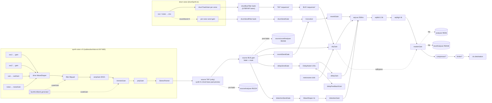
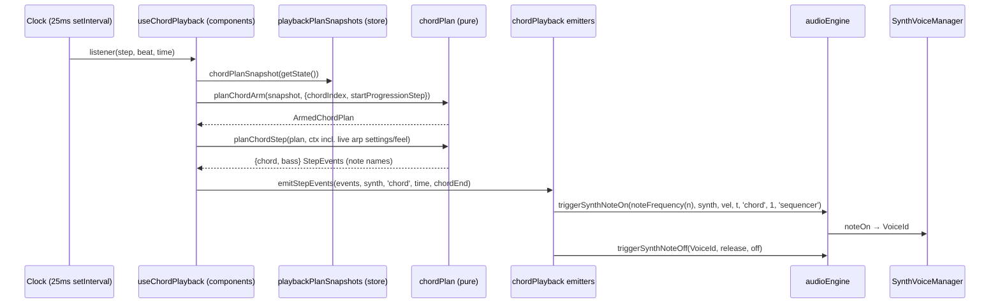
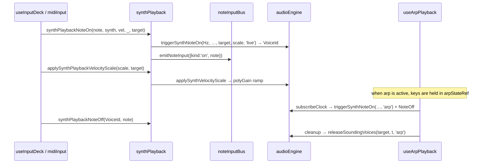

# 03 — Audio layer (`src/audio/`), as built

Mapped from source on 2026-09-21 (HEAD `67008707`). Every claim cites `path:line`; items marked
**(uncertain)** were inferred, not traced end to end. Test files (`*.test.*`, 60 of them) are
excluded from the module map.

Size: 53 non-test files, 13,712 lines (`wc -l`, comments included). The ESLint `max-lines` gate
is 750 **code** lines with comments skipped (`eslint.config.js:267`), so the files below over 750
physical lines pass it.

| Lines | File |
|---|---|
| 1374 | `synth/subtractiveVoice.ts` |
| 1286 | `masterRack.ts` |
| 1122 | `synth/synthLfo.ts` |
| 1009 | `drumSynth.ts` |
| 855 | `synth/voiceManager.ts` |
| 821 | `export/renderMixdown.ts` |
| 736 | `engine.ts` |
| 548 | `leadMelody.ts` |
| 452 | `playback/chordPlayback.ts` |

---

## 1. Module map

"Ext. imports" lists runtime and type imports from outside `src/audio/`.

### 1.1 Core engine (root)

| File | Responsibility | Main exports | Ext. imports |
|---|---|---|---|
| `engine.ts` | `AudioEngine` facade. Owns one `AudioSession` per context generation, the idle-suspend timer, the health monitor and realtime recovery. Nearly every method delegates one-to-one to a subsystem (`engine.ts:132-392`) | `AudioEngine`, `audioEngine` singleton (`:719`), `createRenderEngine(ctx)` (`:732`), `AudioRecoveryResult`, `SESSION_CLOSE_TIMEOUT_MS`; re-exports `STEPS_PER_BAR` (`:713`) and `DRUM_ALIASES`/`METAL_*` (`:717`) | `types`, `utils/musicTheory` (`STEPS_PER_BAR`), `utils/meter`, `types/synth` |
| `masterRack.ts` | Master graph: source taps and buses, send gates, delay, distortion, reverb (with an impulse cache), 3-band EQ, master gain, the analysers, compressor and limiter, and the Beat filter banks. Also hosts shared helpers (`release`, `cancelAndHold`, `createNoiseNode`) | `MasterRack`, `EngineHooks`, `SourceBusState`, `BeatFilterLane`, `BEAT_FILTER_XFADE_SEC` | `types`, `utils/gainUnits` |
| `drumSynth.ts` | The 11-voice Beat synthesizer. `triggerDrum` dispatch, per-voice track gains, `setDrumKit`, `setBeatFilter` | `DrumSynth`, `DRUM_ALIASES`, `METAL_RATIOS`, `METAL_BAND_B_HZ` | `data/beatPresets`, `utils/gainUnits`, `types` |
| `clock.ts` | The shared 16th-note lookahead scheduler, the metronome click, and transport-origin listeners | `Clock` | `utils/meter`, `utils/musicTheory` |
| `beatAdapter.ts` | `applyBeatParams(engine, params, time?)`: the single hop from a Beat patch to the DSP | `applyBeatParams` | `types` |
| `effectLimits.ts` | Clamp table for `MasterEffects`, also used by `store/sanitize.ts` | `EFFECT_LIMITS`, `clampEffects`, `clampEffectValue` | `types` |
| `impulseBudget.ts` | LRU sample budget for the reverb impulse cache | `IMPULSE_CACHE_SAMPLE_BUDGET`, `keysToEvict`, `impulseSampleCount` | none |
| `idleSuspend.ts` | Pure predicate `shouldSuspendWhenIdle`, plus `IDLE_SUSPEND_MS = 30_000` (`:22`) | as named | none |
| `diagnostics.ts` | Diagnostic snapshot types and `audioLatencySnapshot` | as named | none (imports `runtime/healthMonitor`) |
| `constants.ts` | `DEFAULT_VELOCITY = 0.8`, `ENV_FLOOR`, `clampVelocity` | as named | none |
| `rng.ts` | Swappable `random()` source, `mulberry32`, `withSeededRandom`, `MIXDOWN_SEED`, `yieldPreservingRandomStream` | as named | none |
| `voiceOwner.ts` | `VOICE_OWNERS` / `VoiceOwner` (`live`, `arp`, `sequencer`, `preview`) | as named | none |

### 1.2 Music and pattern logic in `audio/` (no Web Audio nodes)

| File | Responsibility | Main exports | Ext. imports |
|---|---|---|---|
| `arpeggiator.ts` | Builds the arp note order, with a cache | `buildArpSequence`, `buildArpSequenceUncached`, cache helpers | `@/musicCore`, `types` |
| `arpSchedule.ts` | Arp trigger timing for each step | `computeArpTriggers`, `arpFiresOnStep`, `ArpTrigger` | `types` |
| `bassPatterns.ts` | Resolves bass steps, groups bass styles, builds custom bass patterns | `resolveBassSteps`, `isApproachToken`, `BASS_STYLE_GROUPS`, `customBassPatternFromSpans` | `@/musicCore`, `data/bassPatterns`, `utils/{customPattern,meter,musicTheory,patternTimeline}` |
| `chordRhythms.ts` | Rhythm and bass cycle resolution, full-hold detection, feel-to-hold scaling | 15 exports (`resolvePlaybackRhythmCycle`, `cycleStepAt`, `equalPowerVelocityScale`, …) | `data/chordRhythms`, `data/bassPatterns`, `utils/{eventAdapt,meter,customPattern,patternTimeline}` |
| `leadMelody.ts` | The lead/FX grid data model: tick/column mapping, resize, transpose, copy/paste a bar, schedule hits | 20 exports | `types/synth`, `utils/{musicTheory,stepResolution}` |
| `leadLiveRecord.ts` | Pure live-record clock: anchors, quantise, map a tick to a column | `createLeadLiveClock`, `quantiseInputStep`, … | `utils/stepResolution` |
| `leadStepRecord.ts` | Octave window for step recording | `leadRecordOctave`, `noteOctave` | `@/musicCore` |
| `chordProgressions.ts`, `drumGrids.ts`, `effectChains.ts` | Id lookups over `data/` tables | `progressionById`/`resolveProgression`, `drumGridById`, `requireEffectChain` | `data/*` |
| `groupByStyle.ts` | Generic group-by-`style` helper | `groupByStyle` | none |

### 1.3 `synth/`

| File | Responsibility | Main exports |
|---|---|---|
| `voiceManager.ts` | Allocates voices by `VoiceId`, manages poly and mono groups, enforces the per-source budget (`DEFAULT_MAX_VOICES_PER_SOURCE = 24`, `:188`), runs two-stage teardown, applies live patch updates and polyphony scale | `SynthVoiceManager`, `ManagedVoice`, `SynthVoiceNoteOn` |
| `subtractiveVoice.ts` | Builds one physical voice graph (see §2.2); `update` handles live patch morphs | `createSubtractiveVoice`, `SubtractiveVoice*` types |
| `synthLfo.ts` | Shared, phase-locked LFO generators with a per-voice fan-out through scale gains (`:447`, `:686`) | `SynthLfoBank`, `phasePeriodicWave`, `createSampleHoldBuffer` |
| `modulation.ts` | ADSR and pitch-envelope scheduling, computed anchors (`envelopeValueAt`, `releaseScheduledParamTo`) | 9 exports |
| `driveCurve.ts`, `noise.ts` | WaveShaper curve; noise buffers by colour | `driveCurve`, `createNoiseBuffer` |
| `voiceId.ts` | Branded `VoiceId` and its allocator | `VoiceId`, `createVoiceIdAllocator` |

Ext. imports: `types/synth`, `utils/synthPatch`.

### 1.4 `playback/` — bridges between components and the engine, plus pure helpers

| File | Imports engine? | Responsibility |
|---|---|---|
| `playbackEngine.ts` | yes | Facade for transport-driven hooks: `playbackNoteOn(noteName, …)` converts to Hz and pins owner `'sequencer'` (`:21-38`); also `playbackStopOwnedVoices`, `subscribePlaybackClock`, `ACCOMPANIMENT_SOURCES`, `HARD_STOP_RELEASE`, latency helpers |
| `synthPlayback.ts` | yes | Live-performance bridge. Owner `'live'` (`:58-66`); announces each note on `noteInputBus` (`:67`, `:94`) |
| `drumPlayback.ts` | yes | `triggerPad` → `audioEngine.triggerDrum` (`:38-40`); `ensureDrumEngine` |
| `arpPlayback.ts` | yes | **A React hook** (`useArpPlayback`, `:160`, imports `react` at `:1`) that subscribes the clock and triggers with owner `'arp'` (`:190`); `computeArpTick`, `releaseTriggeredTargets` |
| `chordPlayback.ts` | yes | Engine-touching emitters (`emitStepEvents`, `scheduleWholeChord`, `playFullHoldChord`) over the pure decisions in `plan/chordEvents.ts`; chord previews (`playChordLegato` with owner `'preview'` on the `'chord'` bus); a `setTimeout` pattern-preview loop (`startPatternLoop`) |
| `presetPreview.ts` | yes | Library auditions on the `'preview'` bus with owner `'preview'` (`:167`, `:212`, `:244`) |
| `padPlayback.ts` | **no** | Pure pad arm and voicing decisions (`resolvePadArm`, `applyPadVoicing`, `padHoldSec`) |
| `heldNotes.ts` | no | Held-note bookkeeping keyed by target |
| `noteInputBus.ts` | no | Pub/sub for performed notes (`emitNoteInput`, `subscribeNoteInput`) |
| `leadLiveClock.ts` | via `playbackEngine` | Singleton anchor collector for live recording, started by `store/leadRecord.ts:88` |
| `plan/padPlan.ts`, `plan/chordPlan.ts`, `plan/melodyPlan.ts`, `plan/chordEvents.ts`, `plan/beatPlan.ts`, `plan/songSnapshot.ts`, `plan/songTimeline.ts` | no (`src/architecture/playbackPlannerImportGraph.test.ts` guards the transitive edge) | Pure planners: `planPadArm`, `planChordArm`, `planChordStep`, `planChordLane`/`planBassLane`, `planMelodyStep`, `planBeatStep`, `buildChordEvents`, `walkSongTimeline`/`buildSongTimeline` |

### 1.5 `runtime/`, `export/`, `automation/`, and test support

| File | Responsibility |
|---|---|
| `runtime/audioSession.ts` | One generation: builds `MasterRack`, `DrumSynth`, `Clock`, `SynthLfoBank` and `SynthVoiceManager` on one context, runs `setupMasterChain`, and creates click buffers for realtime contexts only (`:34-59`); `dispose()` tears everything down and closes the context (`:74-92`) |
| `runtime/healthMonitor.ts` | `AudioHealthMonitor`: samples every `sampleIntervalMs` via an injectable `setInterval` (`:71` of the class), keeps recent evidence, notifies subscribers |
| `runtime/health.ts` | Pure state machine `idle → healthy → suspected → unhealthy` from the audio-to-wall clock ratio (`advanceAudioHealth`) |
| `runtime/policy.ts`, `runtime/profile.ts` | Thresholds (ratio 0.75–1.25, 3 suspicious samples, 1 s interval, 2.5 s max gap), plus iOS WebKit detection (`policy.ts:13-33`) |
| `export/renderMixdown.ts` | Offline arrangement render to WAV (§4) |
| `export/renderMidi.ts` | Song timeline → SMF: lane/GM/meter tables, audibility, the overlap rule, a seeded walk (§4) |
| `export/smfWriter.ts` | Pure SMF format-1 byte encoder |
| `export/smfTestReader.ts` | Test-only SMF parser; excluded from the production Knip graph |
| `export/mixdownFixture.ts` | Test fixture builders. No non-test importer; lives beside production code |
| `automation/sourceBusAutomation.ts` | `applySourceBusAutomation`: `settle` vs `transition` ramps for bus gains |
| `testFakes.ts`, `engineTestHelpers.ts` | Fake `AudioContext`/nodes for tests. Non-test files in the production folder |

### 1.6 Who outside `audio/` imports what (non-test)

- `engine`: `App.tsx`, the four meter components, `diagnostics/browserRecorder.ts`, and 12 files in
  `store/` (`engineSync`, `midiInput`, `loadLoop`, `audioRecovery`, `vibes`, `projectSlice`,
  `synthPresetInstall`, `synthPatchPreview`, `beatPreview`, `effectsPreview`, `incidentReporter`),
  plus `scripts/calibration/renderOffline.ts`.
- `leadMelody`: 11 importers, 7 of them in `store/` (including `store/types.ts`,
  `initialState.ts`, `sanitize.ts`).
- `chordRhythms`: `useInputDeck`, `useChordPlayback`, `useChordView`, `ChordModulePanel`.
- `bassPatterns`, `constants`, `leadLiveRecord`, `leadStepRecord`,
  `chordProgressions`, `drumGrids`, `effectChains`, `effectLimits`, `beatAdapter`, `rng`,
  `diagnostics`, `masterRack` (type only, from `engineSync`) each have 1–4 importers.

---

## 2. Web Audio node graph

### 2.1 Master chain (`MasterRack.setupMasterChain`, `masterRack.ts:456-632`)

Verified edges:

- Source entry is a unity **tap** → **bus**: `getSourceTap` connects tap → bus, and
  `getSourceBus` connects bus → `dryGain`, plus `delaySendGate`, `reverbSendGate` and
  `distortionSendGate` for every source **not** in `SOURCES_WITHOUT_MASTER_SENDS` (today only
  `'sequencer'`, the Beat bus). Both are lazy, one per source string.
- Delay: `delaySendGate` → `delayNode` (2 s max, fixed 0.25 s) ↔ `delayFeedbackGain`, then
  `delayNode` → `delayGain` (`:575-586`). The gate connection is a `DebouncedSendGate` that
  disconnects after a computed tail once the send is idle (`:95-129`, `:824-834`).
- Distortion: `distortionSendGate` → `WaveShaper` (4x oversample) → `distortionGain`
  (`:589-597`). Disconnects 250 ms after going idle (`:82`, `:758-765`).
- Reverb: `reverbSendGate` → `ConvolverNode` → `reverbGain`; `drumSendGate` → the same
  convolver (`:600-613`). Both feeds share one tail timer (`:785-813`).
- EQ is in series: `dryGain`, `delayGain`, `reverbGain` and `distortionGain` go to `eqLow`
  (lowshelf 250 Hz) → `eqMid` (peaking 1.5 kHz, Q 1) → `eqHigh` (highshelf 4 kHz) → `masterGain`.
  EQ bypass reroutes the four returns straight to `masterGain` (`rewireEq`, `:737-750`).
- `masterGain` → `analyser` (fft 256) and `levelAnalyser` (fft 2048), both taps with no output.
  Then `masterGain` → [compressor] → [limiter] → `destination`; each stage is present only when
  enabled (`rewireMasterDynamics`, `:666-708`). Seeded with both stages off (`:631`); the store
  defaults are applied later by `updateEffects`.
- Per-source analysers: `getSourceAnalyser` taps the **tap**, so it reads pre-fader (fft 1024,
  `:1222-1235`). `getSourceLevelAnalyser` taps the **bus**, so it reads post-fader (fft 2048,
  `:1260-1273`).
- Metronome: click `BufferSource` → gain → `dryGain` (`clock.ts:348-349`). It skips every source
  bus and feeds EQ and master directly.

### 2.2 Drum and synth voice graphs

- **Drums** (`drumSynth.ts:393-402`): voice env → per-voice `drumTrackGain` (lazy, keyed by
  voice; `:224-231`) → `drumBusFilter` bank. When a voice's `reverbSend > 0`, a per-voice send
  gain → `drumSendFilter` bank → `drumSendGate` → convolver.
  - Each bank is input gain → three biquads (lowpass, bandpass, highpass) → one gain per lane →
    output (`masterRack.ts:395-413`).
  - The dry bank's output is `getSourceTap('sequencer')`, and the `sequencer` bus feeds
    **`dryGain` only** — it is in `SOURCES_WITHOUT_MASTER_SENDS`, so drums never reach master
    delay, reverb or distortion through the bus. Their only effect path is the per-voice
    `reverbSend` → `drumSendGate` → convolver. (The audit originally said the opposite; see F1.)
  - The sequencer fader is applied to both the bus and `drumSendGate` (`applySourceLevel`,
    `:948-961`).
- **Synth voice** (`subtractiveVoice.ts:547-660`), built per physical voice (unison creates N):
  - Sources: osc1/osc2 each → own level gain; sub → `subGain`; noise → `noiseGain`.
  - Chain: sources → `drive` (WaveShaper) → `filter` (Biquad) → `ampGain` (ENV1) →
    `tremoloGain` → `polyGain` → `StereoPanner` → `destinations.output`, which is
    `masterRack.getSourceTap(source)` (`audioSession.ts:46-47`).
  - LFO generators live in `SynthLfoBank` and connect through a per-voice `scaleGain` to the
    target param (`synthLfo.ts:447`, `:686`).

### 2.3 Signal-path flowchart

---

## 3. Playback

### 3.1 Clock (`clock.ts`)

- `setInterval` every 25 ms (`:49`, `:237`), with a 0.1 s lookahead (`:47`). When a stall passes
  0.05 s the schedule re-anchors instead of bursting missed steps (`:249-256`).
- The timer starts on the first `subscribeClock` and stops with the last (`:137-146`).
- The grid position survives stop and start; only `resetClock` moves it (`:212`). `engineSync`
  calls `resetClock` only on the stopped → playing transition (`store/engineSync.ts:423-429`).
- `AudioEngine.subscribeClock` also starts and stops the health monitor, counting realtime
  subscribers only (`engine.ts:187-205`).
- `AudioEngine.scheduleAfterClockStep` runs a task after the current clock dispatch; with no
  audio session it defers the task to a microtask rather than dropping it. **Fixed on
  `fix/structure-audit-bugs`:** it had become a silent no-op without a session, which dropped
  `songMode`'s `loadLoop` advance so a song never left its first loop (found while fixing the
  audit, not by it; pinned in `clock.test.ts`).

Clock subscribers (non-test): `useChordPlayback` (`:581`), `useLeadPlayback` (`:95`, one per
melody track), `useSequencerPlayback` (`:110`), `useArpPlayback` (`arpPlayback.ts:164`),
`leadLiveClock` (`store/leadRecord.ts`, only while the transport runs), and `presetPreview`'s
live scheduler (`presetPreview.ts:106-116`).

### 3.2 Who creates voices, and with which owner

| Lane / surface | Controller (where) | Decision (pure) | Engine call and owner | Bus |
|---|---|---|---|---|
| Chord and bass | `useChordPlayback.ts` (components) | `planChordArm` / `planChordStep` (`plan/chordPlan.ts`), snapshot from `store/playbackPlanSnapshots` | `playFullHoldChord` / `emitStepEvents` (`chordPlayback.ts`, owner `sequencer`); bass full-hold goes through `playbackNoteOn` (`useChordPlayback.ts:169`) | `chord`, `bass` |
| Pad | `useChordPlayback.ts:128-137` | `planPadArm` → `resolvePadArm` (`playback/padPlayback.ts`) | `playFullHoldChord(…, 'pad')`, owner `sequencer` | `pad` |
| Lead and FX | `useLeadPlayback.ts:95-133` | `planMelodyStep` (`plan/melodyPlan.ts` → `leadMelody.ts`) | `playbackNoteOn/Off` (owner pinned `sequencer`, `playbackEngine.ts:37`) | `synth`, `fx` |
| Drums (sequencer) | `useSequencerPlayback.ts:110-139` | `planBeatStep` (`plan/beatPlan.ts`) | `triggerPad` → `triggerDrum` (no voice id, no owner) | `sequencer` |
| Keyboard arp | `useArpPlayback` (**in `audio/playback/`**) | `computeArpTick` (same file) | `triggerSynthNoteOn(…, 'arp')` (`arpPlayback.ts:190`) | focused target |
| Live keys, on-screen keys, MIDI notes | `useInputDeck.ts:366-393`; `store/midiInput.ts:275` | none | `synthPlaybackNoteOn` → owner `live` (`synthPlayback.ts:58-66`) plus `emitNoteInput` | focused target (MIDI always `synth`) |
| Drum pads | `useInputDeck.ts:619` | none | `triggerPad` | `sequencer` |
| Library auditions | `presetPreview.ts` | none | owner `preview` | `preview` |
| Chord-card held preview | `chordPlayback.ts`'s `playChordLegato` | none | owner `preview`, **no note-off** (released with `stopSource('chord')`) | `chord` |
| Chord/bass pattern preview | `useChordView.ts:494-520` via `startPatternLoop` (`setTimeout`) | — | through `chordPlayback` emitters **(uncertain which owner; likely `sequencer`)** | `chord`, `bass` |

Release paths (`engine.ts:316-360`):
- `triggerSynthNoteOff(VoiceId)` releases exactly one voice.
- `releaseSoundingVoices(source, t, owner)` handles the arp key-up.
- `stopOwnedVoices(source, owner)` is what a grid stop uses (via `playbackStopOwnedVoices`).
- `stopSource(source)` releases the whole bus. Callers: `store/loadLoop.ts:97,126`,
  `vibes.ts:134`, `projectSlice.ts:168`, `synthPresetInstall.ts:56`, the preview helpers, and
  `playChordLegato`.

Mono is decided per patch (`common.voiceMode === 'mono'`, `voiceManager.ts:383`), not per bus.

### 3.3 Sequence — transport lane (chord step)

### 3.4 Sequence — live input (keyboard/MIDI) and the arp

---

## 4. Offline export (`export/renderMixdown.ts`)

Flow:
1. Build an `OfflineAudioContext`.
2. Inside `withSeededRandom(MIXDOWN_SEED)`, call `createRenderEngine(ctx)`. This is a fresh
   `AudioEngine` whose `bindContext` creates an `AudioSession` (`engine.ts`).
3. `applyMasterState`.
4. `planArrangement` (`plan/songTimeline.ts`) sizes the context from the arrangement's passes.
   `scheduleArrangement` then performs `walkSongTimeline`'s items — pass markers, note/drum
   events, step ends — one at a time through `performTimelineEvent`, applying that pass's audio
   automation on its marker and resuming the generator between items; there is no `Clock` and no
   collected array (R288, ADR-0034). `buildSongTimeline` is the same walk drained and
   stable-sorted by time into one `SongTimeline`, the form a consumer outside a render
   (DEV-429) reads instead of performing the walk itself; DEV-428's MIDI export instead walks
   `walkSongTimeline` directly, incrementally, so it can yield and be cancelled (see MIDI below).
5. `startRendering()`, then `encodeWav`.

Shared with live:
- The same engine class and graph code (`AudioSession`, `MasterRack`, `DrumSynth`,
  `SynthVoiceManager`).
- The pure planners `planChordArm`/`planChordStep`, `planPadArm`, `planMelodyStep` and
  `planBeatStep` (`plan/beatPlan.ts`) — called from `plan/songTimeline.ts`'s walk
  (`walkChordStep`/`walkMelodyStep`/`walkPass`), not from `renderMixdown.ts` itself, which no
  longer imports any of them.
- The step-note and full-hold decision math `stepNoteWindow`/`fullHoldVelocity`
  (`plan/chordEvents.ts`), used both by the live emitters `emitStepEvents`/`playFullHoldChord`
  (`chordPlayback.ts`) and by the walk's `walkChordStep`.
- `applyBeatParams`, called from `applyLoopAudioState` on each pass's audio automation.

Not shared or duplicated:
- `applyMasterState` restates `engineSync.applySliceState`'s order by hand.
- The step walk (`walkSongTimeline`, in `plan/songTimeline.ts`) is a second scheduler, separate
  from the `Clock`. Offline performs its items through `renderMixdown.ts`'s
  `performTimelineEvent`; live performs the same per-step decisions through
  `emitStepEvents`/`playFullHoldChord`. The bass full-hold note-on used to be inlined in the
  renderer; it now comes from the walk (`walkChordStep`) like every other timeline item.
- The keyboard arp and the metronome are not rendered.

Offline guards:
- `realtimeCtx()` returns null for any context that has `startRendering`
  (`audioSession.ts:69-72`), so the render engine never arms idle suspend or click buffers.
- `MasterRack` send gates still use wall-clock `setTimeout` for disconnects (`masterRack.ts:117`,
  `:806`) even on an offline context **(uncertain impact; wet sends at 0 only)**.

### MIDI (`export/renderMidi.ts`)

A second, engine-free consumer of the same `walkSongTimeline` (ADR-0036): a seeded walk with no
`AudioContext` and no lane planner, so the MIDI and the WAV cannot disagree about what plays when —
except an arp `'random'` lane, whose MIDI notes may differ from that project's WAV, because the WAV
interleaves engine draws (noise offsets, sample-and-hold buffers) with the arp's on one seeded
stream and the MIDI walk does not run the engine at all (spec R2, ADR-0036). For each `note`/`drum`
item, `eventAudible` re-checks the loop's `'sequencer'`/source bus row (mute and gain, plus the
Beat voice's gain for drums), mirroring what the renderer's per-pass bus state makes audible;
`noteMidi` resolves the ROOTS name to a MIDI number at this boundary only, and
`resolveNoteOverlaps` enforces one sounding instance per `(channel, note)`. `songMidiFile` then
assembles the conductor and lane tracks into an `SmfFile`, and `encodeSmf` (`smfWriter.ts`) writes
the bytes. The walk yields the same way the WAV renderer does, through `rng.ts`'s
`yieldPreservingRandomStream` (§1.1); this export also shares `walkSongTimeline`, `planArrangement`
and `MIXDOWN_SEED` with the renderer.

---

## 5. Runtime lifecycle

- **Create.** `App.tsx:135-142` registers a first-gesture handler that calls `audioEngine.init()`
  and then `applyEngineSnapshot()`. `init()` creates a context and session once and resumes a
  suspended context (`engine.ts:417-443`). `engineSync` calls `init()` again on every transport
  transition (`store/engineSync.ts:423`).
- **Idle suspend.**
  - `markActivity()` arms a 30 s timer (`engine.ts:626-630`).
  - `maybeSuspendNow` suspends only when there are no clock listeners, no live or releasing synth
    voices, and the context is running (`idleSuspend.ts:32-43`, `engine.ts:633-660`).
  - `wakeIfIdle` runs on pointerdown and keydown (`App.tsx:147`) and at every note-on and drum
    hit (`engine.ts:304`, `drumSynth.ts:819`).
- **Health.**
  - `AudioHealthMonitor` samples once a second, but only while at least one realtime clock
    subscriber exists (`engine.ts:191-204`).
  - `advanceAudioHealth` marks the context unhealthy after 3 consecutive ratios outside
    0.75–1.25 (`runtime/health.ts`, `policy.ts:13-21`). The iOS WebKit policy differs only by a
    quirk tag (`policy.ts:23-27`).
- **Recovery.**
  - `store/audioRecovery.ts:96-111` calls `recreateRealtimeSession()`, which disposes the old
    session, constructs a new context, resumes it, and builds a new `AudioSession`, with a token
    guarding against races (`engine.ts:477-546`).
  - It then calls `validateRealtimeClock()` (`engine.ts:562-583`) and `applyEngineSnapshot()`.
  - Every generation gets a **new** `MasterRack`, so pre-init plain fields (`sourceGains`, Beat
    filter values) are rebuilt only because the snapshot is re-applied.
- **Diagnostics.** `getDiagnosticSnapshot()` (`engine.ts:597-619`) is read by
  `diagnostics/browserRecorder.ts:34`.

---

## 6. Findings

### (a) Contradictions with docs

- **F1 — ~~Drums do reach delay and distortion.~~ Withdrawn: the finding was wrong.** The audit
  read `getSourceBus`'s three `bus.connect(this.*SendGate)` lines as applying to every bus. Each
  was guarded by `if (this.*SendGate)`, and `setupMasterChain` built the drum bus filter bank —
  and with it the `sequencer` bus, via `getSourceTap('sequencer')` — *before* it created the send
  gates, so for that bus all three guards were false and it was wired to `dryGain` only. Drums
  never reached master delay, reverb or distortion; `drumSynth.ts` and the skill were right. What
  the audit did expose is that this held only by construction order. **Fixed on
  `fix/structure-audit-bugs`:** `SOURCES_WITHOUT_MASTER_SENDS` in `masterRack.ts` excludes the
  bus by name, so it holds in any build order and in a render engine;
  `masterRack.sendGates.test.ts` checks the bus-level wiring the voice-level
  `drumSynth.test.ts` could not see. Giving drums real sends is **per-track FX**, deferred to its
  own design.
- **F2 — MIDI is split in two, not a straight edge to the engine.** Notes go through
  `synthPlayback` (`store/midiInput.ts`), unlike the old `feature-overview.md` diagram
  (`MIDI --> Engine`). **Fixed on `fix/structure-audit-bugs`:** CC patch edits no longer call
  `audioEngine.updateSynthPatch` directly; they write the slice and reach the engine once,
  through `engineSync`. The overview diagram now shows the split.
- **F3 — The controllers are not in `audio/playback/`.** `feature-overview.md` placed them there
  (now corrected; CLAUDE.md layer 4 now names them). In code, `useChordPlayback`, `useLeadPlayback` and `useSequencerPlayback` are
  in `src/components/`, and `audio/playback/` holds facades (`playbackEngine.ts:6-10`).
- **F4 — Controllers do not call `triggerSynthNoteOn(Hz, …, owner)`.** The overview's sequence
  showed them doing so (now corrected). They pass note names to
  `playbackNoteOn`/`emitStepEvents`, which convert to Hz and pin the owner
  (`playbackEngine.ts`, `chordPlayback.ts`'s `emitStepEvents`).
- **F5 — Stale docs.**
  - **Fixed on `fix/structure-audit-bugs`:** the `dsp-audio` skill's "bass is forced
    monophonic" (mono is per patch) and its deleted `AmbientBackdrop.tsx` entry.
  - The `setupMasterChain` comment claims "nothing anywhere calls ctx.close()" and refers to an
    `init() … if (!this.ctx)` flow (`masterRack.ts:459-469`). Sessions are now closed and
    recreated (`audioSession.ts:88`, `engine.ts:488-546`).
  - `clock.ts:40-42` says the LFO bank "does not exist there yet". `audioSession.ts:56-58`
    subscribes it.

### (b) Smells from organic growth

- **F6 — Music and grid logic lives in `audio/`.** `leadMelody.ts` (548 lines, 20 exports, 11
  importers including `store/types.ts`), `leadLiveRecord.ts`, `leadStepRecord.ts`,
  `chordRhythms.ts`, `bassPatterns.ts`, `arpeggiator.ts` and `arpSchedule.ts`
  build no audio nodes. Nor do the lookup wrappers `chordProgressions.ts`, `drumGrids.ts`,
  `effectChains.ts` and `groupByStyle.ts`, which read like `utils/` or a domain folder.
  `idleSuspend.ts` and `diagnostics.ts` belong in `runtime/`; `voiceOwner.ts` belongs beside
  `synth/voiceId.ts`.
- **F7 — Planner placement is inconsistent.** **Partly fixed (ADR-0034).** Drums are now planned
  by `planBeatStep` (`plan/beatPlan.ts`), shared by the live stepper and the offline song
  timeline. `playback/padPlayback.ts` is pure but named like an engine bridge. The arp's decision
  (`computeArpTick`) still sits inside a React hook module — deferred.
- **F8 — A "pure" planner transitively loads the engine singleton.** **Fixed (ADR-0034).** The
  chord/bass event math moved to pure `plan/chordEvents.ts`, which imports nothing
  engine-touching; `plan/chordPlan.ts` no longer imports `../chordPlayback`.
  `src/architecture/playbackPlannerImportGraph.test.ts` walks the graph so a transitive edge to
  the engine singleton cannot reopen silently.
- **F9 — A React hook lives in `audio/`.** `arpPlayback.ts:1` and `:160`, against the "audio is
  plain data" intent of the layering.
- **F10 — God objects and shared mutable fields.** `MasterRack` (1286 lines) owns the graph,
  buses, analysers, impulse cache, Beat filter state and the generic helpers
  (`release`/`cancelAndHold`/`createNoiseNode`). `DrumSynth` reaches into its public mutable
  fields 23 times (`drumTrackGains` `:276`, `drumBusFilterLanes` `:239`, `beatFilter*` `:259`).
  `AudioEngine` is roughly 40 pass-through delegates (`engine.ts:132-392`).
- **F11 — Three preview schedulers.** A `setTimeout` loop (`chordPlayback.ts`'s
  `startPatternLoop`), the shared clock (`presetPreview.ts:106-116`), and immediate fire with no
  note-off (`chordPlayback.ts`'s `playChordLegato`/`playChordLegatoWithEngine`). The chord-card
  and pattern previews use the `chord`/`bass` buses, while library previews use `preview`.
- **F12 — Dead-looking code.**
  - `AudioEngine.getByteFrequencyData`/`getByteTimeDomainData` (`engine.ts:170-176`) and their
    `MasterRack` twins (`:1275-1285`) have no callers, tests included.
  - `isInitialized` is written (`engine.ts:108`, `:442`) and never read.
  - The `__…ForTests` methods and the private "compatibility alias" getters (`engine.ts:101-107`,
    `:262-266`) exist only for tests.
  - A docblock is duplicated at `masterRack.ts:874-875` and `drumPlayback.ts:25-37`.
  - `testFakes.ts`, `engineTestHelpers.ts` and `export/mixdownFixture.ts` are test-only code in
    the production tree.
- **F13 — Naming and style drift.**
  - Quote style is mixed: `chordPlayback.ts`, `playbackEngine.ts` and `synthPlayback.ts` use
    double quotes; most files use single.
  - Import style is mixed (`@/audio/...` vs `../audio/...` within one hook,
    `useInputDeck.ts:3-4`).
  - `stepInLoop` in `useSequencerPlayback.ts:132` is really step-in-bar (`step % stepsPerBar`).
    The offline path (`plan/songTimeline.ts`'s `walkStep`) names the same value `stepInBar`; the
    live call site now also passes `{ stepInBar: stepInLoop }`, so only the live-side name is
    still misleading.
  - Velocity literals are scattered: 0.8, 0.9, 0.75 and 0.85 appear beside `DEFAULT_VELOCITY`
    (`playbackEngine.ts:23`, `arpPlayback.ts:190`, `presetPreview.ts:167`, `:212`).
  - The engine re-exports `STEPS_PER_BAR` and the drum tables only for old import paths
    (`engine.ts:711-717`).
- **F14 — A second, undocumented note-input emitter.** `useInputDeck.ts:372`, `:393` calls
  `emitNoteInput` directly (the `announce` path), in addition to `synthPlayback.ts:67`
  **(uncertain: probably the arp-held case; see `.claude/rules/note-input.md`)**.
