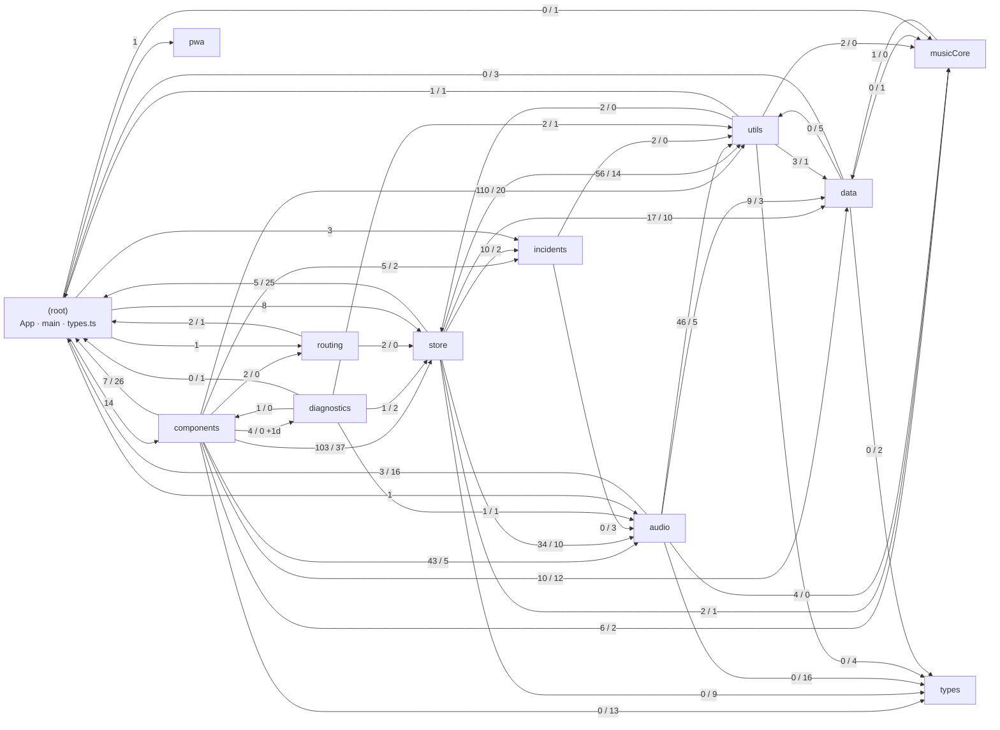
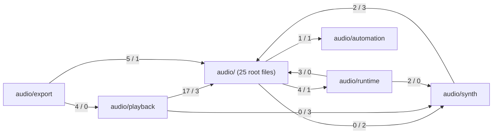

# 04 — Domain modules and the real dependency graph

Scope: `src/data/`, `src/musicCore/`, `src/utils/`, `src/types.ts` + `src/types/`,
`src/incidents/`, `src/diagnostics/`, `src/architecture/`, `eslint.config.js`, `knip.json`,
plus the import graph for all of `src/`.

Everything below was derived from source on 2026-09-21 (commit `67008707` + untracked
`docs/architecture/feature-overview.md`). Line counts, edge counts and file counts are a snapshot —
regenerate rather than trust them later.

## 0. Method

- A throwaway parser (not committed) walked every non-test `src/**/*.{ts,tsx}` file
  (346 files, excluding `*.test.*` and `*.d.ts`), matched every `import … from`,
  `export … from`, side-effect `import '…'` and dynamic `import('…')`, and resolved `@/` and
  relative specifiers to files. 1,483 resolved edges: 1,094 static value, 383 static
  `import type`, 5 dynamic, 1 side-effect (`main.tsx` → `index.css`).
- **"type" means syntactically `import type` / `export type` or an `{ type A, type B }` clause.**
  A plain `import { FilterType }` of a type-only symbol is counted as "value" (e.g.
  `src/audio/engine.ts:1`, `src/audio/masterRack.ts:1`, `src/audio/drumSynth.ts:1`). Neither
  `verbatimModuleSyntax` nor `@typescript-eslint/consistent-type-imports` is enabled, so the split
  is a lower bound on type-only edges.
- `(root)` = the three top-level files `src/App.tsx`, `src/main.tsx`, `src/types.ts`. Almost every
  edge *into* `(root)` is an edge into `src/types.ts`.
- Cross-checked with `bun run check:dead-code` and `check:dead-code:production` (both: zero
  findings) and with `bunx eslint --stdin` probes against the live config (§3).

## 1. Dependency graph

### 1.1 Top-level folders (edge label = value / type; `d` = dynamic)

Not drawn: `pwa/` and `types/` import nothing from other folders; `architecture/` holds only
tests (7 files, 746 lines) and has no non-test module.

### 1.2 `audio/*` internal (value / type)

Subfolder 2-cycles:
- `audio/` ↔ `audio/runtime`: `src/audio/engine.ts` imports `runtime/{audioSession,healthMonitor,profile,policy}`;
  `src/audio/runtime/audioSession.ts` imports `clock.ts`, `drumSynth.ts`, `masterRack.ts`. Not a file cycle.
- `audio/` ↔ `audio/synth`: `engine.ts` → `synth/voiceId.ts` (type); `synth/subtractiveVoice.ts` and
  `synth/synthLfo.ts` → `rng.ts`, `synth/voiceManager.ts` → `voiceOwner.ts`, `diagnostics.ts` (type).
  Not a file cycle.

### 1.3 `components/*` internal (all kinds; `loop/` split one level further)

| from \ to | (files) | ui | project | loop/(files) | loop/chord | loop/beat | loop/lead | loop/synth | loop/sequencer |
|---|---|---|---|---|---|---|---|---|---|
| components/(files) | – | 16 | 1 | 2 | | | | | |
| ui | 8 | – | | | | | | | |
| project | 1 | 5 | – | | | | | | |
| song | 4 | 11 | | | | | | | |
| loop/(files) | 5 | 44 | | – | 7 | 1 | 1 | 5 | 1 |
| loop/chord | 4 | 15 | | 3 | – | | | | |
| loop/beat | 2 | 11 | | 5 | | – | | | |
| loop/lead | 6 | 9 | | 1 | | | – | | |
| loop/sequencer | 4 | 5 | | | | 2 | | | – |
| loop/synth | 1 | 10 | | | | | | | – |

Subfolder 2-cycles: `(files)`↔`ui`, `(files)`↔`project`, `(files)`↔`loop/(files)`,
`loop/(files)`↔`loop/{chord,beat,lead}`. The `ui`→`(files)` direction is the interesting one:
`src/components/ui/StepRow.tsx` → `playbackStep.ts` (a clock subscriber), `ui/BottomInputDock.tsx` →
`useInputDeck.ts` + `mixLayers.ts`, `ui/SegmentHeader.tsx`/`ViewHeader.tsx`/`SegmentedControl.tsx` →
`viewMeta.ts`. `components/ui/` is therefore not a leaf primitive library.

### 1.4 Layering check

**ESLint-enforced rules: 0 violations** (`bun run eslint` is clean and every forbidden edge
the config names is absent from the graph). **Rules stated in `CLAUDE.md`: 0 undocumented
violations.** Checked individually:

| Rule (source) | Result |
|---|---|
| `data/` imports nothing at runtime | Holds: all 11 outgoing edges are `import type`. |
| `audio/` ↛ `store/`, `components/` | Holds (0 edges). |
| `store/` ↛ `components/` | Holds (0 edges). |
| `components/` ↛ `audio/engine` except 4 analysers | Holds: only `AudioVisualizer.tsx`, `ui/VuMeter.tsx`, `ui/GainReductionMeter.tsx`, `ui/SourceMeter.tsx`. |
| `tonal` only in `musicCore/tonalAdapter.ts` | Holds (`src/musicCore/tonalAdapter.ts:1` is the only production import). |
| `musicCore/` ↛ store/components/audio/utils | Holds; its one outgoing edge is `src/musicCore/scale.ts:1` → `@/data/scales` (value, allowed). |
| `incidents/` ↛ store/components/engine | Holds; only `import type` from `audio/runtime/*` (`src/incidents/types.ts:1-2`, `recorder.ts:1`). |
| `utils/` → `store/` only for constants/types | Holds: `src/utils/driveBrowser.ts:1` (`SOLNA_DRIVE_MIME`), `src/utils/localFileSave.ts:1` (`PROJECT_FILE_EXTENSION`, `PROJECT_FILE_MIME`). |

**Grey-zone edges (not violations of any written rule, but against its intent):**

1. `src/diagnostics/browserRecorder.ts:1-2` imports `audioEngine` and `useAppStore` directly;
   `src/diagnostics/DiagnosticPanel.tsx:3` imports `@/components/ui/Modal`. `diagnostics/` has no
   ESLint block of its own (§3), so rule 4 does not reach it; it is a React view living outside
   `components/`. It is dev-only (`src/components/project/ProjectMenu.tsx:20-22` lazy-loads it under
   `import.meta.env.DEV`), but `diagnostics/renderCounts.ts` ships in production via 4 static imports.
2. Components drive the engine through a relay: `src/audio/playback/playbackEngine.ts` (header:
   "Engine bridge for the component-layer playback hooks") is imported by 7 component files —
   `usePlayheadSync.ts`, `playbackStep.ts`, `song/ArrangeView.tsx`, and
   `components/playback/{useSequencerPlayback,useLeadPlayback,useLeadStepPublisher,useChordClockPlayback}.ts`.
   The ESLint pattern bans only `**/audio/engine` (`eslint.config.js:603`), so this passes. `CLAUDE.md`
   itself calls `useChordClockPlayback.ts`/`useLeadPlayback.ts` "controllers", i.e. the playback
   controller half of the planner/controller split lives in `components/`, not `audio/playback/`.

### 1.5 Cycles

- **Folder level:** every top-level folder except `pwa/`/`types/` is in one strongly connected
  component, but most of that is `src/types.ts` sitting at `(root)` next to `App.tsx`
  (`App.tsx` → components/store/audio; everything → `types.ts`). That is a *folder-placement*
  artefact, not a runtime cycle. Genuine folder 2-cycles, excluding `(root)`:

| Pair | Forward | Backward | Kind |
|---|---|---|---|
| components ↔ diagnostics | `PlayheadReadout.tsx:6`, `TransportBar.tsx:19`, `loop/ChordView.tsx:13`, `loop/chord/ProgressionCard.tsx:11` → `diagnostics/renderCounts.ts`; `project/ProjectMenu.tsx:22` (dynamic) | `diagnostics/DiagnosticPanel.tsx:3` → `components/ui/Modal.tsx` | value both ways |
| store ↔ utils | 70 edges | `utils/driveBrowser.ts:1`, `utils/localFileSave.ts:1` | value both ways (documented exception) |
| data ↔ musicCore | `data/chordProgressions.ts:18` (type) | `musicCore/scale.ts:1` (value) | type-only one way |
| data ↔ utils | `data/{vibes,chordRhythms,bassPatterns,drumGrids}.ts` → `utils/timeSignature.ts`, `data/vibes.ts` → `utils/synthControl.ts` (type) | `utils/musicTheory.ts`, `utils/noteSpelling.ts`, `utils/synthPresets.ts` → data (value) | type-only one way |

- **File level (value imports only), two runtime cycles, both in `store/`:**
  - `store/sanitize.ts:20,25` → `sanitizeBeat.ts`, `leadSlice.ts`; `store/sanitizeBeat.ts:43` →
    `sanitize.ts`; `store/leadSlice.ts:25` → `sanitize.ts` (`clampFinite`). The validator imports a
    slice for two octave constants while the slice imports the validator.
  - `store/store.ts` → `loopCopySlice.ts:2` → `loadLoop.ts:5-6` → `store.ts` / `stopAndRestart.ts:4` → `store.ts`.
    Works because the `useAppStore` reads are inside functions, not at module evaluation.

## 2. Module map

Consumers are the *other* top-level folders that import the file (non-test); `self` = same folder.

### 2.1 `src/data/` (10 files, 5,204 lines) — factory tables, type-only imports

| File | Lines | Responsibility | Main exports | Consumers |
|---|---|---|---|---|
| `synthPresets.ts` | 1783 | Factory synth patches + category/tag metadata | `SYNTH_PRESETS`, `SYNTH_CATEGORIES`, `SYNTH_TAGS`, `SynthPreset` | components 9, store 6, utils 2 |
| `vibes.ts` | 755 | Instant Vibe specs (ids only) | `VIBES`, `VibeSpec` | store 3, components 2 |
| `chordProgressions.ts` | 637 | Named progressions (degree steps + `roman` summary) | `CHORD_PROGRESSIONS`, `ChordProgression` | components 3, audio 1 |
| `drumGrids.ts` | 620 | The one drum-grid library | `DRUM_GRIDS`, `DrumGrid` | components, audio, store (1 each) |
| `beatPresets.ts` | 523 | Beat voice roster + factory Beat patches | `BEAT_VOICE_IDS`, `BEAT_PRESETS`, `DEFAULT_BEAT_VOICES`, `DEFAULT_BEAT_PRESET_ID` | store 5, components 3, audio 3 |
| `chordRhythms.ts` | 348 | Chord rhythm patterns | `CHORD_RHYTHMS`, `RhythmPattern`, `RhythmHit` | store 3, audio 2, components 1 |
| `bassPatterns.ts` | 246 | Bass patterns | `BASS_PATTERNS`, `BassPattern`, `BassStep`, `BassNoteToken` | store 8, audio 4, components 2 |
| `scales.ts` | 122 | Scale intervals / tonal names / parent | `SCALES`, `ScaleDefinition` | utils 2, musicCore 1, components 1, store 1 |
| `effectChains.ts` | 92 | Master-rack effect chains | `EFFECT_CHAINS` | audio 1 |
| `trimTable.ts` | 78 | **Generated** calibration evidence (`bun run calibration:generate`) | `DRUM_TRIMS`, `PRESET_TRIMS`, `TrimEntry` | **none in `src/`** — only `scripts/calibration/*`; excluded from Knip's project (`knip.json`, `!src/data/trimTable.ts!`) |

### 2.2 `src/musicCore/` (5 files, 401 lines)

| File | Lines | Responsibility | Main exports | Consumers |
|---|---|---|---|---|
| `index.ts` | 42 | Public API barrel | re-exports 21 names | components 8, audio 4, store 3, utils 2, data 1 (type), root 1 (type) |
| `chordQuality.ts` | 229 | Canonical chord-quality registry, note resolution, snap policy | `CHORD_QUALITY_REGISTRY`, `ChordQuality`, `resolveChordNotes`, `shouldPreserveQualityOnSnap`, `formatChordQuality`, `ROOTS` | self (via index) |
| `tonalAdapter.ts` | 87 | Sole `tonal` importer | `noteMidi`, `pitchClassOfNote`, `octaveOfNote`, `chromaOfNote`, `midiToSharpName`, `transposeByInterval`, `resolveTonalChord`, … | self |
| `pitch.ts` | 21 | Pitch-class transpose keeping octave | `transposePitchClassPreservingOctave` | self |
| `scale.ts` | 22 | Scale lookup with Major fallback | `scaleEntry`, `resolveScaleKey` | self |

Every outside consumer goes through `index.ts` — no deep imports into `musicCore/*` exist.

### 2.3 `src/utils/` (37 files, 5,351 lines)

Grouped by actual concern (the folder is flat):

| Concern | Files (lines) | Main exports | Consumers |
|---|---|---|---|
| Music theory + timing | `musicTheory.ts` (645) | 28 exports: scale notes, degree quality, `degreeToRoman`, borrowed chords, `snapProgressionToScale`, `generateBlockChordNotes`, `noteFrequency`, **and** `STEPS_PER_BAR`, `MIN/MAX_BPM`, `clampBpm`, `stepDurationSec`, `barDurationSec`; re-exports Music Core names at `:33` | components 14, audio 14, store 4 |
| Spelling | `noteSpelling.ts` (206) | `spellNoteInKey`, `getTonicSpelling`, `KEY_OPTIONS`, `formatKeyLabel` | components 12, store 1 |
| Time signature | `meter.ts` (127) | `METERS`, `MeterId`, `MAX_STEPS_PER_BAR`, `getMeter`, `beatIndexAt` | components 19, store 18, audio 10, data 4 (type), diagnostics 1 |
| Step/tick grid | `stepResolution.ts` (123), `patternAdapt.ts` (88), `eventAdapt.ts` (50), `patternTimeline.ts` (106), `customPattern.ts` (229), `songStructure.ts` (118), `playhead.ts` (87) | `LEAD_TICKS_PER_BAR`, `strideFor`; `writeStepWindow`; `adaptStepEvents`; `foldPatternBoundaries`; `writePatternSpan`; `songAdvanceDecision`; `resolveBeatCounter` | spread across components/audio/store |
| Synth patch math & presets | `synthPatch.ts` (224), `synthPresets.ts` (189), `subtractiveSimple.ts` (346), `synthControl.ts` (139) | `dbToGain`/`gainToDb`/`semitonesToRatio`; `applySynthPreset`, `presetById`; Simple-panel read/write; `SynthControlTarget`, `SYNTH_TARGET_STYLES` | components, audio, store |
| Gain & level meters | `gainUnits.ts` (158), `gainReduction.ts` (41), `meterLevel.ts` (212), `meterScale.ts` (81), `meterZones.ts` (30), `meterColor.ts` (37), `meterScheduler.ts` (240), `meterAttach.ts` (110) | branded dB types, `dbToSliderPos`; peak/RMS tracker; zone/scale/colour; rAF scheduler | mainly components; `gainUnits` also audio/store |
| Persistence / IO | `coalescedStorage.ts` (132), `storage.ts` (50), `idbPromise.ts` (16), `projectFileIO.ts` (86), `localFileSave.ts` (163), `driveBrowser.ts` (88), `googleScriptLoader.ts` (185), `encodeWav.ts` (86) | idle-coalesced localStorage; guarded storage reads; IDB promise wrappers; download/read file; File System Access; Drive browser rows; GIS/GAPI script loader; WAV encode | store, components, incidents, diagnostics, audio |
| UI helpers | `knob.ts` (161), `keyboard.ts` (20), `themeColor.ts` (176) | knob geometry + `clamp`; `isTypingTarget`; theme-token RGB | components only |
| Scheduling primitives | `frameCoalescer.ts` (113), `trailingDebounce.ts` (76) | rAF coalescer; trailing debounce | store only |
| Test fixtures (Knip-excluded by `*Fixture` glob) | `diatonicCharacterizationFixture.ts` (274), `spellingCharacterizationFixture.ts` (139) | characterization tables | tests only |

### 2.4 Types

| File | Lines | Content | Consumers |
|---|---|---|---|
| `src/types.ts` | 418 | Grab-bag: view/tab/layer ids **with runtime values and functions** (`PATTERN_SEGMENT_IDS`, `LOOP_TABS`, `SONG_TABS`, `isSongLayer`, `layerForTab`, `PAD_MODES`, `PAD_VOICINGS`, `PAD_INTERVALS`), `ChordItem`, `MasterEffects`, arp scheduler `ArpMode`/`ArpRate`, the Beat bus `BeatFilterType` (derived from the synth `FilterType` since `fix/structure-audit-bugs`), and the entire Beat instrument type family (`BeatVoiceId`, `Beat*Params`, `BeatParams`, `BeatPattern`, `BeatMix`, `FactoryBeatPreset`) | components 33, store 30, audio 19, routing 3, data 3, utils 2, diagnostics 1 |
| `src/types/synth.ts` | 199 | Synth engine patch model (`ActiveSynth`, `EnginePatch`, `SubtractiveParams`, `ModRoute`, `ArpSettings`, the one `FilterType`) — types only | audio 16, components 13, store 9, utils 4, data 2 |
| `src/types/bun-test.d.ts` | 71 | Ambient test typings | — |
| `src/store/types.ts` | 785 | Store slice/state types (out of scope, noted for the split) | store, diagnostics |
| `src/incidents/types.ts`, `src/diagnostics/types.ts` | 67, 55 | Subsystem-local schemas | self (+ components/store for incidents) |

### 2.5 `src/incidents/` (11 files, 769 lines) — public bug-report builder

| File | Responsibility | Consumers |
|---|---|---|
| `types.ts` | Closed `IncidentReportV1` schema, kinds, severities | self 10, components 2, store 2 |
| `sanitize.ts` | `sanitizeError`, `isIncidentReportV1` (rejects unknown keys) | self 4, components 1 |
| `recorder.ts` | `createIncidentRecorder` (freeze incident from sanitized args) | store 2 |
| `incidentStore.ts` | tiny state store + persistence | root, components 2, store 2 |
| `storage.ts` | IndexedDB backend (`createIncidentStore`) via `utils/idbPromise` | self |
| `operationFailure.ts` | `reportOperationFailure` sink | store 3, root |
| `globalCapture.ts` | window error/rejection capture | `App.tsx` |
| `fingerprint.ts`, `newId.ts` | dedupe fingerprint, id | store |
| `githubReport.ts`, `exportIncident.ts` | GitHub issue URL, file export via `utils/projectFileIO` | components |

### 2.6 `src/diagnostics/` (8 files, 644 lines) — dev-only session recorder

| File | Responsibility | Consumers |
|---|---|---|
| `DiagnosticPanel.tsx` | React panel (imports `components/ui/Modal`) | `components/project/ProjectMenu.tsx` (dynamic, DEV only) |
| `browserRecorder.ts` | Binds recorder to `audioEngine` + `useAppStore` | self |
| `recorder.ts` | `createDiagnosticRecorder` (pure, injected deps) | self |
| `renderCounts.ts` | `markDiagnosticRender` no-op-until-active counter | components 4 (**ships in prod**) |
| `session.ts`, `exportSession.ts`, `storage.ts`, `types.ts` | schema check/serialize, file export via `utils/projectFileIO`, IDB store via `utils/idbPromise`, `DiagnosticSessionV1` | self |

### 2.7 `src/architecture/` — 7 test files only

`dependencyLayers.test.ts` (165: musicCore layering + tonal confinement, plus one spot check each
for `audio/arpeggiator.ts`→store and `store/midiInput.ts`→components), `engineDomainPurity.test.ts`
(207), `frequencyBoundary.test.ts` (90), `incidentPrivacyBoundary.test.ts` (41),
`notePatternGuard.test.ts` (69), `playbackPlannerPurity.test.ts` (90),
`schedulingFocusIndependence.test.ts` (84).

## 3. What ESLint actually enforces

Flat config; for a given rule, **the last matching block wins** (replace, not merge). Global
defaults (`eslint.config.js:256-308`, all files): `max-lines` 750 and `max-lines-per-function` 100
(error, skipping blanks/comments), `complexity` 20 (warn), `react-hooks/*`,
`consistent-type-definitions: interface`, bans on `confirm/alert/prompt`, and
`GLOBAL_RESTRICTED_SYNTAX` (`React.FC`, `../../` in import/export). jsx-a11y recommended as errors
for `*.tsx`.

| # | Lines | `files` (ignores) | Import restrictions | Other |
|---|---|---|---|---|
| 1 | 309-329 | `src/audio/**` | tonal, `@tonaljs/*`, `**/store/**`, `**/components/**`, taper fns | — |
| 2 | 330-370 | `src/audio/**` (ignores `rng.ts`, `rng.test.ts`, `export/renderMixdown.test.ts`) | — | `Math.random` in 3 syntactic forms |
| 3 | 371-436 | `src/audio/playback/plan/**` (not tests) | block 1 + engine/`playbackEngine` (incl. `../playbackEngine`) | globals `Date`, `performance`, `crypto`, `fetch`, `window`, timers, rAF, storage… + `Math.random` |
| 4 | — | `export/renderMidi.ts`, `export/smfWriter.ts` | block 1 + engine/DSP modules; `./renderMixdown` type-only | — |
| 5 | 437-481 | `engine.ts`, `synth/**`, `drumSynth.ts`, `masterRack.ts` (not tests) | block 1 + `ENGINE_MUSIC_DOMAIN_BAN` (musicCore, noteSpelling, data/scales, arpeggiator, bass/chord modules, leadMelody, leadStepRecord, `playback/**`; `utils/musicTheory` except 4 timing names) | — |
| 6 | 482-501 | `src/store/**` | tonal, `**/components/**`, taper fns | — |
| 7 | 502-526 | `src/incidents/**` | tonal, store (3 forms), components, `**/audio/engine` | — |
| 8 | 527-559 | `src/musicCore/**` (ignores `tonalAdapter.ts`) | tonal, store, components, audio, utils | — |
| 9 | 560-580 | `src/musicCore/tonalAdapter.ts` | store, components, audio, utils (tonal allowed) | — |
| 10 | 581-609 | `src/components/**` (ignores `ui/VolumeFader.tsx`) | tonal, `**/audio/engine`, taper fns | — |
| 11 | 610-628 | `ui/VolumeFader.tsx` | tonal, `**/audio/engine` | — |
| 12 | 629-653 | `src/**` catch-all (ignores audio, store, components, data, musicCore, incidents) | tonal, taper fns **only** | — |
| 13 | 654-744 | `src/data/**` (not tests) | `@typescript-eslint/no-restricted-imports`: every value import (`allowTypeImports`) | impure globals incl. `Math`; no `new`, function decl/expr, class, module `let/var`; `max-lines` off |
| 14 | 745-764 | 4 analyser components + `**/*.test.ts(x)` | **`no-restricted-imports: off` entirely** | — |
| 15 | 765-782 | `audio/leadStepRecord.ts`, `audio/bassPatterns.ts` | — | regex literal ban + `Math.random` |
| 16 | 783-793 | `loop/lead/melodyGrid.ts`, `ui/Keyboard.tsx`, `utils/musicTheory.ts` | — | regex literal ban |

**Claimed vs enforced:**

- **Matches `CLAUDE.md`:** the four layers, the engine music-domain gate and its file set, the
  planner gate, the tonal confinement, the incidents boundary, the five NOTE_REGEX files, the four
  analyser exemptions, the data-purity rules.
- **Unregulated folders.** `utils/`, `diagnostics/`, `routing/`, `pwa/`, `types/` and the root files
  fall only under block 12 (tonal + taper). Probed with `bunx eslint --stdin`: an
  `import { useAppStore } from '@/store/store'` plus `import { audioEngine } from '@/audio/engine'`
  produces **0 errors** in `src/utils/x.ts`, `src/diagnostics/x.ts` and `src/routing/x.ts`.
  `CLAUDE.md` describes the utils→store inversion as "types and constants … never a call into the
  store"; nothing mechanical keeps it that way.
- **Block 14 over-exempts.** It turns the whole rule off for the four analyser files, so they are
  also exempt from the tonal ban and the taper ban. Probe: `import { Note } from 'tonal'` +
  `dbToSliderPos` gives 0 errors in `src/components/ui/VuMeter.tsx` versus 2 errors in
  `src/components/ui/Knob.tsx`. `CLAUDE.md` says the tonal gate covers "non-test files under
  `src/`" without this carve-out. No architecture test covers it.
- **Rule 3 is a module ban, not a capability ban.** `**/audio/engine` does not match
  `audio/playback/playbackEngine`, which re-exposes `audioEngine.init()` and note-on/off to components
  (§1.4 item 2).
- **Decision D2 ("`@/` alias for every cross-folder import; relative only within the same feature
  folder", spec line 64) is enforced only as a `../../` ban.** 229 non-test imports still cross a
  top-level folder with a single `../` (vs 628 `@/` imports), e.g. `store/engineSync.ts:3-19`
  (store→audio/utils), `audio/chordProgressions.ts:9-10`, `utils/driveBrowser.ts:1`.
- **"`dependencyLayers.test.ts` proves this axis and the four layers above it"** (`CLAUDE.md`,
  architecture paragraph) overstates it: it proves musicCore and tonal rules and spot-checks one
  file each for audio→store and store→components; components→`audio/engine` has no fixture there
  (data purity has its own `src/data/dataLayerPurity.test.ts`).
- **Knip (`knip.json`)**: entry `src/main.tsx` + 5 scripts; project excludes tests, the
  `{engineTestHelpers,testFakes,smfTestReader,*Fixture,*Fixtures}` helpers and
  `src/data/trimTable.ts`;
  `includeEntryExports: true`. Both scans report zero findings today. Because the default graph
  counts tests as consumers and the production scan checks only files/dependencies, **exports used
  only by tests are invisible to both** (e.g. `src/utils/meterScheduler.ts:218,233,237,240`
  `__*ForTests`, `src/store/midiInput.ts:118`).

## 4. Size

### 4.1 Top 30 non-test source files (`wc -l`, physical lines)

| # | Lines | File |
|---|---|---|
| 1 | 1783 | src/data/synthPresets.ts |
| 2 | 1374 | src/audio/synth/subtractiveVoice.ts |
| 3 | 1286 | src/audio/masterRack.ts |
| 4 | 1122 | src/audio/synth/synthLfo.ts |
| 5 | 1009 | src/audio/drumSynth.ts |
| 6 | 886 | src/components/song/SortableLoopCard.tsx |
| 7 | 855 | src/audio/synth/voiceManager.ts |
| 8 | 838 | src/store/sanitize.ts |
| 9 | 821 | src/audio/export/renderMixdown.ts |
| 10 | 798 | src/components/ui/PresetLibrary.tsx |
| 11 | 785 | src/store/types.ts |
| 12 | 776 | src/components/useInputDeck.ts |
| 13 | 755 | src/data/vibes.ts |
| 14 | 745 | src/components/loop/ChordPresetLibrary.tsx |
| 15 | 736 | src/audio/engine.ts |
| 16 | 510 | src/components/playback/useChordClockPlayback.ts |
| 17 | 694 | src/components/song/EffectsRackView.tsx |
| 18 | 685 | src/components/Header.tsx |
| 19 | 677 | src/components/loop/SoundSynthSection.tsx |
| 20 | 663 | src/components/ui/Keyboard.tsx |
| 21 | 645 | src/utils/musicTheory.ts |
| 22 | 637 | src/data/chordProgressions.ts |
| 23 | 627 | src/components/project/ProjectMenu.tsx |
| 24 | 624 | src/components/ui/Knob.tsx |
| 25 | 620 | src/data/drumGrids.ts |
| 26 | 607 | src/components/AudioVisualizer.tsx |
| 27 | 602 | src/components/loop/SynthPresetLibrary.tsx |
| 28 | 577 | src/components/loop/chord/useChordView.ts |
| 29 | 558 | src/components/loop/chord/CustomPatternTimeline.tsx |
| 30 | 548 | src/audio/leadMelody.ts |

The four largest DSP files are ~40-50 % comment lines (`masterRack.ts` 553, `subtractiveVoice.ts`
543, `synthLfo.ts` 538, `drumSynth.ts` 440 comment-prefixed lines), which is how they pass
`max-lines: 750` with `skipComments`.

### 4.2 Per folder (non-test source vs test)

| Folder | Files | Lines | Test lines |
|---|---|---|---|
| components/ | 144 | 29,114 | 17,453 |
| ↳ loop/ | 67 | 14,787 | |
| ↳ ui/ | 45 | 6,279 | |
| ↳ (root files) | 21 | 4,367 | |
| ↳ song/ | 8 | 2,784 | |
| ↳ project/ | 3 | 897 | |
| audio/ | 54 | 13,712 | 18,077 |
| ↳ (root files) | 25 | 5,797 | |
| ↳ synth/ | 7 | 3,857 | |
| ↳ playback/ (incl. plan/) | 13 | 2,190 | |
| ↳ export/ | 2 | 1,016 | |
| ↳ runtime/ | 5 | 460 | |
| ↳ automation/ | 1 | 72 | |
| store/ | 69 | 13,088 | 18,327 |
| utils/ | 37 | 5,351 | 6,539 |
| data/ | 10 | 5,204 | 1,394 |
| incidents/ | 11 | 769 | 722 |
| (root) App/main/types.ts | 3 | 696 | 179 |
| diagnostics/ | 8 | 644 | 373 |
| musicCore/ | 5 | 401 | 332 |
| pwa/ | 2 | 207 | 211 |
| types/ | 1 (+1 `.d.ts`) | 199 | 0 |
| routing/ | 2 | 121 | 85 |
| architecture/ | 0 | 0 | 746 |

## 5. Findings

Verified unless marked *(uncertain)*.

### 5.1 Contradictions with `CLAUDE.md`

1. **Fixed on `fix/structure-audit-bugs`:** one `FilterType` owner (`src/types/synth.ts`); `src/types.ts` now exports only
   `BeatFilterType = Exclude<FilterType, 'notch'>` for the Beat bus, pinned by `src/types.filterType.test.ts`.
   (Was: two different `FilterType` unions, 3 vs 4 members, against CLAUDE.md's "no colliding names".)
2. **Tonal gate is not total.** Block 13 (`eslint.config.js:745-764`) disables all import
   restrictions for the four analyser components, so they may import `tonal` and the taper
   functions (probe in §3). `CLAUDE.md` presented the analyser exemption as unrelated to the tonal axis.
   **Fixed on `fix/structure-audit-bugs`:** CLAUDE.md now states that the block disables every import ban; the config is unchanged.
3. **"Never call engine setters from a component"** is honoured only by module name:
   7 component files call the engine through `src/audio/playback/playbackEngine.ts` (§1.4).
4. **`dependencyLayers.test.ts` does not prove the four layers** (§3). **Fixed on `fix/structure-audit-bugs`:** CLAUDE.md now says
   what it proves (Music Core layering and tonal confinement, plus spot-checks).
5. **`src/data/trimTable.ts` is a per-preset trim table in `src/data/`** consumed by nothing in `src/`.
   `CLAUDE.md` says "there is no trim table beside the engine" — true for the runtime, but the file is a
   generated calibration artefact living in the app's factory-content folder and excluded from
   Knip by name (`knip.json`), rather than living with `scripts/calibration/`.
   **Fixed on `fix/structure-audit-bugs`:** CLAUDE.md now names it as a generated calibration artefact read by no runtime code.

### 5.2 Contradictions with `docs/architecture/feature-overview.md`

6. **Fixed on `fix/structure-audit-bugs`:** the overview no longer calls `utils/` pure. `utils/` was described as "Pure helpers" (`feature-overview.md:37`); it contains DOM/IO modules
   (`googleScriptLoader.ts`, `localFileSave.ts`, `driveBrowser.ts`, `coalescedStorage.ts`,
   `storage.ts`, `idbPromise.ts`, `themeColor.ts`) and two value imports from `store/`.
7. **Fixed on `fix/structure-audit-bugs`:** the overview now shows `diagnostics/` reading the store and engine. The side-system arrow "`incidents/ · diagnostics/ · pwa/` — sanitized args only — Store" is true for
   `incidents/` only; `diagnostics/browserRecorder.ts:1-2` reads `useAppStore` and `audioEngine`
   directly, and `diagnostics/` imports `components/`.
8. **Fixed on `fix/structure-audit-bugs`:** the overview's layering diagram now draws these edges. The layering diagram omitted real edges: components→data (22),
   components→audio non-engine (48), components/store/audio→musicCore, musicCore→data
   (`musicCore/scale.ts:1`), utils→store, incidents→utils, and `components → store → audio → data`
   is drawn as a chain although components→audio is a direct, 48-edge dependency.
9. **Fixed on `fix/structure-audit-bugs`:** the overview now says type-only. "`data/` imports nothing" — it has 11 `import type` edges (to `types.ts`, `types/synth.ts`,
   `utils/timeSignature.ts`, `utils/synthControl.ts`, `musicCore`). Allowed by `CLAUDE.md`, but the overview's
   wording is stricter than the code.

### 5.3 Organic-growth smells

10. **`utils/musicTheory.ts` is two modules.** Pitch/scale/chord/Roman/reharmonization (`:41-548`,
    `:602-643`) plus transport timing (`STEPS_PER_BAR :570`, `MIN/MAX_BPM :573-574`, `clampBpm :581`,
    `stepDurationSec :587`, `barDurationSec :592`) plus `noteFrequency :596`, and a re-export of Music
    Core names (`:33`, incl. `CHORD_QUALITY_ALIASES as TONAL_CHORD_ALIASES`). `ENGINE_MUSIC_DOMAIN_BAN`'s
    `allowImportNames` (`eslint.config.js:153-158`) exists to split this file by name after the fact.
    Music Core symbols are reachable by two routes (`@/musicCore` and `@/utils/musicTheory`).
11. **"meter" means two things in `utils/`.** `utils/timeSignature.ts` is time signatures (`MeterId`,
    `METERS`); `meterLevel/meterScale/meterZones/meterColor/meterScheduler/meterAttach.ts` are level
    meters. Seven files, one prefix, two unrelated domains.
12. **Library lookups scattered across three folders.** `drumGridById` (`audio/drumGrids.ts:16`, 24-line
    file), `progressionById` (`audio/chordProgressions.ts:15`), `requireEffectChain`
    (`audio/effectChains.ts:31`), `beatPresetById` (`store/beatPresets.ts:28`), `presetById`
    (`utils/synthPresets.ts:72`). Each wraps a `src/data/` table; none touches Web Audio. This is also
    why 7 file names exist twice (`bassPatterns`, `chordProgressions`, `chordRhythms`, `drumGrids`,
    `effectChains` in data/+audio/; `beatPresets`, `vibes` in data/+store/; `synthPresets` in data/+utils/).
13. **`src/types.ts` is a grab-bag with runtime code**: 8 value exports incl. `isSongLayer`/`layerForTab`
    (`src/types.ts:37-105`) alongside the full Beat type family (`:228` onward). It is the single most
    imported module (91 importing edges) and the reason every folder appears in one folder-level SCC.
    Types are split across `src/types.ts`, `src/types/synth.ts`, `src/store/types.ts` (785 lines),
    `incidents/types.ts`, `diagnostics/types.ts`.
14. **Duplicate helpers with the same name.** `dbToGain`/`gainToDb` exist in `utils/gainUnits.ts:89,91`
    (branded) and `utils/synthPatch.ts:39,47` (plain, floor-clamped) — intentional per `CLAUDE.md`,
    but same-named exports with different semantics in sibling files. `clamp` is exported from
    `utils/knob.ts:35` and re-declared privately in `audio/synth/subtractiveVoice.ts:329`;
    `clampFinite` exists in `store/sanitize.ts:209` and, with a different signature, in
    `store/sanitizeSynth.ts:121`.
15. **Parallel subsystems.** `incidents/` and `diagnostics/` each have `recorder.ts`, `storage.ts`
    (IDB via `utils/idbPromise`), `types.ts`, a schema check (`sanitize.ts` / `session.ts`) and a file
    export via `utils/projectFileIO` *(whether they should share code is a judgement call; the
    structural duplication is a fact)*. `src/audio/diagnostics.ts` is a third "diagnostics" location.
16. **UI concerns in `utils/`:** `SYNTH_TARGET_STYLES` in `utils/synthControl.ts` (per-target accent
    styling, header at `:5`), `knob.ts`, `keyboard.ts`, `themeColor.ts` are consumed only by
    `components/`; `data/vibes.ts` type-imports `utils/synthControl.ts`, so a data table depends on a
    module that holds styling.
17. **`components/ui/` is not a leaf.** `ui/StepRow.tsx` → `components/playbackStep.ts` (clock/engine
    subscriber), `ui/BottomInputDock.tsx` → `useInputDeck.ts`; `ui/` also holds 663-line `Keyboard.tsx`
    and 798-line `PresetLibrary.tsx`.
18. **Playback controllers live in `components/`:** `playback/useChordClockPlayback.ts`,
    `playback/useLeadPlayback.ts`, `playback/useLeadStepPublisher.ts`,
    `playback/useSequencerPlayback.ts` — mounted by `PlaybackHost` (DEV-422) — plus
    `usePlayheadSync.ts`, `useInputDeck.ts` (776) — non-view logic that is the largest share of
    `components/` root and the reason components→audio has 48 edges.
19. **Two runtime import cycles in `store/`** (§1.5): `sanitize ↔ leadSlice/sanitizeBeat` and
    `store → loopCopySlice → loadLoop → store`.
20. **D2 alias rule half-applied:** 229 cross-folder `../` imports (§3).
21. **Test-only exports in production modules** that Knip cannot see:
    `utils/meterScheduler.ts:218-240`, `store/midiInput.ts:118`.
22. `BEAT_VOICE_IDS` (`data/beatPresets.ts:42`) and the `BeatVoiceId` union (`src/types.ts:228`) spell
    the 11-voice order twice; `readonly BeatVoiceId[]` does not force completeness. Tests pin the
    length (`audio/drumSynth.test.ts:552`) and one schema's key order
    (`components/loop/beat/beatControlSchema.test.ts:37`) *(uncertain whether any test asserts
    union ≡ array)*.
