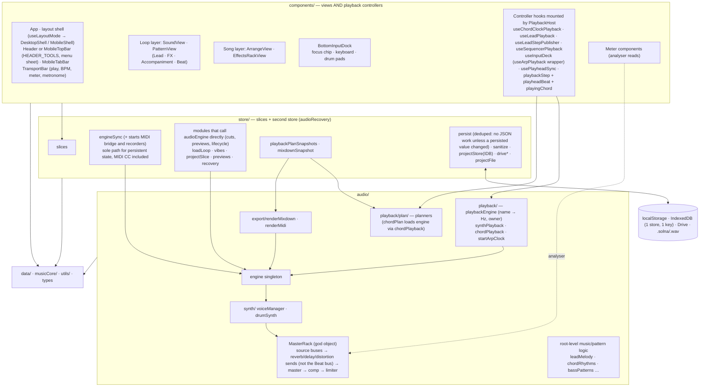

# Solna — Structure as Built

A code-verified map of the app, produced by reading the source rather than the docs. Every claim in
the four detail pages cites `path:line`. Items that were only traced statically are marked
*(uncertain)*. The short feature summary lives in [`../feature-overview.md`](../feature-overview.md).

| Page | Covers |
|------|--------|
| [01-ui.md](01-ui.md) | Component tree (5 diagrams), a feature inventory by UI location, per-view store dependencies, routing and mount gating |
| [02-store.md](02-store.md) | Every slice (keys, actions, cross-slice writes), bridges and subscriptions, persistence by storage zone, boot sequence, the loop model |
| [03-audio.md](03-audio.md) | `audio/` module map, the Web Audio node graph, each lane's playback path, offline export, runtime lifecycle |
| [04-domain-and-dependencies.md](04-domain-and-dependencies.md) | The import graph measured from real imports, cycles, what ESLint actually enforces, size tables, and `data/`, `musicCore/`, `utils/`, `incidents/`, `diagnostics/` |

## Size at a glance (non-test lines)

| Folder | Files | Lines |
|---|---|---|
| components/ | 144 | 29,114 |
| audio/ | 54 | 13,712 |
| store/ | 69 | 13,088 |
| utils/ | 37 | 5,351 |
| data/ | 10 | 5,204 |
| incidents / diagnostics / musicCore / pwa / routing / types | 29 | 2,341 |

`components/` is more than twice the size of any other layer. Part of the reason is that the
playback controllers live there (see finding U1).

## Real runtime structure

## Consolidated findings (ranked)

Codes point to the detail page: U = 01-ui, S = 02-store, A = 03-audio, D = 04-dependencies.
**Status** is as of branch `fix/structure-audit-bugs` (plan:
`docs/superpowers/plans/2026-09-21-structure-audit-fixes.md`). "Fixed" means fixed on that branch;
"Deferred" means deliberately left for its own change.

### Correctness or behavior risks

| # | Finding | Where | Status |
|---|---------|-------|--------|
| A1 | ~~Drums pass through the delay and distortion sends.~~ **The finding was wrong.** The Beat (`sequencer`) bus never reached master delay, reverb or distortion: `setupMasterChain` created it (via the drum bus filter bank) *before* the send gates existed, so `getSourceBus`'s `if (this.delaySendGate)` guards were all false when it was built. That was true by accident of construction order, not by rule. | `masterRack.ts` `setupMasterChain`, `getSourceBus` | **Superseded by DEV-423:** Beat now has delay and distortion sends; its reverb stays per-voice × track send ([ADR-0037](../../decisions/0037-per-track-sends.md)). |
| — | **Found and fixed during the branch (not in the audit):** song mode never left its first loop. `audioEngine.scheduleAfterClockStep` had become a silent no-op without an audio session, dropping `songMode`'s `loadLoop` advance. | `audio/engine.ts` `scheduleAfterClockStep` | **Fixed.** With no session it defers to a microtask, as the clock does outside a dispatch (`clock.test.ts`). |
| S4 | A key/scale change transposes Lead but not FX. | `musicContextSlice.ts` | **Fixed.** `keyChangePatch` moves every `MELODY_TRACKS` row; vibes reuse it. **Fixed on `refactor/dev-424-loop-content`:** renamed to `changeKey` (`store/keyChange.ts`). |
| S5 | MIDI-recorded notes were stored flat-spelled (`Db4`), breaking the ROOTS-spelled identity rule. | `midiInput.ts` → `leadSlice.ts` | **Fixed.** Incoming MIDI notes are spelled sharp. |
| S6 | `deleteLoop` changed `activeLoopId` without loading that loop, so the caller had to call `loadLoop`. `setActiveLoop` had the same hazard. | `loopSlice.ts` | **Fixed.** `deleteLoop` writes the fallback's fields in the same `set()`; `setActiveLoop` is gone. While the transport runs, `deleteLoopLive` wraps that write in `crossLoopSeam`: the deleted loop's voices are cut and the clock reset, and nothing stops. |
| S8 | `applyVibeToStore` made about 40 separate `set()` calls, so subscribers saw intermediate states. | `vibes.ts` | **Fixed.** One atomic patch (`vibes.atomic.test.ts`); the one write now lives in `vibeContentPatch`, applied by `previewVibe` (`vibePreview.ts`, ADR-0045). |
| U6 | Drum-pad velocity was `useState`, but a comment called it "persisted". | `useInputDeck.ts`, `DrumPadGrid.tsx` | **Fixed.** Persisted as `drumPadVelocities` in the ui slice, committed on slider release. |
| U8 | Deleting a loop had no confirm and no undo. | `SortableLoopCard.tsx`, `ArrangeView.tsx` | **Fixed (Undo, no confirm).** `useLoopUndo` raises the Undo as a `FeedbackHost` snackbar, backed by `undoLoopDelete` (`restoreLoop`, then re-activation through the same seam when the loop was active, so Undo never stops the transport). A project install dismisses a pending Undo. A confirm dialog is deferred by choice. |
| D1 | `FilterType` was declared twice with different members (3 vs 4, including notch). | `types.ts`, `types/synth.ts` | **Fixed.** One `FilterType` (synth); Beat bus uses `BeatFilterType = Exclude<FilterType, 'notch'>`. |

### Performance

| # | Finding | Where | Status |
|---|---------|-------|--------|
| S2 | persist re-serialised the whole persisted state on every `set()`, including the preset libraries. That included every playhead beat and every MIDI message. | `store.ts` | **Fixed.** `store/persistStorage.ts` skips serialisation unless a persisted value changed by reference. |
| U5 | `playheadBeat` was written to the store every beat, against the "high-frequency state stays local" rule. | `usePlayheadSync.ts` | **Fixed.** Local pub/sub in `components/playheadBeat.ts`; the key left the store. |
| S3/A2 | MIDI CC called `updateSynthPatch` directly, then `engineSync` pushed the same patch again. | `midiInput.ts`, `engineSync.ts` | **Fixed.** CC edits reach the engine only through `engineSync`. |

### Architecture drift (docs vs reality)

| # | Finding | Where | Status |
|---|---------|-------|--------|
| U4/A3 | The playback controllers live in `components/`. Each lane only sounds because its grid is mounted, so `components/` are not dumb views. | `SequencerGrid.tsx`, `LeadMelodyGrid.tsx`, `useChordView.ts` | **Fixed (DEV-422).** Controllers moved to `components/playback/`, mounted once by `PlaybackHost` ([ADR-0039](../../decisions/0039-playback-host.md)); a lane no longer sounds because its grid is mounted. |
| S3 | `engineSync` is not the only store → engine path: a set of store modules call `audioEngine` directly. | 02-store §5a | **Documented** in CLAUDE.md as a rule (cuts, previews, lifecycle); MIDI CC left the list. |
| S1 | IndexedDB uses one object store with one key. CLAUDE.md said bodies and metadata live in separate stores. | `projectStoreIdb.ts` | **Fixed** in CLAUDE.md. |
| A4 | A "pure" planner imports `chordPlayback`, which instantiates the engine singleton. | `plan/chordPlan.ts`, `chordPlayback.ts` | **Fixed.** The chord/bass event math moved to pure `plan/chordEvents.ts`, which imports nothing engine-touching; `src/architecture/playbackPlannerImportGraph.test.ts` guards the transitive edge so it cannot silently reopen. |
| A5 | There is a React hook inside `audio/`, and drums have no planner in `plan/`. | `arpPlayback.ts`; `plan/beatPlan.ts` | **Fixed.** Drums are now planned by `planBeatStep` (`plan/beatPlan.ts`), shared by the live stepper and the offline timeline. The hook half is **Fixed (DEV-422)**: the body is `startArpClock` in `audio/`, its React wrapper is `components/playback/useArpPlayback.ts`, and `REACT_IMPORT_BAN` keeps `react`/`react-dom` out of `src/audio/`. |
| D2 | The meter-file exemption turns off every import ban for those files, including the tonal and taper bans. | `eslint.config.js` | **Documented** in CLAUDE.md; config unchanged. |
| D3 | `utils/`, `diagnostics/` and `routing/` have no layering block. `diagnostics/` imports the store, the engine and a UI Modal. | `diagnostics/browserRecorder.ts` | Deferred. |
| D-cyc | Runtime file cycles: `sanitize` ↔ `leadSlice`, and `store` → `loopCopySlice` → `loadLoop` → `store`. | 04 §1.5 | Deferred. |

### Deferred work

- ~~Per-track FX~~ **Done** in DEV-423 ([ADR-0037](../../decisions/0037-per-track-sends.md)): every
  track, drums included, has reverb/delay/distortion sends; the per-voice `reverbSend` became a
  multiplier of the Beat track's reverb send.
- D3 and D-cyc remain deferred. The smells list below was worked through in DEV-426: each item is
  now marked fixed or waived with a reason, so nothing there is waiting on an unwritten decision.
  (A5's hook half and moving the controllers out of the grids are Fixed, DEV-422.)

### Organic-growth smells (refactor candidates)

- **Misplaced logic.** `audio/` root holds files that build no audio. **Partly fixed (DEV-426):** the largest, `leadMelody.ts`, now sits in `audio/playback/` with the rest of the lane planning; the remaining root files (`arpeggiator`, `bassPatterns`, `chordRhythms`, `drumGrids`, …) are lookup tables the planners read, left where they are. Preset lookups are spread across `audio/`, `store/` and `utils/` (**waived (DEV-426):** the names are already distinct per layer). Mixdown orchestration and the theme live in `Header.tsx`. (A6, D5, U7)
  **Mixdown half of U7 fixed on `refactor/dev-421-export-feature`:** export is its own feature
  (`store/exportSlice.ts`, `store/exportJob.ts`, `store/exportKinds.ts`, `components/export/`).
  **Theme half fixed (DEV-430):** the theme is `components/header/useTheme.ts`.
- **Duplicated shapes.** The per-loop field list is written out in 5+ places, and slice defaults duplicate `createDefaultLoop`. (S7) **Fixed on `refactor/dev-424-loop-content`:** `LoopContent` is bound to `LOOP_FLAT_KEYS` and slice defaults read `createDefaultLoopContent()`; `sanitizeLoops` still validates field by field on purpose and `LOOP_COPY_GROUPS` stays a test-pinned partition.
- **Large files.** `MasterRack`, `SortableLoopCard.tsx`, `PresetLibrary.tsx`, `useInputDeck.ts`. (A7, U) **Waived (DEV-426):** each is under the ESLint code-line cap and cohesive; split one when a feature next touches it, not as a sweep.
- **Naming.**
  - `utils/meter.ts` is time signature, while `meterLevel` and `meterScale` are level meters: **fixed (DEV-426)** — the table is `utils/timeSignature.ts`.
  - `utils/musicTheory.ts` mixes theory and timing: **fixed (DEV-426)** — timing is `utils/tempo.ts`.
  - `src/types.ts` holds runtime code and is the most-imported file. **Waived (DEV-426):** the runtime bits (`isSongLayer`, `layerForTab`, the id/tab tuples) are small, pure and genuinely shared; splitting them turns one obvious import into several.
  - Cross-folder `../` imports remain despite the `@/` rule. **Waived (DEV-426):** ESLint bans `../../`; a single `../` inside a folder is legal and readable, and a blanket sweep is churn.
  - (D4, D6-D8)
- **Dead or stale code.**
  - `getByteFrequencyData`/`getByteTimeDomainData` and `isInitialized`: **fixed (DEV-426)** — removed from the engine and the rack; `AudioVisualizer` reads the analyser node directly.
  - The `KEYBOARD_NOTES` re-export in `loop/SoundView.tsx` reads as dead inside `src/`, but `scripts/check-key-bindings.ts` imports it: it is the gate's historical path, kept on purpose (DEV-426).
  - Toast timers: **fixed (DEV-426)** — every site is on `ui/useTimedToast.ts`, so a pending timer is cleared on unmount and an older timer can no longer dismiss a newer toast.
  - Stale comments. (The skill's stale `AmbientBackdrop.tsx` entry is fixed on this branch.)
  - (A8, U8)

### Verified clean

- There are no layering violations against the ESLint config, and none against CLAUDE.md that are undocumented.
- Both Knip scans report zero findings. They cannot see exports kept alive only by tests.
